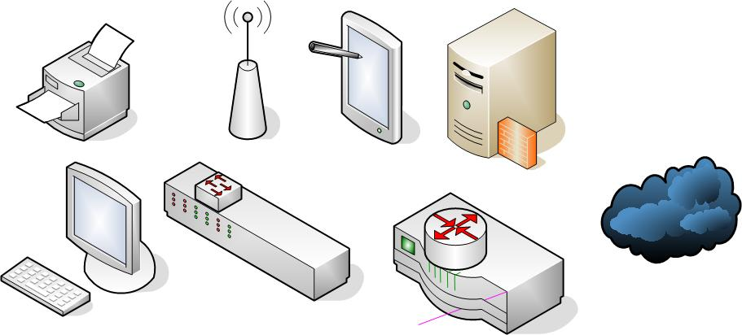

---
title: "Thème Internet - Chapitre 1 : Architecture des réseaux"
author: [Sébastien SAUVAGE]
date: "12/01/2023"
keywords: [SNT, Internet, architecture, réseau]
discipline: SNT
...

\Huge \textbf{Thème 1 : Internet}\normalsize  

\ 

\huge \textbf{Chapitre 1 : Architecture des réseaux}\normalsize

\ 

Un   réseau interconnecte un ensemble d'objets (autonomes - un réseau peut n'interconnecter que des machines, par exemple dans l'internet des objets - ou dotés d'utilisateurs humains) afin de leur permettre de communiquer et de partager des ressources. Les réseaux permettent de **s'affranchir de contraintes** :  

- **d'espace** (ressources humaines, matérielles ou informationnelles en un même lieu physique),
- **de temps** (les TIC offrent des possibilités de communication et de travail synchrones ou asynchrones),
- **de nombre** (diffusion et partage élargis : site web, conférences en ligne, forum, ...),
- **de type d'information** échangées : textuelles, audio, vidéo, réalité virtuelle (télémédecine, ...), ...

# étendue géographique des réseaux
Les réseaux peuvent avoir différentes étendues géographiques :  

- **un réseau local** (LAN : Local Area Network) connecte en réseau des équipements situés dans un même ensemble de bâtiments à proximité,
- un réseau distant (WAN Wide Area Network ou réseau étendu) interconnecte des LAN distants,
- **Internet** (Interconnected networks) est un réseau informatique mondial accessible à tous (WAN mondial) ; c'est un réseau de réseaux qui interconnecte près de 50 000 réseaux autonomes.

# Architecture d'un réseau
Un réseau repose sur :  

- une infrastructure matérielle,
- des protocoles logiciels (**un protocole réseau** est un ensemble de règles de communication),
- permettant des usages de services, selon une organisation logique.

L'infrastructure Internet permet des usages : le courrier électronique, la messagerie instantanée, le pair-à-pair et le World Wide Web.  

En anglais : un internet est une interconnexion de réseaux et the Internet (majuscule, article défini, nom propre) est le plus étendu "internet" du monde.  

En français : l'article défini est peu répandu ("l'internet" dans le dictionnaire de l'Académie française), le journal officiel utilise "internet" comme un nom commun donc sans majuscule (alors que les québécois utilisent la majuscule).  

# Architecture physique (matérielle) d'un réseau

- le point de connexion : **la carte réseau** de l'équipement (ordinateur, imprimante, smartphone, ...),
- **les supports de communication**
  - filaires : cuivre (RJ45), fibre optique, CPL, ...
  - non filaires : Wi-Fi, 5G, IrDA (infrarouge), Li-Fi, ...
- **les équipements d'interconnexion**
  - \underline{A l'intérieur d'un réseau}  
  Le commutateur (ou switch) : cette sorte de "multiprises " transmet des données entre les équipements qui y sont interconnectés au sein d'un même réseau.  
  
  - \underline{pour communiquer avec d'autres réseaux}  
  Le routeur : il fait passer les données d'un réseau à un autre (réseaux ayant des plages d'adresses différentes).  
    
  Le proxy et le pare-feu : ce dispositif de sécurité centralise, contrôle et filtre si besoin les entrées et sorties d'un réseau.  
    

Le débit de la communication sur un réseau dépend de ceux des cartes réseaux et des supports de communication ; il s'exprime en Mbit/s (mégabits par seconde : millions de bits par seconde ; 1 Méga-octet = 8 mégabits).  

### Exercice 1
On souhaite mettre en place un réseau local avec accès partagé à internet. Nommer chaque élément et dessiner les câbles nécessaires :  

 \ \  

\   

**Warriors of the Net (13:00)** : [https://youtu.be/nWCCLRgHT_k](https://youtu.be/nWCCLRgHT_k)  

# Architecture logique d'un réseau
L'architecture logique décrit une "répartition des tâches " au sein du réseau. Deux modèles coexistent :  

\underline{Client-serveur}  

Les postes clients demandent des services aux serveurs (qui centralisent des ressources).  

\ \  

Client et serveur sont des notions logicielles :  

- un client est \textbf{un logiciel qui émet des requêtes auprès d'un serveur} (demande de services).  
    Par extension, on parle de poste client pour désigner une machine qui exécute un logiciel client.
- un serveur est \textbf{un logiciel qui attend une requête d'un client et délivre un service en retour}.  
    Par extension, on parle de poste serveur pour désigner une machine qui héberge et exécute un logiciel serveur. Un même poste peut exécuter plusieurs logiciels serveurs.

En pratique, un poste peut donc être à la fois (et plusieurs fois) client et serveur selon les logiciels qu'il exécute.

**Une application** est dite **client-serveur** si elle est conçue pour partager son fonctionnement (interface, traitement, données) entre un ou des logiciels serveurs et un ou des logiciels clients.

L'architecture client -- serveur permet de cumuler les avantages de :  

- la centralisation des ressources : unicité et cohérence des données, maintenance et sécurité centralisée, ...
- l'accès décentralisé (multiple et sans "déplacement") aux ressources pour les utilisateurs concernés.

\underline{Pair-à-pair (peer to peer)}

\textbf{Les réseaux pair-à-pair (2:17)} : \href{https://interstices.info/wp-content/uploads/jalios/docs/video/mpeg/2014-08/p2p.mp4}{https://interstices.info/wp-content/uploads/jalios/docs/video/mpeg/2014-08/p2p.mp4}

### Exercice 2

juin 1999 : _Napster_ permet à des utilisateurs de partager des fichiers musicaux MP3 qu'ils hébergent ; un serveur centralise la liste des fichiers disponibles afin de permettre la recherche.  

mars 2000 :	_Gnutella_ est totalement décentralisé, la recherche ne passe plus par un serveur central, les fichiers partagés ne sont pas seulement musicaux ; _KaZaA_ fonctionne selon le même principe.  

Les sociétés de production et de distribution d'oeuvres ainsi que celles chargées de la gestion des droits d'auteurs se sont attaqués à ces systèmes. Le créateur d'un système totalement décentralisé n'héberge aucun fichier, ni aucune liste et décharge sa responsabilité sur les activités des utilisateurs. Ceux-ci vont également chercher une "protection" par le biais de système qui fonctionnent sur un chiffrement des données et un mode anonyme (_BitTorrent_). Avec le streaming, celui qui consulte une œuvre protégée n'est jamais en possession du fichier.  

À l'aide de recherches déterminer :  

1. Quel est le cadre juridique français de lutte contre le téléchargement illégal ?  

..................................................................................................................................................  

2. Quelles sont les sanctions encourues ?  

..................................................................................................................................................  

3. Quelles sont les limites ?  

..................................................................................................................................................  

**Principe**  

Tous les postes sont "égaux" et se rendent des services mutuels (ils sont à la fois client et serveur). Cela permet :  

- le partage de fichiers avec un taux de réception élevé (plusieurs émetteurs peuvent envoyer simultanément les différents "morceaux" d'un même fichier : le débit est plafonné par celui du récepteur et non de l'émetteur : un serveur central aurait lui à supporter l'envoi simultané à une multitude de récepteurs).  
Dans un réseau local, les mise à jour Windows 10 se déploient de cette façon ; chaque poste qui a obtenu les mises à jour les partage avec ceux qui les demandent au lieu de télécharger directement sur Internet.
- le calcul distribué (calcul complexe répartit entre plusieurs postes, parfois en arrière-plan, afin de profiter d'une puissance de calcul globale élevée),
- de promouvoir un modèle décentralisé (sans serveur physique) résilient, plus résistant aux pannes (sans point central) et plus favorable à l'anonymat (d'autant que dans les systèmes récents les échanges sont chiffrés).

**Le Peer To Peer | Méthode de Partage de Données (07:53)** : [https://youtu.be/6ZazbI8faqw](https://youtu.be/6ZazbI8faqw)  

# Protocoles réseau
Un "problème" de communication peut être décomposé en sous-problèmes (avec quel support ? qui "parle " quand ? avec qui ? dans quel but ?) dont chacun est pris en charge par un protocole réseau : **un protocole réseau** est donc une règle de communication (qui peut se décrire sous forme d'algorithme). L'adoption de protocoles communs est nécessaire à une communication.  

Les humains emploient de nombreux protocoles pour communiquer entre eux : "Bonjour" pour commencer une communication, ne pas parler en même temps, ...  

Les protocoles sont des logiciels et mis en œuvre par les équipements qui communiquent (ceux aux deux extrêmes de la chaîne de communication) et non par l'infrastructure réseau. Cela les rend indépendant du réseau physique et permet de passer d'un élément à un autre sans perte de communication (de la 4G au wifi, d'une antenne à une autre, ...).  

Les protocoles de la pile TCP/IP sont ceux utilisés le plus courant, notamment par le réseau Internet. Ils harmonisent les communications indépendamment des éléments matériels et logiciels (système d'exploitation, ...).  

\   

**Sources**  

- Cours de SNT de François DUREL