---
title: "Thème Internet - Chapitre 3 : Simulation d'un réseau à l'aide du logiciel Filius"
author: [Sébastien SAUVAGE]
date: "04/02/2023"
keywords: [SNT, Internet, TCP, IP, réseau, Filius]
discipline: SNT
...
[^^Filius]:Filius : [https://www.lernsoftware-filius.de/Herunterladen](https://www.lernsoftware-filius.de/Herunterladen)

\Huge \textbf{Thème 1 : Internet}\normalsize  

\ 

\huge \textbf{Chapitre 3 : Simulation d'un réseau à l'aide du logiciel Filius}\normalsize

\ 

# Introduction
Le but de ce TP est de construire un réseau virtuel afin de bien configurer l'ensemble des éléments de ce dernier et d'observer le déplacement des paquets d'un ordinateur à un autre lors d'une requête.  

Pour cela, nous utiliserons le logiciel allemand gratuit **Filius**[^^Filius].  

Nous avancerons à petit pas en commençant par constituer un réseau simple de deux ordinateur, un réseau un peu plus évolué avec un switch, puis avec un routeur. Nous effectuerons une simulation de mise en réseau de plusieurs réseaux locaux via internet puis d'un réseau local en connections avec différents serveurs.  

# Lien direct
### Exercice 1
1. Créer un réseau simple avec deux Portables liés, servant de clients.
2. Configurer les Portables avec les noms indiqués ci-dessous et les adresses IP `192.168.0.10` et `192.168.0.11`
3. L'utilisation du masque de sous-réseau `255.255.255.0` garantit que les deux ordinateurs font partie du même réseau.  

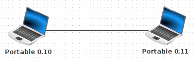\ \  

### Remarque 
Pour ne pas nommer manuellement chaque Portable, utiliser l'option _Utiliser l'adresse IP comme nom_ pour permettre à FILIUS de définir automatiquement le nom de l'ordinateur en tant qu'adresse IP.  

### Exercice 2
1. Sélectionner le Portable avec l'adresse IP se terminant par `0.10`
2. Installer dessus le logiciel _Ligne de commande_.
3. Démarrer la ligne de commande et tester la connexion à l'ordinateur `0.11` à l'aide de la commande `ping 192.168.0.11`

\ \  

\newpage

4. Inspecter l'activité du réseau en affichant les données échangées de l'ordinateur `0.10` dans le modèle OSI (clic droit sur le `Portable 0.10` puis _Afficher les échanges de données_ (`192.168.0.10`)).

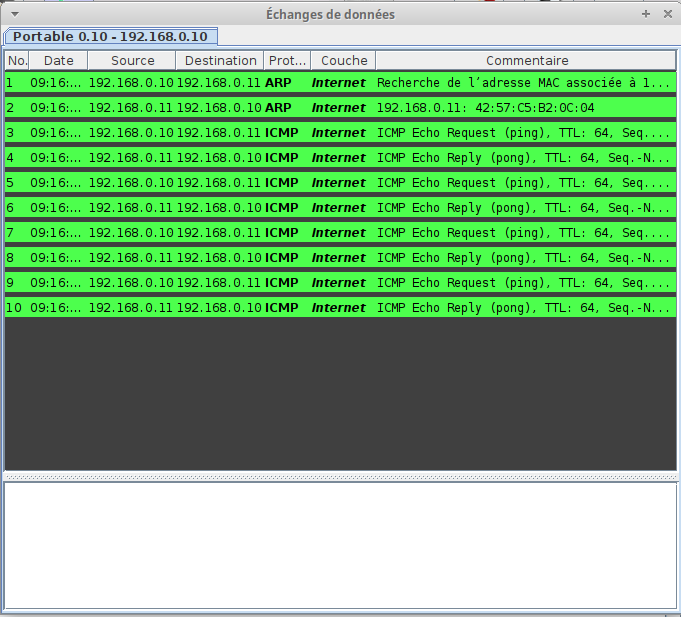\ \  

5. Nous pouvons observer que l'activité du réseau n'atteint que la couche _Internet_. Les couches plus élevées et plus complexes du modèle TCP/IP ne sont pas encore nécessaires. En sélectionnant l'une des lignes dans la fenêtre d'échange de données, il est possible d'afficher des informations sur les couches inférieures du modèle TCP/IP, ainsi que des informations plus détaillées sur les couches utilisées.  

### Exercice 3
Essayer ensuite d'autres commandes en utilisant la ligne de commande, telles que `ipconfig`, `host localhost` ou `ls`.  

L'utilisation de la commande `host` apparaîtra clairement ultérieurement, lors des exercices incluant un DNS Server.  

# Connexion d'ordinateurs à l'aide d'un Switch
### Exercice 4
1. Développer maintenant ce réseau en ajoutant un troisième ordinateur qui correspond à un serveur, avec l'adresse IP `192.168.0.12`.
2. Puis connecter les trois ordinateurs à un Switch.  

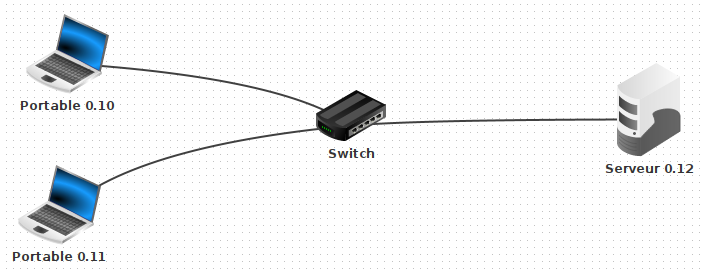\ \  

### Exercice 5
1. Ouvrir le bureau du `serveur 0.12`.
2. Installer et démarrer le logiciel _Serveur générique_ sur le port prédéfini `55555`.
3. Utiliser l'un des Portable pour installer le logiciel _Client générique_ et le connecter au serveur.
4. Essayer d'envoyer des messages texte du client au serveur et observer le résultat. Jeter également un coup d'oeil à l'activité du
réseau dans la fenêtre d'échange de données du Portable.  

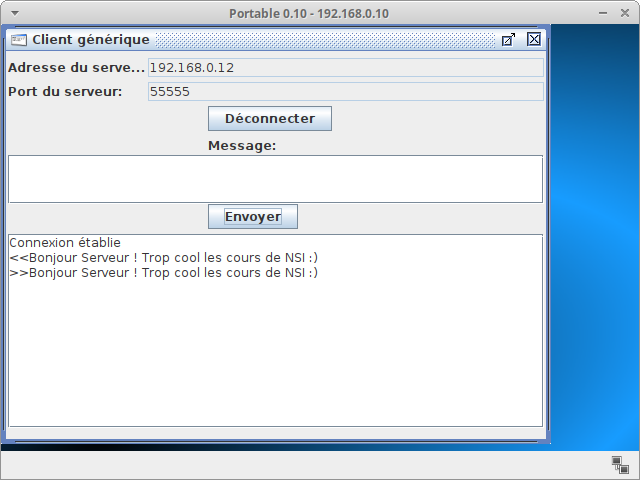\ 
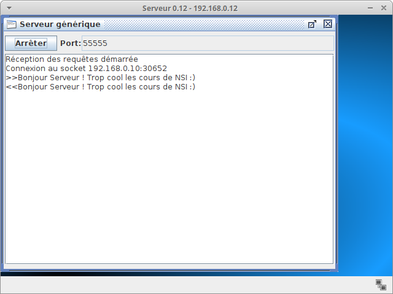\ \  

La fenêtre d'échange de données (voir image ci-dessous) montre, dans cet exemple, que la couche de transport est nécessaire pour la première fois. L'établissement de la connexion entre le client et le serveur utilise déjà trois couches dans le modèle TCP/IP. Les deux premières lignes sont à nouveau utilisées pour déterminer l'adresse MAC, appartenant à l'adresse IP du serveur. Dès que vous envoyez un message de client à serveur, la quatrième couche, appelée couche d'application, entre en jeu.

\ \  

Le logiciel, qui est le _Client générique_, utilise tout d'abord la couche _application_, puis la couche _transport_, la couche _internet_ et enfin la couche _réseau_. Toutes ces informations seront affichées en cliquant sur la première ligne bleu foncé dans le modèle d'échange de données, ce qui affichera l'image ci-dessous :  

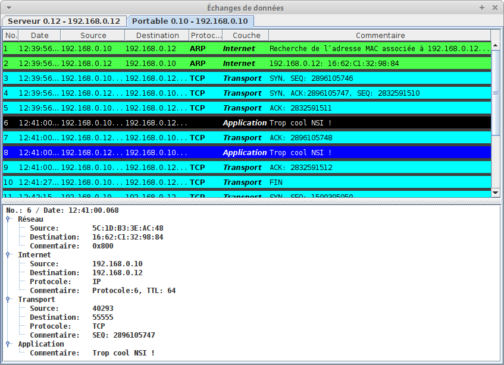\ \  

### Remarque 
Dans les exercices suivants, ne pas oublier de regarder de temps en temps la fenêtre d'échange de données pour avoir une idée du type d'informations en cours de transmission au sein du réseau.  

# Connexion de deux réseaux à l'aide d'un Routeur
### Exercice 6
1. Créer un deuxième réseau avec trois nouveaux ordinateurs, comme indiqué ci-dessous :  
Nous voulons que les trois nouveaux ordinateurs se trouvent sur un réseau logiquement différent, pour lequel nous utiliserons les adresses IP `192.168.1.10` à `192.168.1.12`

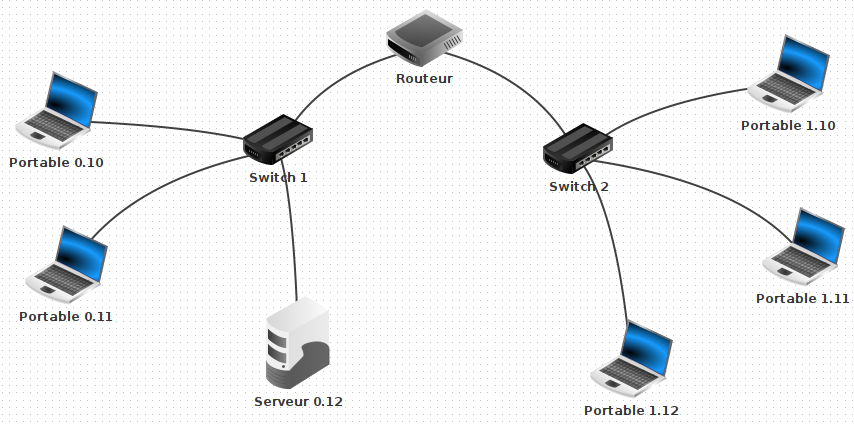\ \  

2. Ensuite, connecter les deux réseaux à l'aide d'un _Routeur_ et configurer les deux cartes d'interface réseau avec les adresses IP `192.168.0.1` et `192.168.1.1`

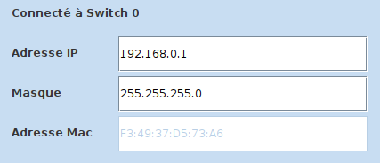\ \  

3. Pour finir tester la connexion entre les ordinateurs `0.10` et `0.11` à l'aide de la commande `ping`.  
Tout doit fonctionner. Ensuite, tester la connexion entre les ordinateurs `0.10` et `1.11` à l'aide de nouveau de la commande `ping`.  
_FILIUS_ affiche alors le message suivant dans l'invite de commande :

\ \  

Ce message d'erreur s'affiche car la requête doit quitter le réseau local. La passerelle de chaque ordinateur n'est pas encore configurée. Or, cette configuration permet à la requête de quitter le réseau local.  

### Exercice 7
1. Le Routeur dispose d'une carte d'interface réseau avec l'adresse `192.168.0.1` que vous configurerez en tant que passerelle pour les trois portables du côté gauche.

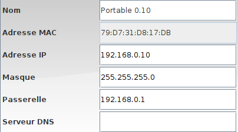\ \  

2. Définir la passerelle pour les trois portables du côté droit sur `192.168.1.1` en conséquence.
3. Essayer à nouveau la même connexion à l'aide de la commande `ping` depuis le `portable 0.10` vers le `portable 1.11`.  
Cela devrait fonctionner correctement cette fois, comme sur la figure ci-dessous.

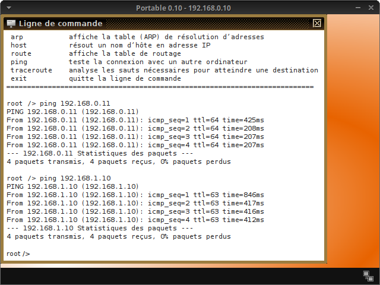\ \  

4. Lorsque vous regardez la fenêtre d'échange de données, vous pouvez constater que la première demande prend beaucoup plus de temps que les trois suivantes. En effet, la table de routage des deux _Switchs_ est vide au début et est ensuite créée après la première demande.  

\ 
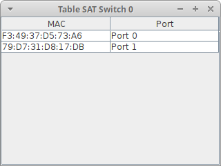\ 
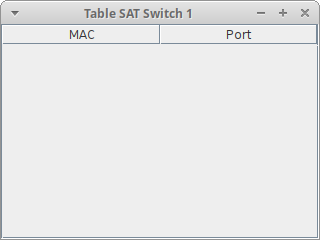\ 
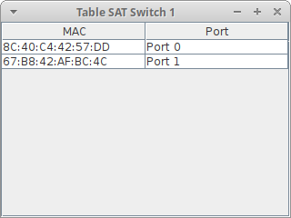\ \  

### Exercice 8
1. Essayer de tester le réseau avec un _client générique_ et un _serveur générique_.
2. Utiliser le `portable 1.10` pour installer le logiciel _Client générique_ et le connecter au `serveur 0.12`.  

\ \  

# Simulation du World Wide Web
### Exercice 9
Utiliser le `serveur 0.12` pour installer les logiciels _Serveur Web_ et _Editeur de textes_. Prendre l'éditeur de texte pour ouvrir le fichier `index.html` qui se trouve dans le répertoire virtuel `./webserver`. Le fichier peut être maintenant modifié afin de représenter les informations souhaitées. Vous pouvez le modifier comme bon vous semble. Nous avons déjà vu en début d'année dans le thème 2 comment rédiger une jolie page web ...  

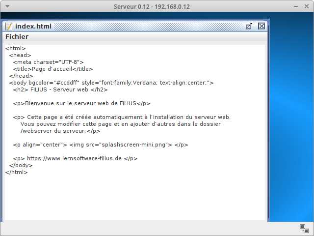\ \  

### Exercice 10
1. Sur le bureau du `serveur Web 0.12`, démarrer le logiciel _Webserver_ d'un double clic. Puis démarrer le _serveur Web virtuel_ en cliquant sur le bouton Démarrer :

\ \  

2. Après cela, passer à l'`ordinateur 1.10` pour installer le logiciel _Navigateur Web_. Démarrer le navigateur et essayer d'établir une connexion au serveur Web en tapant l'URL `http ://192.168.0.12` dans le champ d'adresse du navigateur Web :  

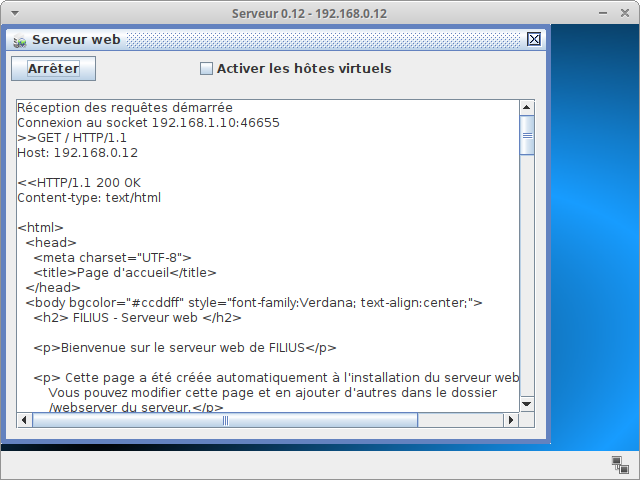\ 
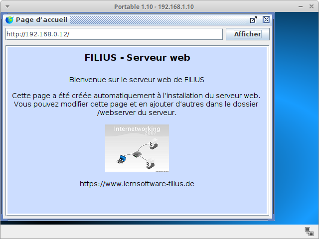\ \  

### Exercice 11
Nous avons établi une connexion, mais ce n'est pas comme cela que nous communiquons habituellement avec d'autres serveurs Web. Normalement, nous contactons un site Web en tapant son URL et non l'adresse IP du serveur Web. La résolution entre l'URL et l'adresse IP correspondante est effectuée par un serveur de noms de domaine, également appelé **serveur DNS**, que nous allons maintenant configurer.  

1. Créer un nouveau serveur avec l'adresse IP `192.168.2.10` (masque `255.255.255.0`) et la passerelle définie sur `192.168.2.1` (ce sera l'IP de l'interface du routeur branchée sur le serveur).
2. Changer le nombre d'interfaces du Routeur (clic droit sur le routeur, _paramètres_, _gérer les connexions_ puis _ajouter une interface locale_).  
Définir l'adresse IP `192.168.2.1` de cette nouvelle interface et renseigner le masque à `255.255.255.0`  
Enfin, connecter le nouveau serveur au Routeur avec un câble :

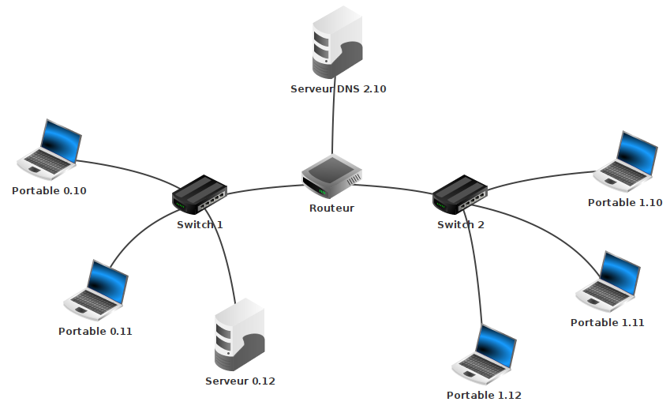\ \  
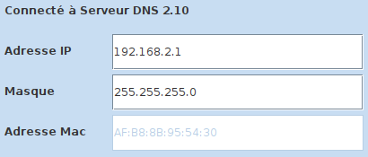\ 
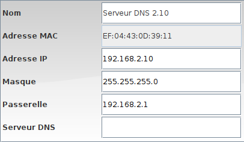\ 

3. Tester votre configuration à l'aide d'un ping 192.168.2.10 à partir d'un ordinateur quelconque du réseau pour vérifier que le `serveur DNS` est accessible.  

### Exercice 12
Pour permettre à tous les ordinateurs d'utiliser le service du serveur DNS, ajouter l'adresse IP du serveur DNS (`192.168.2.10`) à la configuration de chaque Portable.  

### Exercice 13
Il ne nous reste plus qu'à attribuer au serveur Web une URL appropriée et l'ajouter à la table de référence du serveur DNS afin que nous puissions l'atteindre par son nom et pas uniquement via son adresse IP.  

1. Pour cela, sélectionner le `serveur 2.10`. Installer et démarrer le logiciel _Server DNS_.  
Saisir `www.snt4ever.fr` dans le champ _Nom de domaine_ et `192.168.0.12` dans le champ Adresse IP.
2. Cliquer ensuite sur le bouton _Ajouter_ pour ajouter l'entrée au tableau de référence du serveur DNS.  

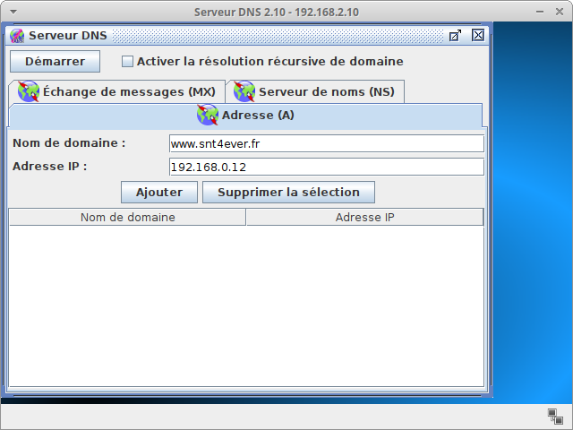\ 
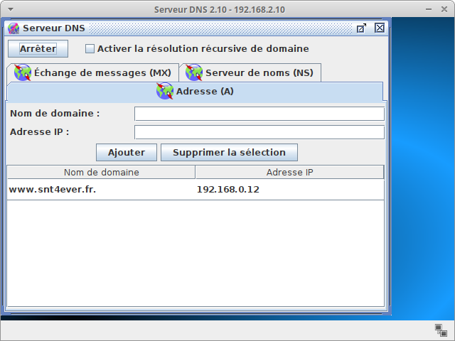\ \  

3. Enfin, démarrer le serveur DNS en cliquant sur le bouton _Démarrer_ et tester la connexion en utilisant le navigateur Web sur le `Portable 0.10` et en recherchant l'URL `http ://www.snt4ever.fr` (et non l'adresse IP comme lors de la première fois).  
\ \  

### Exercice 14
Au début de l'activité, nous avons appris la commande `host` dans le terminal. Essayer à nouveau d'utiliser la commande `host` avec l'URL `www.snt4ever.fr`. Constater que le Serveur DNS fait son travail et renvoie l'adresse IP du Webserver :  

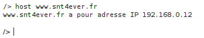\ \  

# Echanges de fichiers via peer-to-peer
### Exercice 15
_FILIUS_ offre la possibilité de connecter plusieurs ordinateurs à un réseau d'égal à égal et de partager des fichiers sur tout le réseau à l'aide du logiciel Gnutella. Tous les ordinateurs de ce type de réseau remplissent la fonction de client et peuvent se connecter à tous les autres ordinateurs du réseau. C'est pourquoi nous utilisons un ordinateur de type Portable pour cet exercice.  

1. Créer le réseau comme indiqué ci-dessous, en connectant trois Portables à l'aide d'un Switch à un réseau d'égal à égal. On pourrait ajouter des routeurs pour simuler les Box des différents lieux de connexion des ordinateurs mais cela n'apporterait rien au principe de **Pair à Pair**.

\ \  

2. Installer ensuite le logiciel _Gnutella_ sur les trois ordinateurs.
3. Installer les logiciels _Explorateur de fichiers_ et _Serveur Web_ pour le `Portable 0.10`
3. Démarrer l'explorateur de fichiers et copier le fichier `index.html` du répertoire `webserver` dans le répertoire `peer2peer` en utilisant un clic droit.
4. Ensuite, lancer le logiciel _Gnutella_ sur le `Portable 0.12` et rejoindre le réseau du `Portable 0.10` (adresse IP `192.168.0.10`). La liste des voisins connectés devrait s'actualiser automatiquement.
5. Rechercher dans le réseau `peer-to-peer` des fichiers nommés `index.html` et les télécharger.  

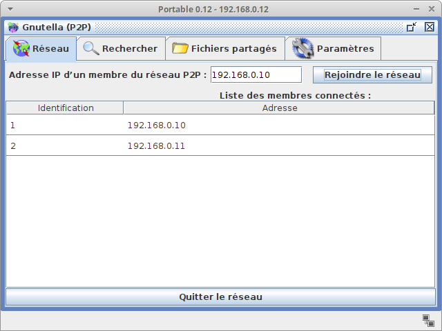\ 
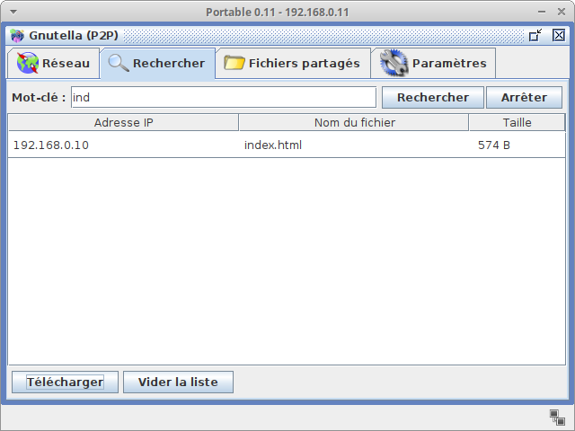\ \  

# Pour terminer la séance ... et la soirée !
### Exercice 16
Réaliser le réseau ci-dessous et le configurer pour pouvoir utiliser les services suivants :  

- Tous les masque de sous-réseau sont `255.255.255.0` ;
- site Web sous un nom de domaine précis à choisir vous-même ;
- serveurs mail ;
- DHCP (attribution automatique d'adresses IP) pour l'un des réseaux locaux.  

Ne pas hésiter à faire un peu de recherche pour la configuration des serveurs mail et DHCP.  

Dans chaque réseau local, l'un des `Portables` servira pour réceptionner les mails, un autre pour consulter les pages Web.  

Chaque réseau local disposera d'un logiciel _Gnutella_ installé sur l'un de ses ordinateurs pour échanger en Pair à Pair.  

\ \   

\ \  

\   

**Sources**  

- David ROCHE. Architectures matérielles et systèmes d'exploitation. [https://pixees.fr/informatiquelycee/n_site/nsi_prem.html](https://pixees.fr/informatiquelycee/n_site/nsi_prem.html)  (Consulté le 30 mars 2020)
- Daniel GARMANN et Gymnasium ODENTHAL. [https://www.lernsoftware-FILIUS.de](https://www.lernsoftware-FILIUS.de) (Consulté le 30 mars 2020)
- Stéphane KELLER. Filius : guide du débutant. [https://github.com/KELLERStephane/KELLER-Stephane-Tests2maths/blob/master/6 - Filius/Filius guide du debutant.pdf](https://github.com/KELLERStephane/KELLER-Stephane-Tests2maths/blob/master/6 - Filius/Filius guide du debutant.pdf)
(Consulté le 30 mars et 5 octobre 2020)