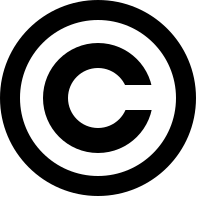
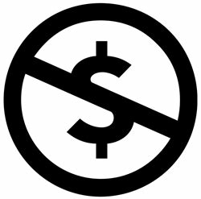
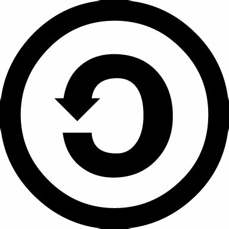
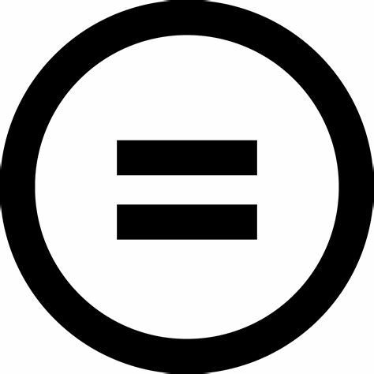
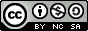
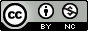
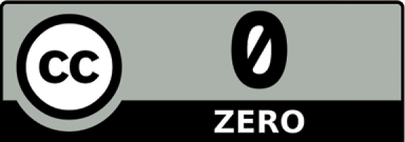
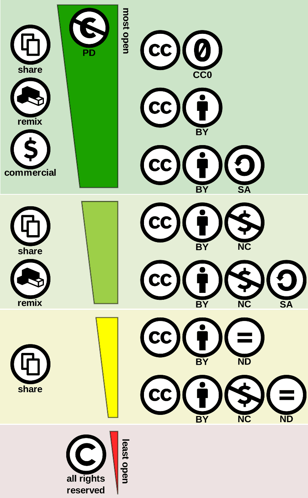

---
title: "Thème web - Chapitre 4 : Notions juridiques"
author: [Sébastien SAUVAGE]
date: "14/09/2022"
keywords: [SNT, WEB, Juridique, licence]
discipline: SNT
...
[^copyright]: Domaine public, [https://commons.wikimedia.org/w/index.php?curid=471019](https://commons.wikimedia.org/w/index.php?curid=471019)  

[^TradeMark]: Par Google — [https://github.com/android/platform_frameworks_base/blob/jb-mr2.0.0-release/data/fonts/AndroidEmoji.ttf](https://github.com/android/platform_frameworks_base/blob/jb-mr2.0.0-release/data/fonts/AndroidEmoji.ttf), Domaine public, [https://commons.wikimedia.org/w/index.php?curid=60124457](https://commons.wikimedia.org/w/index.php?curid=60124457)

[^Registered]: Par Roman Tworkowski — Travail personnel, Domaine public, [https://commons.wikimedia.org/w/index.php?curid=1085527](https://commons.wikimedia.org/w/index.php?curid=1085527)

[^CreativeCommon]: [https://creativecommons.org/licenses/?lang=fr-FR](https://creativecommons.org/licenses/?lang=fr-FR)  

[^Art_L111-3]: Art. L111-3 du code de la propriété intellectuelle.  

[^motifsCNIL]: Les 6 motifs sont disponibles ici : [https://www.cnil.fr/fr/reglement-europeen-protection-donnees/chapitre3#Article17](https://www.cnil.fr/fr/reglement-europeen-protection-donnees/chapitre3#Article17)  

\Huge \textbf{Thème 2 : Le web}\normalsize  

\ 

\huge \textbf{Chapitre 4 : Notions juridiques}\normalsize

\ 

Le Web est une source très importante d'information de toutes sortes. En particulier, nous pouvons y trouver des photos, des vidéos, de la musique, des écrits, des logiciels, etc.  

Ce n'est pas pour autant que le Web soit un lieu de non droit où chacun y fait ce qu'il veut. En effet, tout auteur dispose de droits sur son oeuvre, quelle qu'elle soit. Libre à lui, lorsqu'il dépose sur le Web cette dernière de céder des droits à l'utilisateur.  

# Droits et licences
## Copyright \ [^copyright] \   
**Copyright** (droit de copie) désigne un ensemble de lois en application dans les pays de common law (comme aux Etats-Unis, au Canada, en Australie, etc.).  

C'est-à-dire que la plupart des décisions de justice s'appuient sur des jurisprudences (décisions déjà prises dans des cadres similaires effectuées par le passé).  

Le copyright relève plus d’une logique économique et accorde un droit moral restreint, là où le droit d'auteur (voir plus loin) assure un droit moral fort en s'appuyant sur le lien entre l'auteur et son oeuvre.  

## Droit des marques
Le droit des marques confère à une entreprise, une association ou un particulier le monopole d'exploitation de la marque pour le type de produits ou services qu'elle accompagne.  

La marque est un signe permettant à un acteur économique ou social de distinguer les produits ou services qu'il distribue des produits ou services identiques ou similaires de ses concurrents.  

La marque constitue un capital immatériel pour son propriétaire, généralement une entreprise. Les entreprises protègent juridiquement leur marque pour des raisons financières, d’image de marque voire historique.  

### Trade-mark \ [^TradeMark] \   
Dans certains pays, comme les États-Unis, le simple usage d'un signe à titre de marque confère à une entreprise un monopole sur l'exploitation de ce signe en relation avec les produits ou services auxquels il se rapporte. Les concurrents ne peuvent donc utiliser ce signe pour le même type de produits ou de services.  

### Registered \ [^Registered] \   
Dans d'autres pays, comme la Belgique ou la France, la protection juridique est accordée à l'entreprise qui dépose un signe à titre de marque pour une ou plusieurs catégories de produits ou de services.  

## Licence libre
### Définition
**Une licence libre** s’applique à une oeuvre par laquelle l’auteur concède tout ou partie des droits que lui confère le droit d’auteur, en laissant au minimum quatre droits considérés fondamentaux aux utilisateurs :  

- la possibilité d’utiliser l’oeuvre, pour tous les usages ;
- la possibilité d’étudier l’oeuvre pour en comprendre le fonctionnement ou l’adapter à ses besoins ;
- modification (amélioration, extension et transformation) ou incorporation de l’oeuvre en une oeuvre
dérivée ;
- redistribution de l’oeuvre, c’est-à-dire sa diffusion à d’autres usagers, y compris commercialement.

### Principales licences libres

- Licences générales adaptées aux photos, cartes, textes, vidéos : certaines licences Creative Commons.
- Licences plutôt dédiées aux logiciels :  
    - GNU GPL (GNU General Public License)
    - GNU LGPL (GNU Lesser General Public License).  

### Licence libre de diffusion
**Une licence de libre diffusion** est une licence qui concède une partie seulement des quatre droits d'une licence libre.  

_Exemple_ :  

L’éditeur logiciel _Sun_ inclut dans certaines de ses licences l’interdiction d’usage dans le cadre de la fabrication de missiles, d’armes nucléaires, chimiques ou biologiques.  

### Principales licences de libre diffusion

- GPL (General Public License) et LGPL (Lesser General Public License)
- Creative Commons (les licences "NC" et "ND" sont bien des licences de libre diffusion, mais
ne sont pas considérées comme libres par les tenants de la définition originelle)
- CeCILL (licence libre française).

Une oeuvre sous licence libre est souvent (mais pas nécessairement) disponible gratuitement, tout comme une oeuvre disponible gratuitement n’est pas nécessairement libre.  

Le principe de licence libre n’interdit pas de faire payer l’accès à l’oeuvre.

## Les licences Créative Commons  [^CreativeCommon] \  
**Creative Commons** est une organisation multinationale à but non lucratif créée en 2001 au sein de l’université de Stanford. Cette organisation a été créée par Lawrence Lessig, grand spécialiste du droit sur internet et défenseur de la liberté du web.  

### Déclinaisons
Une licence Créative Commons se base sur le choix de conserver ou non chacun des quatre éléments suivants :  

\   

 \   

**Attribution (BY)** : toute utilisation doit mentionner le nom de l’auteur.  

\   

 \   

**Non commercial (NC)** : Pas d’utilisation commerciale sans autorisation de l’auteur.  

\   

 \   

**Partage dans les mêmes conditions (SA = Share Alike)** : toute adaptation ou modification doit être publiée avec la même licence Creative Commons.  

\   

 \   

**Pas de modification (ND = No Derivative works)** : Pas de modification sans autorisation de l’auteur.  

### Exemples
Même si théoriquement, il est possible de créer seize licences différentes, certaines n'ont pas forcément de sens et ce sont surtout les six suivantes qui sont utilisées.  

\   

Compléter la signification des différentes licences ci-dessous en prenant exemple sur la première licence :  

\   

 \   

Toute utilisation doit mentionner le nom de l'auteur, il est possible d'en faire un usage commercial, de modifier l'oeuvre et de la partager.  

\   

\   

 \   
\   
....................................................................................................................................  
\   
....................................................................................................................................  
\   

\newpage

 \   
\   
....................................................................................................................................  
\   
....................................................................................................................................  
\   

\   

 \   
\   
....................................................................................................................................  
\   
....................................................................................................................................  
\   

\   

 \   
\   
....................................................................................................................................  
\   
....................................................................................................................................  
\   

\   

 \   
\   
....................................................................................................................................  
\   
....................................................................................................................................  
\   

Tous les contenus diffusés sur Wikipédia sont sous licence Creative Commons BY-SA.

### La licence CC0  \  
**La licence CC0** donne aux auteurs la possibilité d’abandonner tous leurs droits d’auteur dans la limite de ceux exigés par la loi. Elle s’applique à toutes les juridictions et est similaire à d’autres licences libres ou open source, comme la licence BSD. L’abandon total des droits d’auteur étant impossible dans certains pays, cette licence est destinée à fournir le moyen le plus complet pour contribuer au domaine public quel que soit le pays concerné.  

### Bilan schématique des différentes licences Créative Commons
 \   

# Droits d'auteurs
Un auteur (ou ses ayants droits) d’une oeuvre originale est protégé par **le droit d’auteur**.  

C’est un droit "immatériel", indépendant du droit de propriété sur l’objet matériel qui sert de support à l’oeuvre (la toile, la pierre, le papier, etc.).  

L’acheteur du support de l’oeuvre n’acquiert donc pas, du seul fait de la vente, les droits sur l’oeuvre elle-même[^Art_L111-3] : **toute reproduction ou représentation de l’oeuvre doit se faire avec l’autorisation de l’auteur**.  

\   

Le droit d’auteur est composé de deux types de droits : **le droit moral** et **les droits patrimoniaux**.  

## Droit moral
La loi reconnaît à l’auteur un droit moral dont l’objet est de protéger, à travers l’oeuvre, la personnalité de l’artiste.  

Ce droit est :  

- **inaliénable** : l’auteur ne peut pas y renoncer, ni le céder à un tiers ;
- **imprescriptible** : il s’applique tant que l’oeuvre existe ;
- **perpétuel** : alors que les droits patrimoniaux s’éteignent 70 ans après la mort de l’auteur, le droit moral persiste au-delà de cette période. Ce sont alors les ayants droit de l’auteur qui l’exercent.  

Le code de la propriété intellectuelle reconnaît à l’auteur plusieurs prérogatives au titre du droit moral :

### Droit à la paternité
L’auteur a le droit d’exiger que, pour toute exploitation de ses oeuvres, son nom (ou éventuellement son pseudonyme) soit mentionné. Nul ne peut le forcer à y renoncer ou à accepter que l’oeuvre soit divulguée sous le nom d’un autre auteur. L’auteur garde toutefois la faculté, s’il le souhaite, de publier son oeuvre de manière anonyme.  

### Droit au respect de l'intégrité de l'oeuvre
L’auteur a le droit de s’opposer aux atteintes portées à l’intégrité de son oeuvre (modification, colorisation, destruction, démantèlement, agrégation à d’autres éléments...).  

### Droit de divulgation
L’auteur est le seul à pouvoir décider du moment et des modalités de la divulgation de son oeuvre. Nul ne peut le contraindre à rendre publique une oeuvre dont il n’est pas satisfait, quand bien même on lui en aurait passé commande.  

### Droit de repentir ou de retrait
L’auteur peut regretter d’avoir rendu publique une de ses oeuvres. La loi lui reconnaît le droit de revenir sur sa décision, même s’il a cédé ses droits d’exploitation. En pratique, ce droit est très rarement mis en oeuvre en cas de cession des droits, car la loi exige que l’auteur indemnise préalablement le cessionnaire du préjudice créé.  

\   

**Toute atteinte au droit moral est un acte de contrefaçon susceptible d’engager la responsabilité civile ou pénale de son auteur** : elle peut donner lieu au versement de dommages et intérêts ou au paiement d’une amende.  

## Droits patrimoniaux
La loi française reconnaît à l’auteur plusieurs **droits patrimoniaux** (exploitation économique sur l’oeuvre) :

### Droit de suite
Spécifique au domaine des oeuvres graphiques et plastiques. Permet à l’auteur de **percevoir un pourcentage sur le prix de toute vente (ou revente) de cette oeuvre** faite aux enchères publiques ou par
l’intermédiaire d’un commerçant, même si l’oeuvre originale a été cédée.  

Le droit de suite n’est pas exigible si le prix de vente de l’oeuvre est inférieur à 750 euros.  

### Droit de reproduction et d'adaptation
Permet à l’auteur (ou ses ayants droit) **d’autoriser ou d’interdire tout forme de reproduction** (partielle ou intégrale) de son oeuvre. Il en est de même pour la traduction, l’adaptation ou la transformation, l’arrangement ou la reproduction par un art ou un procédé quelconque.  

### Droit de représentation
Permet à l’auteur **d’autoriser ou d’interdire la communication de son oeuvre au public**, de manière directe (représentation d’un spectacle vivant, la projection publique d’un film ou la diffusion publique d’une musique) ou indirecte (en rendant l’oeuvre accessible au public par télédiffusion, streaming, etc.).  

\   

Les droits patrimoniaux durent pendant toute la vie de l’auteur et **persistent pendant les 70 années qui suivent son décès**.  

# Droits d'usage
Lorsque l’oeuvre a été divulguée, **l’auteur ne peut interdire** :  

- **Les représentations privées et gratuites** effectuées exclusivement dans un cercle de famille.
- **Les copies ou reproductions strictement réservées à l’usage privé** du copiste et non destinées à une utilisation collective, à l’exception des copies des oeuvres d’art destinées à être utilisées pour des fins identiques à celles pour lesquelles l’oeuvre originale a été créée.
- Sous réserve que **soient indiqués clairement le nom de l’auteur et la source** :
    a) **les analyses et courtes citations** justifiées par le caractère critique, polémique, pédagogique, scientifique ou d’information de l’oeuvre à laquelle elles sont incorporées ;
    b) les revues de presse ;
    c) **la diffusion, même intégrale, par la voie de presse ou de télédiffusion, à titre d’information d’actualité**, des discours destinés au public prononcés dans les assemblées politiques, administratives, judiciaires ou académiques, ainsi que dans les réunions publiques d’ordre politique et les cérémonies officielles ;
- **La parodie, le pastiche et la caricature**, compte tenu des lois du genre.

# Droits à l'image
## Définition
C’est **un droit exclusif que vous avez sur votre image et l’utilisation qui en est faite**.  

Les images peuvent être des photos ou vidéos sur lesquelles vous apparaissez et êtes reconnaissable ou identifiable, quel que soit le contexte : vacances, événement familial, manifestation culturelle ou religieuse, etc.  

## Exceptions
**Certaines images ne nécessitent pas d’autorisation** des personnes concernées, sous réserve de ne pas porter atteinte à la dignité de la personne représentée.  

### Exemples

- images d’événements d’actualité qui peuvent être publiées sans l’autorisation des participants au nom du droit à l’information ou de création artistique ;
- images de personnalités publiques dans l’exercice de leur fonction (élus par exemple) à condition de les utiliser à des fins d’information ;
- images illustrant un sujet historique.

## Remarques intéressantes

- photographier une foule peut être possible mais les individus "ciblés" ne doivent pas être pris en gros plan.  
Exemple : la publication de photographies de deux célébrités, prises lors du tournoi de tennis de Monte-Carlo, à l’insu des intéressés et avec un cadrage les isolant du public environnant, est illicite ;
- **pour qu’une image soit protégée, il suffit que la personne concernée soit identifiable** (et non pas reconnaissable).  

\newpage

# Droit à l'oubli et RGPD
## Explications

**_LE DROIT A L'OUBLI SUR INTERNET : Le RGPD, c'est quoi ?_** _(3:50)_ : [https://youtu.be/-dsnfyuSjm4](https://youtu.be/-dsnfyuSjm4)  

## A retenir sur le RGPD
 \   

- Adopté par le Parlement européen en avril 2016.
- Applicable dans les 28 États membres à partir du 25 **mai 2018**.
- L’article 4 du Règlement européen définit **le profilage** comme étant : "_toute forme de traitement automatisé de données à caractère personnel consistant à utiliser ces données à caractère personnel pour évaluer certains aspects personnels relatifs à une personne physique, notamment pour analyser ou prédire des éléments concernant le rendement au travail, la situation économique, la santé, les préférences personnelles, les intérêts, la fiabilité, le comportement, la localisation ou les déplacements de cette personne physique_".  
Le profilage a donc pour but de collecter des informations sur un individu ou un groupe d’individus afin d’analyser leurs caractéristiques et leurs comportements pour les placer dans une certaine catégorie et/ou de prédire ou d’évaluer certaines de leurs caractéristiques tels que la capacité à réaliser une tâche, leurs intérêts, ou anticiper leur comportement.  
L’article 21 du RGPD précise que "_la personne concernée a **le droit de s’opposer à tout moment [...] à un traitement des données à caractère personnel la concernant, y compris un profilage**_".
- S’applique aux entreprises de l’UE mais **également aux sociétés non européennes** si elles ciblent des résidents de l’UE par le profilage ou leur proposent des biens et services.
- Les entreprises et organismes doivent donner aux citoyens davantage de contrôle sur leurs données privées, notamment via **l’acceptation des cookies sur les sites internet et sur le contrôle de l’utilisation qui est faite des données** que les internautes envoient dans les formulaires de contact.  
Par exemple, il n’est plus possible que la case _j’accepte de recevoir la newsletter_ soit pré-cochée lors de l’envoi d’un formulaire de contact dans lequel l’e-mail est renseigné.
- **Droit à l’effacement** : la personne concernée a le droit d’obtenir (pour 6 motifs [^motifsCNIL]) du responsable du traitement l’effacement, dans les meilleurs délais, de données à caractère personnel la concernant.
- **Notification** à la CNIL, sous 72 heures, **en cas de fuite de données**.
- En cas de non-respect : **sanctions financières** allant jusqu’à 4 % du chiffre d’affaires mondial annuel d’une entreprise ou **20 millions d’euros** (le montant le plus élevé étant retenu).

**Sources**  

- [https://www.mathemathieu.fr/classes/secondes-snt/snt-5-web](https://www.mathemathieu.fr/classes/secondes-snt/snt-5-web),consultée le 14 septembre 2022.
- [https://fr.wikipedia.org/wiki/Droit_des_marques](https://fr.wikipedia.org/wiki/Droit_des_marques), consultée le 14 septembre 2022.
- [https://www.legifrance.gouv.fr](https://www.legifrance.gouv.fr), consultée le 14 septembre 2022.
- [https://www.adagp.fr](https://www.adagp.fr), consultée le 14 septembre 2022.
- [https://creativecommons.org/licenses/?lang=fr-FR](https://creativecommons.org/licenses/?lang=fr-FR), consultée le 14 septembre 2022.
- [https://www.cnil.fr/](https://www.cnil.fr/), consultée le 14 septembre 2022.