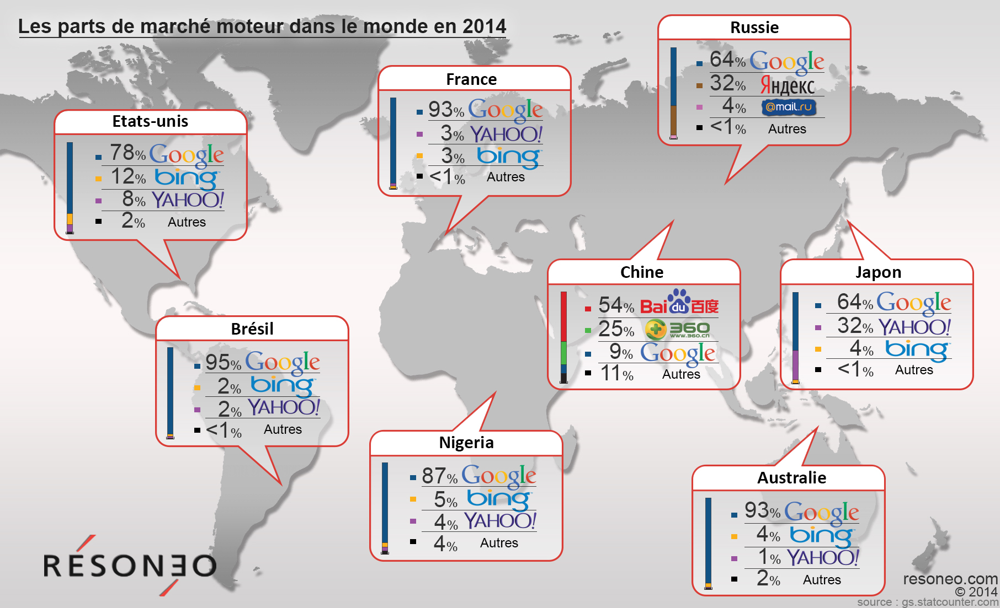
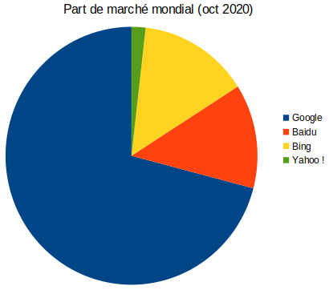
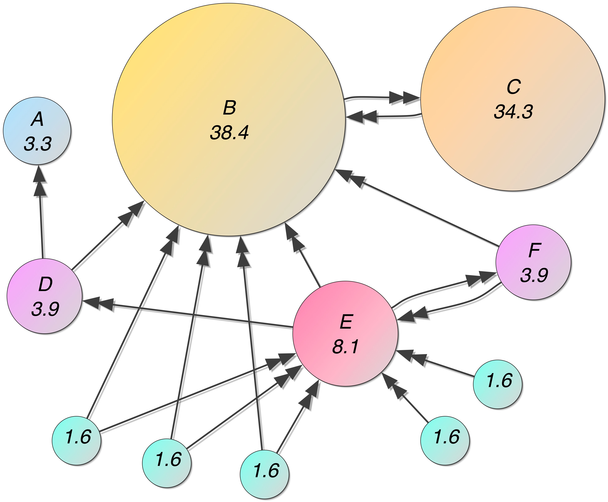
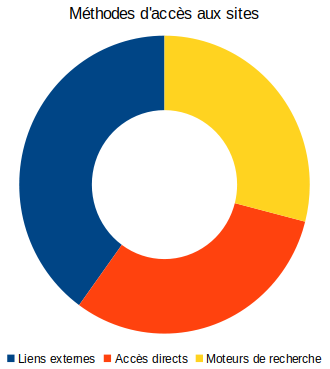
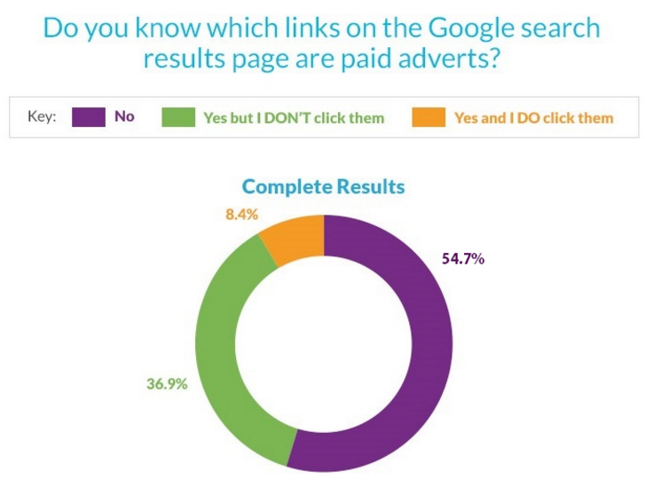
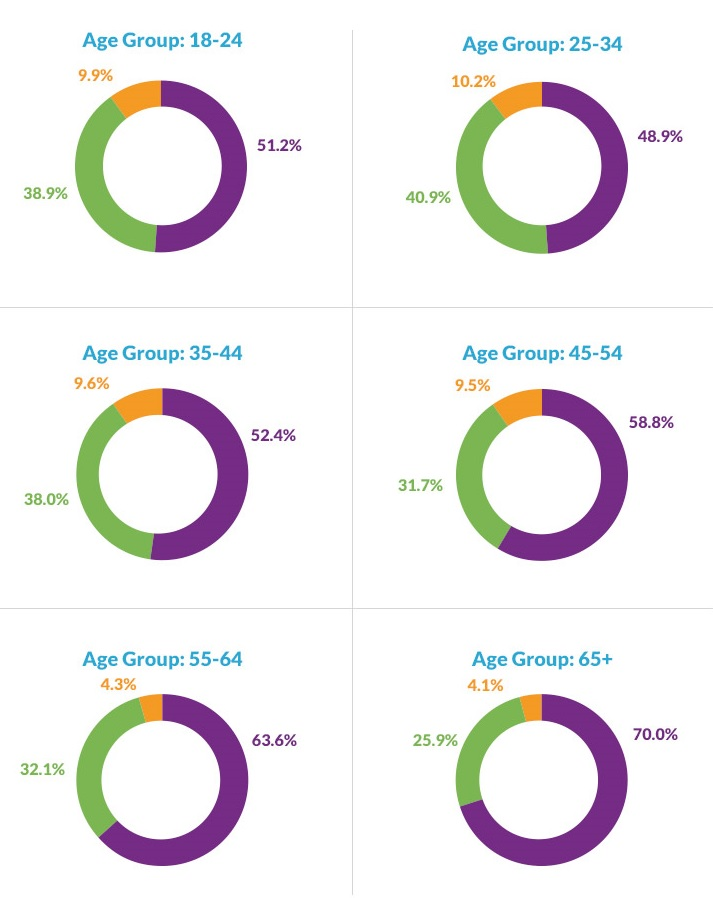
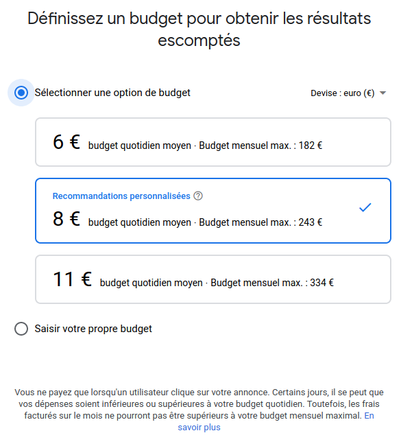

---
title: "Thème web - Chapitre 5 : Les moteurs de recherche"
author: [Sébastien SAUVAGE]
date: "04/10/2022"
keywords: [SNT, WEB, Moteurs, recherche]
discipline: SNT
...
[^Panorama]: **Sources** : [https://www.resoneo.com/wp-content/uploads/ancien/2014/07/Carte_infographie_part-trafics-moteurs-de-recherche.jpg](https://www.resoneo.com/wp-content/uploads/ancien/2014/07/Carte_infographie_part-trafics-moteurs-de-recherche.jpg) et [https://gs.statcounter.com/#search_engine-ww-monthly-201406-201406-bar](https://gs.statcounter.com/#search_engine-ww-monthly-201406-201406-bar)  

[^PartsMarche]: **Source** : [https://www.netmarketshare.com](https://www.netmarketshare.com)  

[^PageRank]: **Source** : [https://en.wikipedia.org/wiki/File:PageRanks-Example.jpg](https://en.wikipedia.org/wiki/File:PageRanks-Example.jpg)  

\Huge \textbf{Thème 2 : Le web}\normalsize  

\ 

\huge \textbf{Chapitre 5 : Les moteurs de recherche}\normalsize

\ 

Internet est un réseau informatique mondial qui interconnecte des réseaux. Cette infrastructure permet de nombreux services et applications dont le web, qui l’a popularisé à partir des années 1990. Le web est un ensemble de pages associées par des liens hypertextes et lisibles par un navigateur.  

\   

Le volume des données numériques dans le monde double tous les 18 mois (règle des trois V : vitesse, volume, variété). Il convient donc, notamment sur le web, d’**organiser ces données** dans l’intérêt :

- de l’utilisateur pour qu’il trouve les informations pertinentes quant à ses besoins,
- du producteur qui a priori souhaite la diffusion et la valorisation de son travail.

Les ressources du web :

- ont été référencées dans un premier temps par des annuaires ou, de façon thématique, par des portails réalisés par des humains,
- puis sont apparus des outils automatisés : les moteurs de recherche.

Un moteur de recherche est une application web qui permet de trouver des ressources (pages web, images, ...) à partir de requêtes (généralement sous forme de mots).  

# Introduction
## Exercice : fonctionnement
Après quelques recherches éventuelles, répondre par oui ou non aux questions suivantes :  

1. Un moteur de recherche explore le web après validation des critères de recherche. \dotfill
2. Pour les mêmes mots clés, différents moteurs donnent les mêmes résultats. \dotfill
3. Les résultats des moteurs de recherche sont subjectifs. \dotfill
4. Les résultats des moteurs de recherche sont neutres. \dotfill
5. Les algorithmes des moteurs de recherche évoluent. \dotfill
6. Toutes les pages du web sont recensées par les moteurs de recherche. \dotfill
7. Pour les mêmes mots clés et un même moteur, les résultats peuvent différer. \dotfill
8. Certains résultats ont été « achetés ». \dotfill
9. Tous les moteurs de recherche personnalisent les résultats. \dotfill
10. Dans une bibliographie, on peut citer un moteur de recherche en tant que source de données. \dotfill
11. Certains moteurs de recherche font appel à d’autres moteurs de recherche. \dotfill

## Exercice : Utilisation des mots clés
1. Un mot écrit en minuscule ou en majuscule donne les mêmes résultats. \dotfill
2. Un mot, qu’il soit accentué ou non, donne les mêmes résultats. \dotfill
3. L’operateur booléen ET est toujours choisi par défaut. \dotfill
4. Il est conseillé de mettre les expressions entre guillemets. \dotfill
5. Les résultats trouvés changent en fonction de l’ordre des mots. \dotfill

## Exercice : Panorama des moteurs de recherche

[^Panorama] \hfill [^PartsMarche] \   

1. Des « parts de marché » sont données pour les moteurs de recherche : quel est le marché associé ?  
\   
....................................................................................................................................  
2. Quelle est l’importance de _Google_ en tant que moteur de recherche ?  
\   
....................................................................................................................................  

# Fonctionnement des moteurs de recherche
Un moteur de recherche effectue principalement trois actions :  

- **l’exploration** (_crawl_) permanente du web, en accès public, par des logiciels appelés robots d’indexation,
- **l’indexation** des contenus explorés associe des mots clés à des contenus jugés pertinents,
- **la recherche** répond à des requêtes en explorant l’index (déjà constitué, ce qui explique la rapidité des résultats : le moteur ne parcoure pas le web à chaque requête).

Toutes les ressources ne sont pas référencées (le _darknet_ et le _deepweb_ ou web profond, par exemple les parties privées des sites).  

## Exercice : Indexation par les moteurs de recherche

1. Qu’est-ce qu’un index dans un document ?  
\   
....................................................................................................................................
2. Une indexation de tous les mots d’un texte est-elle pertinente ?  
\   
....................................................................................................................................
3. _La recherche de termes dans un document PDF s’effectue par défaut par balayage de l’intégralité du texte du début à la fin (ce qui peut prendre du temps pour un long document)._  
_Un index peut-être constitué au préalable : il recensera les mots pertinents du document et leur emplacement dans une base de données. Les recherches s’effectueront ensuite dans cet index (plus court que le document) et seront donc plus rapides._  
\   
À titre d’exemple, on souhaite établir l’index des termes des deux paragraphes ci-dessus.  
Souligner les termes à indexer ; relever une difficulté.  
\   
....................................................................................................................................
4. Des moteurs de recherche indexent des images selon différents critères.

a. En vous rendant sur le moteur de recherche `Qwant`, rechercher des images à l'aide du mot clé `web`, de `taille moyenne`, dans le `domaine public`, plutôt `jaunes`, et de type `photo`.  
Que représente la première photo obtenue ?  
\   
....................................................................................................................................
b. Indiquer pour chacun des cinq critères de sélection ci-dessous, s’il est fondé sur des métadonnées et/ou sur l’analyse du contenu de l’image :  
La taille : \dotfill   
.\   
La licence : \dotfill    
.\   
La période de publication : \dotfill   
.\   
La couleur : \dotfill   
.\   
Le type : \dotfill   

# Référencement naturel
Les résultats issus de la recherche dans l’index sont appelés **résultats naturels** (ou référencement naturel). Ces résultats sont classés selon les critères choisis par les concepteurs des algorithmes du moteur de recherche : ce **classement des résultats** est donc **subjectif** et non neutre (malgré son caractère automatique).
Les résultats sont notés (selon une échelle logarithmique de 0 à 10 pour le _PageRank_ de _Google_). Une ressource est supposée de qualité ou pertinente si elle est pointée par beaucoup de liens, les sites de provenance étant eux-mêmes notés selon leur réputation (_TrustRank_ chez _Google_).  

[^PageRank]\   

## Exercice : Enjeu du référencement
L’accès à des sites web découle de trois méthodes :

- les liens externes (liens hypertextes en provenance d’un autre site)
- les accès directs (saisie directe de l’URL ou appel à un favori/marque-page)
- les moteurs de recherche

 \   

1. Ecrire une démarche éco-responsable pour accéder à un site régulièrement.  
\   
....................................................................................................................................
2. Quel est l’enjeu du référencement par un moteur de recherche pour un site ?  
\   
....................................................................................................................................  
\   
....................................................................................................................................  

_Pour aller plus loin, un petit article sur la remise en question de la neutralité de Google comme moteur de recherche, publié en octobre 2016_ :  

_https://www.numerama.com/tech/205099-lincident-entre-protonmail-et-google-ou-lenjeu-de-la-neutralite-des-moteurs-de-recherche.html_  

## Exercice : Sur Internet, l’invisible propagande des algorithmes
**There are no « regular results » on Google anymore (1:21)** : [https://youtu.be/PlVN5IGBnWQ](https://youtu.be/PlVN5IGBnWQ)  

\   

_Deux personnes opposées politiquement, l’une de droite, l’autre de gauche, lancent une recherche Google sur « BP ». La première reçoit, en tête de page, des informations sur les possibilités d’investir dans la British Petroleum, la seconde sur la dernière marée noire qu’a causée la compagnie pétrolière britannique [...] des réponses diamétralement opposées car elles ont été « filtrées » par Google selon le profil des internautes. [...]_  

_Cass R. Sunstein, professeur de droit à Harvard [...] craint qu’en proposant en priorité aux usagers du Web ce qu’ils aiment et pensent déjà, le Net les emprisonne dans un monde égocentré, qu’il les traite en consommateurs au lieu de les aider à se comporter en citoyens ouverts et pluralistes. [...]_  

_[...] D’après la théorie de la bulle filtrante, les algorithmes de Google sélectionnent les résultats présentés en fonction des internautes en s’appuyant sur 57 signaux différents : âge, sexe, dernières recherches, géolocalisation, navigateur utilisé, résolution de l’écran, services visités, fréquence des clics, raccourcis, etc. Et ce filtrage est encore plus développé [...] sur les réseaux sociaux. [...]_  

_Une étude de l’université britannique d’Oxford, menée en juin 2016 dans vingt-six pays auprès de 50 000 personnes, [le] confirme [...] : 51 % des internautes ont déclaré s’informer via les réseaux sociaux, qui constituent la première source de nouvelles pour 12 % d’entre eux – et 28 % chez les 18-24 ans._  

_En nous informant de plus en plus auprès d’« amis » dont nous faisons circuler sans les discuter les posts, vidéos et hashtags – voire les trolls et les théories de la conspiration –, nous finissons par vivre, estime Eli Pariser (spécialiste du cyberespace), dans une prison mentale dorée où plus rien ne nous dérange. [...]_  

\hfill _Frédéric Joignot, Le Monde, 15/09/2016_  

1. Les résultats naturels sont-ils « naturels » ? Expliquer.  
\   
....................................................................................................................................  
\   
....................................................................................................................................  
2. Les moteurs de recherche sont-ils des outils neutres et objectifs ? Expliquer.  
\   
....................................................................................................................................  
\   
....................................................................................................................................  
\   
....................................................................................................................................  
\   
....................................................................................................................................  

Certains moteurs personnalisent les résultats en fonction du profil de l’internaute (57 signaux chez Google : âge, sexe, géolocalisation, historique de navigation, navigateur utilisé, résolution de l’écran, fréquence des clics, raccourcis). D’autres s’interdisent l’utilisation de ces données personnelles.  

La personnalisation des résultats est aussi une exclusion de résultats censés ne pas nous convenir et nous enferme dans une bulle informationnelle filtrante, renforçant nos idées (et préjugés) au lieu de les ouvrir en étant confrontés à des idées opposées.  

# Enjeux du référencement
Un internaute accède à une ressource :  

- soit parce qu’il en connaît l’adresse (éventuellement stockée dans ses marque-pages),
- soit parce qu’elle lui a été fournie par un autre site qui la référence (fait un lien vers elle), les principaux sites de référencement étant les moteurs de recherche (puis les portails et annuaires).

Le trafic d’un site dépend donc largement de son bon référencement. Il existe des méthodes et outils pour assurer un bon référencement naturel (sachant que les algorithmes des moteurs de recherche se modifient sans cesse pour contrer les techniques de détournement : liens croisés artificiels, bourrages de mots clés, ...).  

Outre le référencement naturel, il existe un référencement payant consistant à acheter des mots-clés afin qu’un lien sponsorisé soit affiché (distinctement) en complément du référencement naturel.  

## Exercice
**Étude IFOP**  

_Cette étude pointe [...] l’importance des liens sponsorisés dans l’utilisation des moteurs de recherche par les Français : 52 % des internautes qui utilisent Google cliqueraient sur les liens AdWords, et seulement 10 % rapportent ne jamais cliquer sur ces annonces. L’étude indique, par ailleurs, que 53 % des internautes désirant acheter un produit utiliseraient les liens Google AdWords pour le trouver._
_Les résultats concernant les perceptions des annonces AdWords sont encourageants, mais mettent en évidence quelques limites. On apprend par exemple que 36 % des utilisateurs de Google ne savent pas qu’il s’agit d’une publicité lorsqu’ils cliquent sur une de ces annonces. Parmi les 64 % d’internautes qui ont conscience de cliquer sur des publicités, 70 % estimeraient qu’elles correspondent à leurs besoins : un résultat plutôt positif, sauf si l’on considère que seulement 10 % sont entièrement satisfaits._
\hfill _www.frenchweb.fr, 19 juin 2013_  

1. Quels sont les deux types de liens proposés par un moteur de recherche ?  
\   
....................................................................................................................................  
2. Voici les résultats d’une étude menée en Grande-Bretagne en juillet 2016 (après la mise en place des labels verts) :  
\  \   
Quelle part d’internautes n’ont pas conscience que certains liens sont sponsorisés ?
\   
....................................................................................................................................  
3. L’optimisation du classement dans les résultats naturels d’un moteur est-il possible ? Expliquer.  
\   
....................................................................................................................................  
\   
....................................................................................................................................  

\newpage

## Exercice : Faire une campagne de référence payant
Voici une campagne sous _Google Ads_ ([https://ads.google.com/intl/fr_fr/home/](https://ads.google.com/intl/fr_fr/home/)) :  

 \  \   

1. Combien me coûtera mensuellement l’annonce que je souhaite effectuer ?  
\   
....................................................................................................................................
2. Vais-je payer 8€ chaque jour ?  
\   
....................................................................................................................................
3. Comment le ciblage géographique par zone fonctionne-t-il ?  
\   
....................................................................................................................................
4. À quoi reconnaîtra-t-on qu’il s’agit de référencement payant ?  
\   
....................................................................................................................................
5. D’autres annonceurs pourraient-ils utiliser les mêmes mots clés ?  
\   
....................................................................................................................................
6. Comment pourraient-ils être mieux placés que moi ?  
\   
....................................................................................................................................  

**Explications _Google Adwords_, un référencement selon son budget (2:55)** : [https://youtu.be/da7TkcLXRdU](https://youtu.be/da7TkcLXRdU)  

# Modèle économique des moteurs de recherche
Les moteurs de recherche se financent principalement par :  

- le référencement payant (2/3 des revenus du moteur _Google_, plus de 50$ annuels par utilisateur),
- la vente de technologie aux organisations qui ont besoin de moteurs internes à leur système d’information.

Un clic est une information pour le moteur de recherche qui présume que le résultat présenté était donc pertinent, cela permettre d’« améliorer » les résultats futurs. L’internaute apporte donc, bénévolement et sans le percevoir, de la valeur au moteur de recherche et sans contrepartie financière (mais avec une potentielle amélioration du service ?). On nomme cela **le digital labor**.

\newpage

## Exercice : Bruxelles accuse Google d’abus de position dominante
**Article 1**  

_[...] La Commission [européenne] craint que les utilisateurs de Google « ne voient pas nécessairement les résultats les plus pertinents en réponse à leurs requêtes ». [...]_  

_La trentaine de plaignants (dont Microsoft) qui accusent la multinationale de mettre davantage en avant ses services que les leurs dans les résultats de recherche des internautes sur son moteur [...]_  

_Le géant de l’Internet risque une amende pouvant aller jusqu’à 10 % de son chiffre d’affaires mondial (soit plus de 6 milliards d’euros). Mais ce ne serait pas le pire pour un groupe aussi riche (66 milliards de dollars de chiffre d’affaires en 2014, soit 62 milliards d’euros, pour 14 milliards de dollars de profits)._  

_La Commission pourrait surtout lui imposer des actions « correctives » de nature à transformer son modèle économique. « Peut-être une séparation radicale, dans le résultat des recherches, entre les liens sponsorisés et les autres résultats de recherche », suggère un bon connaisseur bruxellois du dossier. [...]_  

\hfill _Cécile Ducourtieux, Le Monde, 15 avril 2015_  

\   

**Article 2**  

_Après sept longues années d’enquête, la Commission européenne sort le carton rouge contre Google. Le géant américain se voit condamné à une amende record, d’un montant de 2,42 milliards d’euros, dès mardi 27 juin [2017], pour abus de position dominante. [...]_  

_C’est le service en ligne Google Shopping (un comparateur de prix) que ciblent les services de la commissaire à la concurrence, Margrethe Vestager. [...] « Google a lancé des produits qui ont réellement modifié nos vies, pour autant, sa stratégie ne s’est pas juste au bénéfice des consommateurs. Google a abusé de sa position dominante en promouvant son propre service de comparateurs de prix, c’est illégal au regard des règles européenne anti trust » a estimé Margrethe Vestager, mardi. [...]_  

_Au début des années 2010, Google Shopping s’appelait Froogle et [...] faisait apparaître les produits les moins chers des marchands, allant lui-même chercher les bonnes réponses sur le Web. En 2012, Google rebaptise son service Google Shopping et y applique son modèle publicitaire classique [...] : les annonceurs paient pour faire remonter leurs produits, qui ne s’affichent que lorsqu’ils correspondent aux requêtes des internautes. L’espace n’est pas fermé aux autres comparateurs de prix, qui peuvent comme les marchands apparaître dans Google Shopping en mettant en avant des produits. Mais ils se sont plaints d’être moins bien traités que les marchands dans les résultats de recherche, de n’apparaitre qu’à partir de la 3ème ou 4ème page de recherches. [...]_  

_Au-delà de l’amende, qui pèse peu au regard des résultats du groupe en 2016 (80,4 milliards d’euros de chiffre d’affaires et 17,8 milliards d’euros de profits), ce sont les mesures correctives imposées à Google que vont scruter les spécialistes et les multiples plaignants du groupe. Habile, la commission a laissé à Google le soin de trouver ses propres solutions techniques pour « rentrer dans le rang » comme précisé par Mme Vestager._  

_Seule condition à respecter : « l’égalité de traitement entre les services concurrents de comparaison de prix et son propre service ». [...]_  

\hfill _Cécile Ducourtieux, Le Monde, 27 juin 2017_  

\   

**Article 3**  

_Condamné en juin [2017] à une amende record par Bruxelles pour abus de position dominante, Google a déposé un recours en annulation, a-t-on appris lundi 11 septembre [2017]. [...]_  

_L’examen de ce recours devrait prendre [deux ans] étant donné la complexité de l’affaire [...], a-t-on indiqué à la Cour de justice de l’UE. Ce recours n’est pas suspensif. [...] L’entreprise peut néanmoins [...] déposer l’argent auprès d’une banque sur un compte bloqué, jusqu’à ce qu’une décision tranche le différend. [...]._  

_Bruxelles a sur le feu deux autres cas d’abus de position dominante, pour lesquels il pourrait aussi sanctionner Google : Android, son système d’exploitation sur smartphone et AdSense, sa régie publicitaire._  

\hfill _Le Monde, 11 septembre 2017_  

1. À qui la position dominante de Google nuit-elle ?  
\   
....................................................................................................................................  
2. La position dominante de Google présente-t-elle des risques pour les internautes ? Expliquer.  
\   
....................................................................................................................................  
\   
....................................................................................................................................  
\   
....................................................................................................................................

Cette affaire est toujours en cours :  

Concernant _Google Shopping_, _Android_ et _AdSense_, toutes propriétés de _Google_, des amendes respectives de 2,42, 4,3 et 1,5 milliards d’euros ont été prononcées en juin 2017, juillet 2018 et mars 2019. _Google_ a fait appel de ces décisions.  

Le 10 novembre 2021, la cours européenne de justice a rejeté l'appel concernant _Google Shopping_. Le 14 septembre 2022 la cours de justice européenne a rejeté l'appel de _Google_ concernant _Android_, elle s'est contenté de diminué à 4,1 milliards d'euros le montant de la sanction.  

## Exercice : Les alternatives
_Sur Qwant, 30 % des requêtes génèrent un affichage publicitaire et 4 % des internautes cliquent dessus. « Au final, chaque internaute nous rapporte 12 € par an. [...] », se félicite [Eric Léandri, son fondateur]._  

_Lancé en 2013, Qwant n’a cessé de croître grâce à un positionnement clair sur la protection des données personnelles. « Nous ne pistons pas des utilisateurs, nous ne conservons aucune donnée, même pas l’adresse IP. Pas besoin de savoir si vous êtes gay, de droite ou malade pour vous donner les réponses de l’Internet »._  

_Si Qwant est assez solide pour espérer atteindre 5 à 10 % du marché de la recherche en ligne dans les trois prochaines années, c’est aussi parce qu’il est indépendant de Google. Si, pour l’affichage de la publicité, il dépend de Bing [...], le moteur affirme qu’il possède son propre robot d’indexation du Web et son algorithme de recherche à lui. Les « vrais » moteurs de recherche se comptent sur les doigts des mains : [...] Google, Bing, Yahoo !, Baidu (Chine), Naver (Corée du Sud), Yandex (Russie) et Seznam (République tchèque). [...] Du coup, en France et ailleurs, tous les moteurs alternatifs [(Ecogine, Ecosia, ...) utilisent la technologie] de Google, Bing et Yahoo !. [...] Une recherche sur ces moteurs les enrichit aussi (Google facture 750 $/an pour 150 000 requêtes annuelles et il touche une partie des revenus publicitaires générés par les clics des internautes)._  

_[Les moteurs à visée écologique (redistribution d’une partie des recettes dans des projets environnementaux) consomment leur propre énergie, qui n’aurait pas lieu d’être en faisant les requêtes directement sur Google ... Ces moteurs investissent dans des programmes de compensation (et se donnent ainsi un droit à polluer ?).]_  

\hfill _Que Choisir n°557, Avril 2017, p 22-23_  

Certains moteurs de recherche conservent des informations sur :

- les dates de toutes vos visites,
- tous les mots-clés que vous entrez,
- tous les liens sur lesquels vous cliquez.

... pendant une durée minimum de 6 mois.  

Comment éviter les risques mis en évidence auparavant ?  
\   
....................................................................................................................................  
\   
....................................................................................................................................  

\   

_Pour aller plus loin :_  

_https://www.1ere-position.fr/blog/10-meilleurs-moteurs-de-recherche-alternatifs-google/_  

_https://www.clubic.com/telecharger/actus-logiciels/article-843987-1-google-qwant-duckduckgo-comparatif-6-moteurs-recherche.html_  

# Progrès technique
Les moteurs de recherche progressent pour :

- indexer tous types de contenus (pas seulement textuels),
- interpréter la sémantique des termes (savoir distinguer « jaguar » en tant qu’animal ou en tant que voiture, sélectionner un article sur la « récolte du blé en France » en réponse à une question sur la « culture des céréales en Europe », ...),
- permettre les requêtes en langage naturel (poser une question) et fournir une réponse plutôt qu’une liste de ressources y
répondant.

## Exercice : Déréférencement

**2010** : Un internaute espagnol demande à l’autorité espagnole de protection des données la suppression de deux articles concernant ses anciennes dettes, et à _Google_ de désindexer ces articles (qu’il n’apparaissent plus dans les résultats de recherche).  

L’affaire est finalement renvoyée vers la cour de justice de l’UE (CJUE).  

**2014** : La CJUE consacre le droit à l’oubli en indiquant qu’un moteur de recherche est responsable du traitement consistant à fournir des résultats et qu’à ce titre il doit appliquer le droit à l’oubli et déréférencer des articles lorsqu’il y a un intérêt légitime du demandeur (des exceptions peuvent toutefois être admises pour des personnes jouant un rôle public et si l’intérêt du
public l’emporte).  

_Google_ met à disposition en mai un formulaire de demande de déréférencement.  

**déc 2014** : _Google_ a reçu environ 150 000 demandes dans l’UE , concernant 500 000 résultats de recherche. Environ 40 % des demandes ont été satisfaites ; par exemple :

- une victime d’agression a pu obtenir la disparition des liens vers des articles évoquant cette agression, afin de faciliter sa « reconstruction »,
- l’auteur d’un délit dont la condamnation a été rendue publique lui n’a pas obtenu gain de cause, du moins tant que sa condamnation reste récente.

Selon la loi du 29 juillet 1881 sur la liberté de la presse, les articles en eux-mêmes peuvent rester en ligne s’ils n’ont pas été jugés diffamatoires (une éventuelle plainte doit être déposée dans les 3 mois suivant leur publication) ; ils peuvent parfois faire l’objet d’un droit de réponse.  

**2015** : En mai, **la CNIL** met en demeure _Google_ de procéder au déréférencement sur toutes ses extensions (un lien qui a disparu sur les extensions européennes peut rester visible sur google.com). Le recours gracieux de _Google_ est rejeté en septembre, la société s’expose à des sanctions.  

**2016** : En janvier, _Google_ propose d’étendre le déréférencement sur toutes les extensions européennes de son moteur et un filtrage géographique de référencement sur le moteur du pays du plaignant.  

En mars, le CNIL considérant que les résultats sont toujours accessibles (notamment à partir du « .com ») et que le déréférencement ne limite pas la liberté d’expressions (il ne supprime pas des contenus) a prononcé une sanction de 100 000 euros à l’encontre de _Google_ qui n’a pas répondu à ses demandes.

**Le règlement européen sur le protection des données personnelles (RGPD)** entré en vigueur en 2018 permet un droit à l’effacement et une procédure de droit à l’oubli accélérée pour les mineurs.  

1. Quels droit et liberté semblent ici « s’opposer » ? Quels sont les intérêts en opposition ?  
\   
....................................................................................................................................  
\   
....................................................................................................................................  
\   
....................................................................................................................................  
\   
....................................................................................................................................
2. Quelles sont les limites de la procédure de déréférencement ?  
_Aide pour répondre :_  
[https://www.cnil.fr/fr/le-dereferencement-dun-contenu-dans-un-moteur-de-recherche](https://www.cnil.fr/fr/le-dereferencement-dun-contenu-dans-un-moteur-de-recherche)  
\   
....................................................................................................................................  
\   
....................................................................................................................................  
\   
....................................................................................................................................  
\   
....................................................................................................................................  

