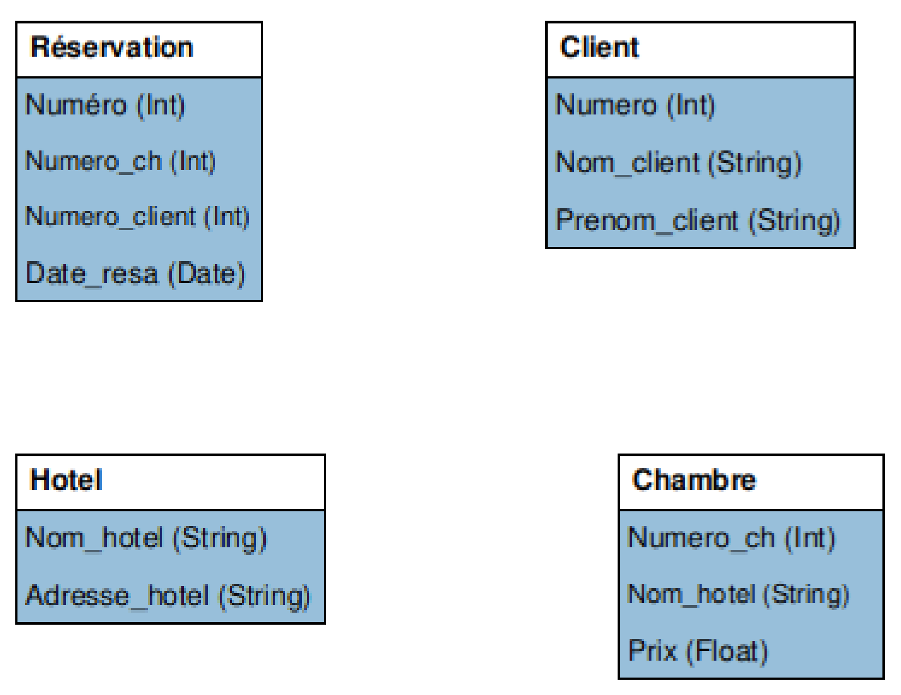

\huge \textbf{Thème 2}\normalsize  

\ 

\Large \textbf{Modèle relationnel}\normalsize  

# Introduction
Lorsque l'on considère une activité tel que le prêt d'un livre dans une bibliothèque, cela nécessite un \textit{système d'information}, c'est à dire un système technique et humain permettant de gérer la situation.  

\   

Le système informatique qui gère cela contient \textit{une description} partielle d'objets (les livres), d'humains (les utilisateurs) et de processus (le prêt). Cette description est partielle puisque seules les informations nécessaires concernant ces éléments sont utilisées (on ne va pas utiliser la taille des personnes par exemple). C'est ce que l'on appelle \textbf{une modélisation}.  

# Le modèle relationnel
Un modèle de données est une représentation de concepts que l'on souhaite étudier afin de pouvoir effectuer des opérations simples sur des données pour programmer des processus complexes comme l'emprunt d'un livre dans une bibliothèque.  

## Définition
Un modèle relationnel est un modèle de données où :  

- un objet modélisé, appelé **entité** est représenté par un _n_-uplet de valeurs ;
- les collections d'objets, appelés **relations**, par des ensembles de _n_-uplets.

## Historique
Le modèle relationnel a été défini en 1970 par l'informaticien américain Edgar F. Codd (1923 - 2003), alors qu'il était employé par IBM.  

Depuis, cela reste un domaine de recherche très actif.  

## Exemple
Pour mettre en place le prêt dans une bibliothèque,

- un livre (une entité) peut être représenté par un quintuplé : ('Dom Juan', 'Molière', 'Pocket', 2019, '978-2266295963')  
Quatre composantes sont des chaînes de caractères (le titre, l'auteur, l'éditeur et l'EAN) et une composante est de type entier (année d'édition).
- l'ensemble des livres de la bibliothèque (une relation) peut alors être représenté par un ensemble de quintuplés :  
`Livres = \{ ('Dom Juan', 'Molière', 'Pocket', 2019, '978-2266295963'),`  
`('Le rouge et le noir', 'Stendhal', 'Gallimard', 2019, '978-2072858888'),`  
`('Germinal', 'Émile Zola', 'Lgf', 1971, '978-2253004226'),`  
`... \}`

## Définition
On considère une entité, c'est à dire un _n_-uplet.  
A chaque composante de cette entité peut être associé :

- **un attribut** : à quoi correspond la composante ;
- **un domaine** : ensemble des valeurs admises pour l'attribut.

## Exemple
La relation `Livres` dispose de cinq attributs : le titre, l'auteur, l'éditeur, la date de parution et l'EAN.  

Les trois premiers et le dernier sont des chaînes de caractères, la date de parution est un entier naturel.

## Définition
**Un schéma** d'une relation est une description de chaque entité de la relation, c'est à dire son nom, la liste de ses attributs avec leur domaine.  

## Remarque
On représente en général un schéma d'une relation de deux manières :

- `Livre` (_titre_ **String**, _auteur_ **String**, _éditeur_ **String**, _année_ **Int**, _EAN_ **String**)
- \   

## Définitions

- **Une base de données** est un ensemble de relations.
- **Un schéma d'une base de données** est l'ensemble des schémas des relations qui la constituent.

## Exercice
Ecrire les schémas des relations `Emprunt` et `Utilisateur` dans le cadre de notre exemple, ce qui définira une base de donnée pour gérer l'emprunt des livres de la bibliothèque.

\   

\   

\   

\   

\   

\   

\   

\   

# Modélisation relationnelle des données
## Principes généraux
La modélisation des données se décompose en plusieurs étapes :

- \underline{déterminer les entités} que l'on souhaite manipuler ;
- modéliser les ensembles d'entités comme des relations en donnant \underline{leur schéma}, en s'attachant en particulier à choisir \underline{le bon}   \underline{domaine} pour chaque attribut ;
- définir **les contraintes**de la base de données, c'est à dire l'ensemble des propriétés logiques que nos données doivent vérifier à tout moment.

## Contraintes d'intégrité
### Définition
**Une contrainte d'intégrité** est une propriété logique, préservée à tout instant par la base de données et qui garantit la cohérence des données.

Une contrainte d'intégrité est donc un invariant d'une base de données.  

### Remarque
Ces contraintes doivent être utilisées pour assurer la qualité des données : elles permettent de s'assurer que les données sont "conformes" aux entités du monde réel qu'elles représentent.  

## Contrainte de domaine
### Définition
**Les contraintes de domaine** sont des contraintes qui restreignent les valeurs d'un attribut à celles du domaine et évitent que l'on puisse donner à un attribut une valeur illégale.  

### Exemple
Si dans le schéma la relation `Usagers`, on souhaite ajouter un numéro de téléphone de chaque usager. Il est nécessaire de définir un type _String_ et non _Int_.  

En effet, un numéro de téléphone peut commencer par un 0. De plus, il est possible d'avoir un numéro de téléphone comportant un signe +.  

### Type génériques possibles de domaine
Sans tenir compte de l'aspect technique d'un langage particulier, six domaines différents sont fréquemment utilisés :

- **String** : représente les chaînes de caractères ;
- **Int** : représente les entiers signés (qu'on suppose de taille arbitraire, comme les entiers de Python) ;
- **Boolean** : représente les valeurs booléennes `True` et `False` ;
- **Float** : représente les nombres flottants ;
- **Date** : représente des dates (jour/mois/année) ;
- **Time** : représente des instants (heure:minute:seconde).

### Remarque
Le choix du domaine est très important, car il doit répondre à deux impératifs :

- permettre de représenter exactement et sans perte de d'information toutes les valeurs possibles pour un attribut ;
- limiter autant que possible la saisie de valeurs illégales ou mal formées.

## Contrainte d'entité
### Définition
**Une contrainte d'entité** est une contrainte qui garantie que chaque entité d'une relation est unique.  

### Définition
**Une clé primaire (PK : Primary Key)** est un ensemble d'attributs qui identifie chaque entité de la relation de manière unique et garantit la contrainte d'entité.  

La clé primaire dans le schéma d'un modèle est indiquée en la soulignant.  

### Exemple
Dans le schéma la relation `Utilisateur`, on peut définir comme clé primaire, le numéro d'inscription.  

Le schéma de cette relation s'écrit alors :  `Utilisateur`$\left(\underline{\textit{Num inscription} \text{  } \textbf{Int}},\text{ }\textit{NOM}\text{  }\textbf{String},\text{ }\textit{Prénom}\text{  }\textbf{String}\right)$.  

### Exercice
Quelle peut être la clé primaire de la relation `Livre` ? de la relation `Emprunt` ?  

\   

\   

\   

Ecrire les schémas des relations en tenant compte de cela.  

\   

\   

\   

\   

\   

\   

## Contrainte de référence
### Définition
**Une contrainte de référence** est une contrainte qui crée des associations entre deux relations. Elles permettent de garantir qu'une entité d'une relation B mentionne une entité existante dans une relation A.

### Définition
**Une clé étrangère (FK : Foreign key)** est un ensemble d'attributs d'une table qui sont une clé primaire dans une autre table.  

La clé étrangère dans un schéma est indiquée en faisant précéder l'attribut du symbole #. Elle peut être aussi parfois soulignée en pointillée.  

### Exemple
Dans le schéma la relation `Emprunt`, l'attribut _EAN_ est une clé primaire de la relation `Livre` qui peut être une clé étrangère dans la relation `Emprunt`.  

Le schéma de la relation `Emprunt` s'écrit alors :  `Emprunt` $\left(\#\underline{\textit{EAN}\ \ \textbf{String}},\ \textit{Num inscription}\ \ \textbf{Int},\ \textit{Date d'emprunt}\ \ \textbf{Date}\right)$.

### Exercice
Compléter le schéma de la relation `Emprunt` avec une autre clé étrangère.  

\   

\   

\   

## Contraintes d'utilisateurs
### Définition
**Une contrainte d'utilisateur** (ou contrainte métier) est une contrainte qui restreint encore plus les valeurs d'un ou plusieurs attributs.  

### Remarques
Les contraintes utilisateurs sont guidées par la nature des données que l'on souhaite stocker en base.  

Les contraintes utilisateurs sont toutes les contraintes non couvertes par les trois premières.  

### Exemple
Le domaine de l'attribut _EAN_ est de type _String_ mais cela n'empêche pas de saisir tout et n'importe quoi. Or un numéro EAN répond à un formatage précis : Chiffre-12 Chiffres.  

Imposer ce format est une contrainte utilisateur.  

Grâce à cette nouvelle contrainte, le traitement de l'attribut _EAN_ s'en trouvera facilité.  

# Exercices
## Exercice
On souhaite modéliser un annuaire téléphonique simple dans lequel chaque personne (identifiée par son nom et son prénom) est associée à son numéro de téléphone.  

1. Proposer une modélisation relationnelle de cet annuaire.
2. Dans les ensemble suivants, indiquer ceux qui ne peuvent pas convenir pour un modèle d'annuaire téléphonique où le numéro de téléphone est une clé primaire :

        - {}
        - {('Titi', 'Toto', '0123456789')}
        - {('Titi', 'Toto', '0123456789') ; ('Doe', 'John', '0123456789')}
        - {('Titi', 'Toto', '0123456789') ; ('Doe', 'John', '9876543210')}
        - {('Titi', 'Toto', '0123456789') ; ('Titi', 'Toto', '9876543210')}
        - {('Titi', 'Toto', '0123456789') ; ('Doe', 'John')}
        - {('Titi', 'Toto', 9876543210)}

## Exercice
Donner une modélisation relationnelle d'un bulletin scolaire. Cette dernière doit permettre de mentionner :

- des élèves, possédant un numéro d'étudiant alphanumérique unique ;
- un ensemble de disciplines fixées, mais qui ne sont pas données ;
- au plus une note sur 20, par matière et par élève.

## Exercice
Modéliser les informations sur les départements français.  
Pour chaque département, on veut pouvoir stocker son nom, son code, son chef-lieu et la liste de tous les départements voisins.  

\   

Proposer une contrainte utilisateur permettant d'éviter la redondance des voisins.  

## Exercice
Un commerçant utilise plusieurs fichiers pour gérer ses produits. On considère un fichier destiné à gérer des produits frais. La tableau présenté est un extrait du contenu de ce fichier. Les quatre colonnes contiennent respectivement un identifiant numérique, le nom d'un produit, son prix et la marque qui le commercialise. Les mêmes noms de marques peuvent apparaître de nombreuses fois dans la colonne **marque** mais aussi dans les fichiers correspondant à d'autres type de produits.  

\begin{center}
\begin{tabular}{|c|c|c|c|}
    \hline
    \textbf{id} & \textbf{nom} & \textbf{prix} & \textbf{marque} \\
    \hline
    17 & Yaourt6 & 2,52 & Yopnone\\
    \hline
    21 & Yaourt12 & 4,93 & Dalait\\
    \hline
    25 & Beurre250 & 2,27 & Croisement\\
    \hline
    28 & Crème50 & 2,74 & Dalait\\
    \hline
    31 & Crème70 & 3,79 & Yopnone\\
    \hline
\end{tabular}
\end{center}

A partir de ce fichier, construire une relation `Frais`, (pour les produits frais), et une relation `Marques` suivant le modèle relationnel permettant d'éviter la redondance d'informations.  

\   

Indiquer une clé primaire pour chacune des deux tables et préciser un champ jouant le rôle d'une clé étranger.  

## Exercice
On dispose de données, écrite dans un tableur, concernant les vols qui sont prévus à un aéroport pendant une journée. Nous avons le numéro du vol, les heures de départ et d'arrivée, la provenance pour les vols à l'arrivée et la destination pour les vols au départ, le type d'avion et sa capacité totale en passagers. CHaque vol a un numéro unique.  

Extrait du tableau :  
\begin{center}
\begin{tabular}{|c|c|c|c|c|c|c|}
    \hline
    \textbf{Vol} & \textbf{HD} & \textbf{HA} & \textbf{Provenance} & \textbf{Destination} & \textbf{Avion} & \textbf{Capacité} \\
    \hline
    AF373 & 8h45 & 10h05 & & Paris FRANCE & Airbus A320 & 150 \\
    \hline
    LX 529 & 11h45 & 12h50 & Genève SUISSE & & Boeing 747 & 424 \\
    \hline
    ... & & & & & & \\
    \hline
\end{tabular}
\end{center}

Décrire six relations `Départ`, `Arrivée`, `Villes`, `Pays`, `Avions` et `Constructeurs` construites à partir de ce fichier permettant de satisfaire au modèle relationnel.  

## Exercice
Un particulier a un grand nombre de chansons stockées sur son ordinateur. Il tient à jour un fichier qui contient toutes les chansons enregistrées par des groupes. Ce fichier contient quatre colonnes où sont notés respectivement le titre de la chanson, le groupe qui l'a enregistrée, les membres du groupe et la date d'enregistrement.  

Voici une ligne de ce fichier :  

\begin{center}
\begin{tabular}{|c|c|c|c|}
    \hline
    \textbf{Titre} & \textbf{Groupe} & \textbf{Membres} & \textbf{Année} \\
    \hline
    Roxane & The Police & Sting, Summers, Copeland & 1978 \\
    \hline
\end{tabular}
\end{center}

Constituer un modèle relationnel normalisé à l'aide de trois tables nommées \textbf{Chansons}, \textbf{Groupes} et \textbf{Artistes}.  

## Exercice
On souhaite gérer des réservations dans une compagnie d'hôtels. On considère donc le modèle Entités/Associations incomplet suivant :  

 \   

1. Recopier et compléter le modèle en ajoutant des clés primaires et étrangères.
2. A l'aide de ce modèle, répondre aux questions suivantes :

    a. Un client peut-il réserver plusieurs chambres à une date donnée ?
    b. Est-il possible de réserver une chambre sur plusieurs jours ?
    c. Peut-on savoir si une chambre est libre à une date donnée ?
    d. Peut-on réserver plusieurs fois une chambre à une date donnée ?

\   

\   

\underline{{\textit{\textbf{Sources}}}}  

- _numérique et sciences informatiques, Tle_, Ed. ellipses. p285 à 296. ISBN 978-2-340-03855-4.
- Serge Bays, _numérique et sciences informatiques, Tle_, Ed. ellipses. p189 et 190. ISBN 978-2-340-03844-8.