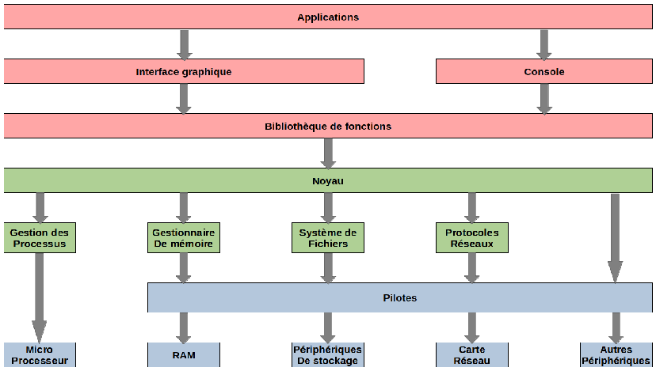
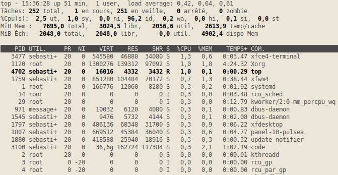
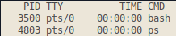
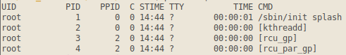
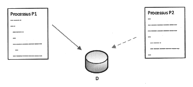
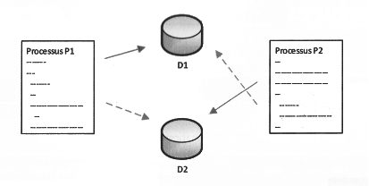

\huge \textbf{Thème 3}\normalsize  

\ 

\Large \textbf{Chapitre 2 : Gestion des processus et ressources par un OS}\normalsize  

\  

\  

# Les systèmes d'exploitation
## Le fonctionnement général
Le système d'exploitation est un ensemble de programmes qui va permettre d'utiliser les éléments physiques d'un ordinateur pour exécuter les applications nécessaires à l'utilisateur.  

L'élément fondamental du système d'exploitation est le noyau, c'est lui qui permet et gère l'accès aux ressources matérielles.  

Ses principales fonctions sont :  

- le dialogue avec les périphériques (microprocesseur, mémoire, disques, carte graphique, carte réseau, clavier, souris ...),
- l'exécution par le microprocesseur des programmes souhaités par les utilisateurs et l'ordonnancement de ces tâches,
- la gestion des accès aux ressources, pour permettre d'une part à tous les utilisateurs de travailler simultanément, et d'autre part de ne permettre l'utilisation d'une ressource qu'aux utilisateurs autorisés.  

Au-dessus du noyau, de très nombreux programmes sont en charge de toutes les fonctions qui sont offertes aux programmes utilisateurs pour permettre une utilisation complète et optimale de la machine physique (gestionnaire de fichiers, lecture de sons, gestion de l'énergie, gestion des communications réseau, gestion des performances ...)  

Les systèmes d'exploitation actuels proposent aussi de nombreux outils de niveau supérieur, qui apportent du confort de travail à l'utilisateur, jusqu'à lui éviter l'installation de programmes à part entière (navigateur Internet, outils de traitement d'image, logiciel de messagerie, traitement de texte, outils de diagnostic ...).  

## Les différents éléments
Le schéma suivant illustre l'architecture globale d'un système d'exploitation :  

\ \  

Au niveau utilisateur, nous trouvons \textbf{les applications}, exécutées via \textbf{l'interface graphique} ou directement en \textbf{mode commandes}. Les applications peuvent utiliser \textbf{des bibliothèques de fonctions}.  

Ces applications s'appuient sur \textbf{le noyau}, élément central du système d'exploitation, qui génère des appels système pour accéder à une ressource.  

Selon la nature de la ressource nécessaire, des gestionnaires spécifiques sont sollicités \textbf{le gestionnaire de processus} pour l'exécution d'un programme par le microprocesseur, \textbf{le gestionnaire de mémoire} pour l'accès à une donnée en mémoire, \textbf{le système de fichiers} pour la gestion des périphériques de stockage de masse (disque dur, DVD...), \textbf{les protocoles réseaux} pour les outils de gestion des différents réseaux disponibles.  

Chaque \textbf{ressource physique} est gérée par \textbf{un pilote}, seule entité logicielle capable du dialogue avec le périphérique.  

Pour de nombreux périphériques, un gestionnaire spécifique n'est pas nécessaire le noyau peut solliciter directement le pilote concerné.  

# Les processus
## Objectifs
Pour permettre le fonctionnement d'un ordinateur, de nombreuses tâches ou applications doivent être exécutées simultanément, par le système d'exploitation et les différents utilisateurs.  

Notons aussi qu'une même application (programme) doit pouvoir s'exécuter plusieurs fois simultanément (par plusieurs utilisateurs par exemple), ou que plusieurs applications doivent pouvoir accéder à un même périphérique sans conflit.  

Pour permettre cela, le système d'exploitation génère de nombreux processus, puis gère leur exécution.  

#### Définition  

\ \  

\textbf{Un processus} est une instance d'un programme en cours d'exécution.  

Les notions de programme et de processus sont différentes : le même programme exécuté plusieurs fois (dans le temps ou par plusieurs utilisateurs simultanément) générera plusieurs processus. Un processus a une durée de vie limitée (de sa création à sa destruction), alors qu'un programme existe de façon permanente dans la machine, enregistré dans une mémoire non volatile.  

Chaque processus possède en mémoire les instructions à exécuter et ses données.  

Lorsqu'un processus est créé, il peut ensuite créer d'autres processus, c'est-à-dire démarrer l'exécution d'autres programmes. On parle de processus père et de processus fils.  

### Création d'un processus
A la création d'un processus, différents paramètres ou identificateurs lui sont associés :  

- un PID, le numéro du processus  (\textit{Process Identification}),
- un PPID, le numéro du processus père,
- un UID, l'identifiant de l'utilisateur qui a démarré le processus,
- un GID, l'identifiant du groupe de l'utilisateur qui a démarré le processus.  

## Gestion des processus
Dans l'ensemble des nombreux et divers processus, on peut distinguer trois types :  

- Les applications : par exemple, on ouvre un navigateur comme \textit{Firefox}, le programme \texttt{Firefox} est exécuté sur la machine et lui-même peut exécuter d'autres sous-programmes qui dépendent de \textit{Firefox}.
- Les processus qui fonctionnent en permanence en arrière-plan, comme un antivirus, qui s'exécute au démarrage de la machine. On trouve des services sous \textit{Windows} et des Daemons sous \textit{Linux}.
- Les processus du système d'exploitation, différents gestionnaires et processus hôtes.  

Ces processus peuvent être regroupés en deux grandes catégories : les processus créés par le système, et ceux créés par l'utilisateur.  

### Les processus sous Linux
Avec un système de type Linux, on ouvre un terminal. La commande \texttt{top} permet de lister tous les processus en cours d'exécution. L'ordre d'affichage est dynamique et selon la consommation de ressource du processeur. Pour arrêter l'affichage, on appuie simultanément sur les touches \texttt{Ctrl} et \texttt{C}. La commande \texttt{htop} est similaire mais propose en plus d'exécuter différentes actions sur les processus affichés.  

\ \  

Parmi les informations affichées, on trouve le PID, l'état (en particulier S, R ou I pour \textit{Sleeping}, \textit{Running} et \textit{Idle}), les \% de CPU et de mémoire utilisés. CMD le nom de la commande.  

Dans un terminal, la commande \texttt{ps} permet de lister les processus qui sont associés au terminal courant. Le résultat peut ressembler à ce qui suit :  

\ \  

Les deux commandes associées au terminal sont \texttt{bash} pour le terminal lui-même et \texttt{ps}.  

La commande \texttt{ps aux} permet de lister les processus de manière statique par ordre de PID. La commande \texttt{ps aux | grep pi} permet de lister les processus qui contienne \textit{pi} dans leur nom. De manière générale, la commande \textit{ps aux | grep *} permet d'obtenir la liste de tous les processus qui contiennent \texttt{*} dans leur nom ou qui ont été lancés par \texttt{*} (\texttt{*} représente des caractères).  

La commande \texttt{pstree -p} propose un affichage sous une forme arborescente. Ceci nous permet d'observer pour l'ensemble des processus, leur arbre "généalogique", autrement dit les processus parents successifs.  

La commande \texttt{ps -aef} affiche en plus le PPID, c'est-à-dire le PID du processus parent.  

Par exemple on ouvre un navigateur comme \textit{Firefox}. Puis dans un terminal nous écrivons la commande \texttt{ps -aef}. Nous voyons en bas de la liste plusieurs processus liés au navigateur et ayant tous une commande commençant par \texttt{/usr/lib/firefox/firefox} : Le PID du premier est par exemple 1522, ensuite 1542 avec pour parent 1522, 1544 avec pour parent 1542, etc. Entrons la commande \texttt{kill} 1522, le navigateur se ferme.  

La commande \texttt{ps -aef | head -5} permet d'afficher les premières lignes avant la ligne 5 :  

\ \  

Nous obtenons l'utilisateur, l'identificateur du processus et celui de son père.  

Remarque : les processus \texttt{init} et \texttt{kthreadd} ont respectivement pour PID 1 et 2. Leur PPID est 0, ils n'ont pas de processus parent et ont été engendrés par le noyau du système au démarrage. Tous les autres processus "descendent" de l'un de ces deux processus. On peut le vérifier en prenant un processus quelconque et en remontant pas à pas avec les PPID.  

Nous avons la possibilité d'intervenir sur la gestion des processus : arrêter un processus, changer sa priorité, passer un processus en arrière-plan ou en avant-plan.  
"
Pour arrêter un processus, il faut connaître son PID : \texttt{kill PID}. Si le processus ne s'arrête pas, s'il est bloqué, pour forcer l'arrêt : \texttt{kill -9 PID}. (On remplace \texttt{PID} par le PID du processus).  

On peut aussi arrêter un processus si l'on connaît son nom avec la commande \texttt{pkill nom} ou \texttt{pkill -9 nom}.  

## L'ordonnancement
Le système d'exploitation doit permettre à toutes les applications et tous les utilisateurs de travailler en même temps, c'est-à-dire donner l'impression à chacun qu'il est seul à utiliser l'ordinateur et ses ressources physiques. Cette gestion complexe des processus est réalisée par une partie spécifique du noyau du système d'exploitation : \textbf{l'ordonnanceur}.  

### Etats d'un processus
Tous les systèmes d'exploitation "modernes" (Linux, Windows, macOS, Android, iOS...) sont capables de gérer l'exécution de plusieurs processus en même temps. Mais pour être précis, cela n'est pas en véritable "en même temps", mais plutôt un "chacun son tour". Pour gérer ce "chacun son tour", les systèmes d'exploitation attribuent des "états" au processus.  

Voici les différents états :  

- Lorsqu'un processus est en train de s'exécuter (qu'il utilise le microprocesseur), on dit que le processus est dans l'état "élu".
- Un processus qui se trouve dans l'état élu peut demander à accéder à une ressource pas forcément disponible instantanément (par exemple lire une donnée sur le disque dur). Le processus ne peut pas poursuivre son exécution tant qu'il n'a pas obtenu cette ressource. En attendant de recevoir cette ressource, il passe de l'état "élu" à l'état "bloqué".
- Lorsque le processus finit par obtenir la ressource attendue, celui-ci peut potentiellement reprendre son exécution. Mais comme nous l'avons vu ci-dessus, les systèmes d'exploitation permettent de gérer plusieurs processus "en même temps", mais un seul processus peut se trouver dans un état "élu" (le microprocesseur ne peut "s'occuper" que d'un seul processus à la fois). Quand un processus passe d'un état "élu" à un état "bloqué", un autre processus peut alors "prendre sa place" et passer dans l'état "élu". Le processus qui vient de recevoir la ressource attendue ne va donc pas forcément pouvoir reprendre son exécution tout de suite, car pendant qu'il était dans à état "bloqué" un autre processus a "pris sa place". Un processus qui quitte l'état bloqué ne repasse pas forcément à l'état "élu", il peut, en attendant que "la place se libère" passer dans l'état "prêt" (sous entendu "j'ai obtenu ce que j'attendais, je suis prêt à reprendre mon exécution dès que la "place sera libérée").  

Le passage de l'état "prêt" vers l'état "élu" constitue l'opération "d'élection". Le passage de l'état élu vers l'état bloqué est l'opération de "blocage". Un processus est toujours créé dans l'état "prêt". Pour se terminer, un processus doit obligatoirement se trouver dans l'état "élu".  

On peut résumer tout cela avec le diagramme suivant :  

\ \  

Il est vraiment important de bien comprendre que le "chef d'orchestre" qui attribue aux processus leur état "élu", "bloqué" ou "prêt" est le système d'exploitation. On dit que le système gère l'ordonnancement des processus (tel processus sera prioritaire sur tel autre ...).  

Chose aussi à ne pas perdre de vue : un processus qui utilise une ressource R doit la "libérer" une fois qu'il a fini de l'utiliser afin de la rendre disponible pour les autres processus. Pour libérer une ressource, un processus doit obligatoirement être dans un état "élu".  

### Principe
Comme une ressource (le processeur ou un périphérique) ne peut pas être partagée, c'est son temps d'utilisation qui va l'être : le temps d'utilisation d'une ressource est partagé en intervalles très courts, pendant lesquels l'ordonnanceur l'alloue à un seul utilisateur.  

L'ordonnanceur permet :

-  de minimiser le temps de traitement du processus d'un utilisateur,
-  de garantir l'équité entre les différents utilisateurs,
-  d'optimiser l'utilisation de la ressource,
-  d'éviter les blocages.  

Plusieurs algorithmes d'ordonnancement sont possibles, parmi les plus répandus nous pouvons citer :  

-  \textbf{Le tourniquet} : la ressource est affectée à chaque processus à tour de rôle. Pour l'exécution simultanée des processus, c'est la rapidité de ce tour de rôle qui va donner l'impression à chaque utilisateur que son processus est seul à utiliser processeurs. Cette méthode ancienne a les avantages de sa simplicité, de sa rapidité de gestion et de sa robustesse.  
 
\ \  

-  \textbf{La mise en place d'un système de priorités} : l'ordre d'affectation de la ressource sera alors fonction de la priorité de la tâche. Cette méthode est très équitable, mais la définition du niveau de priorité d'une tâche doit être objective.
-  La gestion du \textit{premier entré, premier sorti} (\textbf{FIFO} : \textit{First in, First Out}). L'exemple le plus évident de cet algorithme est la file d'impression des documents sur une imprimante.
-  L'algorithme du "\textbf{plus court d'abord}" très efficace pour satisfaire au mieux les utilisateurs, mais il n'est pas toujours simple d'évaluer le temps d'exécution d'une tâche avant son début.  

Parallèlement à l'évolution des performances des microprocesseurs, l'ordonnancement est aussi un moyen d'amélioration de la rapidité de traitement : des algorithmes récents, de plus en plus complexes, ont été proposés récemment.  

## Les interblocages
Nous avons dit précédemment que des processus peuvent avoir besoin de la même ressource.  

Dans de nombreuses situations, deux processus (ou davantage) peuvent souhaiter accéder à la même donnée sur le disque dur :  

-  Les deux processus ont uniquement besoin de lire la donnée : celle-ci est alors partagée, sans problème complexe.
-  Les deux processus ont besoin de la donnée de manière exclusive, pour la modifier par exemple.
-  Les deux processus ont besoin de communiquer entre eux : l'un doit attendre un résultat de l'autre.  

Sur le schéma suivant, les processus P1 et P2 ont tous les deux besoins de la même donnée D pour la modifier, c'est-à-dire de manière exclusive. Le premier à y accéder est P1, D lui est allouée par le système d'exploitation. Lorsque P2 souhaite accéder à D, la ressource n'est pas disponible : P2 est alors bloqué jusqu'à la fin de l'utilisation de D par P1.  

\ \  

Prenons maintenant un autre exemple deux processus P1 et P2 ont tous les deux besoins de deux données, nommées sur le schéma suivant Dl et D2. Voici une situation qui peut se produire :  

\ \  

Chaque processus bloque une donnée et est en attente de l'autre, rien ne pourra évoluer sans une intervention extérieure : cette situation porte le nom d'\textbf{interblocage}.  

Face à cette problématique, deux solutions sont envisageables :  

-  essayer d'éviter un interblocage,
-  détecter qu'un interblocage est apparu, et le supprimer.  

La plupart des systèmes d'exploitation ont choisi de ne pas essayer d'éviter les interblocages, mais de les détecter s'ils surviennent et de les solutionner.  

# Exercices
#### Exercice 1

\ \  

Ouvrir un navigateur, par exemple \textit{Firefox}. Pour chacune des questions, il s'agit d'indiquer le nom du processus, le PID et le PPID.  

1.  Déterminer combien de processus sont créés.
2.  Déterminer quel est le premier processus qui a été créé parmi ceux relevés à la question suivante ?
3.  Déterminer le processus parent de celui de la question précédente.  

#### Exercice 2

\ \  

On considère trois processus $P_1$, $P_2$ et $P_3$ décrits ci-dessous :  

-  $P_1$ : Demande $R_1$, demande $R_2$, libère $R_1$, libère $R_2$ ;
-  $P_2$ : Demande $R_2$, demande $R_3$, libère $R_2$, libère $R_3$ ;
-  $P_3$ : Demande $R_3$, demande $R_1$, libère $R_3$, libère $R_1$.  

1.  Si les processus sont exécutés l'un après l'autre, d'abord $P_1$, puis $P_2$ et enfin $P_3$, y a-t-il une situation d'interblocage ? Expliquer.
2.  Décrire une exécution des trois processus qui conduit à une situation d'interblocage.
3.  Dessiner un schéma illutrant la situation de la question précédente.  

\   

\underline{{\textit{\textbf{Sources}}}}  

- \textit{Numérique et sciences informatiques, Tale}, Ed. ellipses. p170 à 175. ISBN 978-2-340-03815-8.
- Serge Bays, \textit{numérique et sciences informatiques, Tle}, Ed. ellipses. p222 à 224. ISBN 978-2-340-03844-8.
- ROCHE D. (2020, 7 décembre). \textit{Les processus}. Informatique au lycée.   \hfill \href{https://pixees.fr/informatiquelycee/n_site/nsi_term_archi_proc.html}{https://pixees.fr/informatiquelycee/n\_site/nsi\_term\_archi\_proc.html}