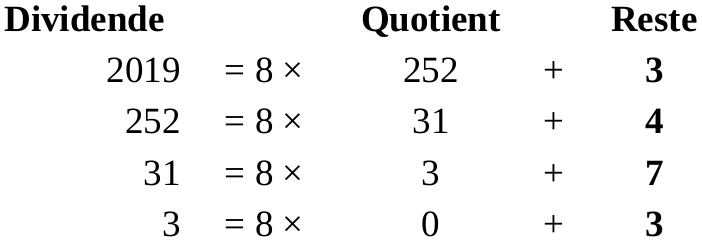

\huge \textbf{Thème 1}\normalsize  

\ 

\Large \textbf{Chapitre 1 : Ecriture d'un nombre dans différentes bases}\normalsize  

[^hist-info.org]: François GUILLIER. *Histoire de l'informatique* [en ligne]. 2016 [consulté le 18 juillet 2019]. [histoire-informatique.org](https://histoire-informatique.org/grandes_dates/)  

[^hist-info.online]: Serge ROSSI. *Histoire de l'informatique* [en ligne]. 20 novembre 2004 [consulté le 18 juillet 2019]. [histoire.info.online.fr](http://histoire.info.online.fr/)  

[^NSI-Nathan]: L'ensemble des exercices de cette partie est issu de (c) PASQUET, Stéphane. *Numérique et Sciences Informatiques*. Nathan, 2019. 224p. ISBN 978-209-157465-3  

# Eléments du programme  

 \ 

# Un peu d'histoire [^hist-info.online] [^hist-info.org]  
**_-3000_** : Période de l'empereur Chinois `Fu-Xi` dont le symbole magique, l'`octogone à trigramme` contient les 8 premiers nombres représentés sous forme binaire par des traits interrompus ou non : 000 001 010 011 etc ...  
  

**_1000_** : Apparition du `zéro`. Inventé en Inde et rapporté en Occident par les invasions arabes, le zéro trouvera un ardent défenseur en la personne de Gerbert d'AURILLAC qui tentera de l'imposer lorsqu'il deviendra le pape Sylvestre II. Mais, ce n'est que vers le XIVème siècle, que le monde occidental l'acceptera définitivement.  

**_Fin du XVIIè siècle_** : Introduction du binaire en Europe par `Gottfried Wilhelm LEIBNITZ` (1646-1716). Il découvre et met au point une arithmétique binaire (et analyse les octogrammes de Fou-Xi).   

# Comment comptons-nous ? ... le système décimal  
Pourquoi *treize* s'écrit-il *13* ? Pourquoi ne s'écrit-il pas par exemple *M* ou encore *#* ?  

## Petites explications  
On pourrait imaginer un système qui attribue à chaque nombre un symbole, mais ça nécessite autant de symboles que de nombres, autant dire ... beaucoup ! Il faudrait en plus, les connaître par cœur ... Ca fait trop !!! Aussi limite-t-on le nombre de symboles. Le système utilisé quotidiennement est un `système décimal`, c'est à dire de `base dix`. Cela signifie que pour écrire les nombres, il faut utiliser exactement dix symboles, les `chiffres` qui servent à l'écriture de ces nombres.  

En base dix, les chiffres utilisés sont : `0`, `1`, `2`, `3`, `4`, `5`, `6`, `7`, `8` et `9`. On aurait pu prendre dix autres symboles, peut importe, tant que tout le monde utilise les mêmes !  

Maintenant comptons ! 0 ... 1 ... 2 ... 3 ... 4 ... 5 ... 6 ... 7 ... 8 ... 9 ... et après ???  

Après, il suffit de regrouper les dix éléments et cela fait 1 petit groupe. On a donc dans dix, 1 petit groupe (de dix) et 0 élément seul, on écrit donc : 10 !  

Ensuite, on poursuit 10 ... 11 ... 12 ... 13 (tiens, voilà pourquoi treize s'écrit 13 !) ... 14 ... 15 ... 16 ... 17 ... 18 ... 19 ... Et ensuite ? Facile ! On a un deuxième groupe, d'où 20 ... 21 ... etc ...  

En procédant ainsi, on arrive à 99. Et ensuite ? On fait un moyen groupe (de cent), comme il n'y en a qu'un, ça s'écrit 100 (1 moyen groupe et 0 petit groupe et 0 élément seul). On poursuit ainsi de suite.  

A 999 ? On a alors un gros groupe de mille, noté donc 1000 ... 1001 ... etc ...  

On construit ainsi une notation de l'ensemble des nombres entiers positifs avec seulement dix chiffres.  

La position de chacun des chiffres s'appelle `le rang`.  

## Un peu de mathématiques ...  
Maintenant que l'on sait écrire un nombre en base dix, on peut constater une chose : le nombre 1 654, c'est 1 gros groupe de mille, 6 moyens groupes de 100, 5 petits groupes de 10 et 4 éléments seuls.  

On peut donc écrire :  

$1654 = 1 \times 1000 + 6 \times 100 + 5 \times 10 + 4 \times 1$ ou encore : $1654 = 1 \times 10^3 + 6 \times 10^2 + 5 \times 10^1 + 4 \times10 ^ 0$  

## Notation  
Comme le système décimal est très courant, il n'y a pas besoin de le préciser en général. Mais, dans certaines situations, il est nécessaire de préciser que l'écriture d'un nombre est effectuée en base dix. Pour cela, on trace un trait au-dessus du nombre et on indique la base en exposant.  
Par exemple, le nombre 1654 (écrit en base dix) s'écrira alors $\overline{1654}^{10}$.  
Par convention, si rien n'est précisé, il s'agit d'une notation en base dix.  

## Exercices  
1. *Décomposer comme ci-dessus les nombres suivants :*  
    $A = \overline{12465}^{10}$ 
    $B = \overline{2063}^{10}$  
    $C = \overline{230}^{10}$  
    $D = \overline{255}^{10}$  
    $E = \overline{1024}^{10}$  

2. *Quels sont les nombres décomposés suivants :*  
    $F = 1 \times 10^3 + 9 \times 10^2 + 1 \times 10^1 + 9 \times 10^0$  
    $G = 5 \times 10^4 + 2 \times 10^3 + 7 \times 10^1 + 9 \times 10^0$  
    $H = 3 \times 10^6 + 2 \times 10^1$  

# Le système binaire  

## Présentation  
Pour nous c'est assez simple de compter en base 10, mais pour un ordinateur, c'est compliqué, avec des composants électroniques, de le faire compter ainsi. Il est plus simple de compter pour lui en `base 2` (`système binaire`) puis que :  

- la tension aux bornes d'un transistor est `basse` (0) ou `haute` (1) ;
- un interrupteur est `ouvert` (0) ou `fermé` (1) ;
- c'est `false` (0) ou `true` (1).  

## Petites explications (le retour !)  
Quand on travaille en base 10, il faut dix chiffres, donc quand on travaille en base deux, il faut ... deux chiffres ! On peut considérer par exemple les chiffres :  

- `---` et `- -` comme dans l'octogone à trigramme ;
- `O` (ouvert) et `F` (fermé) ;
- `Noir` et `Blanc` ;
- `0` et `1`.  

Pour nous simplifier la tâche, on utilise généralement `0` et `1`. Mais alors ça donne quoi quand on compte ?  

  
\ 

### Exercice  
*Compléter le tableau en indiquant les écritures binaires des nombres jusqu'à 20 inclus.*  

## Conversion du décimal en binaire  
Evidemment, si l'on souhaite connaître comment s'écrit en binaire le nombre 2 019, ça peut prendre du temps, et ce, à chaque fois que l'on cherche à le savoir (sauf en l'apprenant par cœur ...).  
Pour commencer, la connaissance des puissances de 2 permet de se faciliter la tâche !  

### Puissances de 2 à connaître  
$2^0 = 1$  
$2^1 = 2$  
$2^2 = 4$  
$2^3 = 8$  
$2^4 = 16$  
$2^5 = 32$  
$2^6 = 64$  
$2^7 = 128$  
$2^8 = 256$  
$2^9 = 512$  
$2^{10} = 1 024$  
$2^{11} = 2 048$  
$2^{12} = 4 096$  

Pour pouvoir déterminer l'écriture binaire d'un nombre écrit en base 10, deux méthodes peuvent être utilisées :  

### Méthode 1 : les puissances de 2  
Au même titre que l'on peut écrire :  
$1654 = 1 \times 10^3 + 6 \times 10^2 + 5 \times 10^1 + 4 \times10 ^ 0$  
on pourrait décomposer 1 654 en **somme de puissances de 2** :  
$1654 = 1 \times 1 024 + 1 \times 512 + 1 \times 64 + 1 \times 32 + 1 \times 16 + 1 \times 4 + 1 \times 2$  
c'est à dire :  
$1654 = 1 \times 2^{10} + 1 \times 2^9 + 1 \times 2^6 + 1 \times 2^5 + 1 \times 2^4 + 1\times 2^2 + 1 \times 2^1$  
Finalement :  
$\overline{1 654}^{10} = \overline{11001110110}^2$

### Méthode 2 : les divisions euclidiennes par 2  
Une autre méthode consiste à effectuer des **divisions euclidiennes par 2** successivement et de conserver les restes :  

 \ 

Ensuite, il faut écrire les restes en remontant la colonne :  
$\overline{1654}^{10} = \overline{11001110110}^2$

### Exercice  
*A l'aide de chacune des deux méthodes, convertir en base 2 les nombres suivants écrits en base 10 :*  
$I = \overline{46}^{10}$  
$J = \overline{2 019}^{10}$  
$K = \overline{1023}^{10}$  

## Conversion du binaire en décimal  
Pour convertir des nombres écrits en binaire en écriture décimale, c'est assez simple, il suffit d'utiliser la décomposition en somme de puissances de 2 :  
$\overline{101011101}^{2} = 1 \times 2^8 + 1 \times 2 ^6 + 1 \times 2 ^4 + 1 \times 2^3 + 1 \times 2^2 + 1 \times 2^0$  
$\overline{101011101}^{2} = 1 \times 256 + 1 \times 64 + 1 \times 16 + 1 \times 8 + 1 \times 4 + 1 \times 1$  
$\overline{101011101}^{2} = \overline{349}^{10}$

### Exercice  
1. *Ecrire en base 10 les nombres suivants :*  
  $L = \overline{111010}^2$  
  $M = \overline{00101101}^2$  

2. *Quel est le plus grand entier écrit en base 10 que l'on peut écrire avec huit chiffres en base 2 ?*  

# Le système hexadécimal  
## Présentation  
Si le principe du système binaire est compris, le `système hexadécimal` (`base seize`) ne va pas vous poser de problème.  

## Petites explications (le retour du retour !)  
En effet, alors que le système binaires s'écrit à l'aide de deux symboles, le système décimal avec dix, il faut seize symboles pour écrire en système hexadécimal.  
Afin de simplifier les choses, les dix premiers restent les chiffres utilisés pour le système décimal, auxquels il faut ajouter six nouveaux symboles :
`0`, `1`, `2`, `3`, `4`, `5`, `6`, `7`, `8`, `9`, `A`, `B`, `C`, `D`, `E`, `F`.  

 \ 

### Exercice  
*Compléter le tableau en indiquant les écritures hexadécimales des nombres jusqu'à 40 inclus.*  

## Conversion du décimal en hexadécimal  
Comme pour le système binaire, il est utile d'être capable de convertir d'une écriture à l'autre les nombres sans pour autant en connaître par coeur les valeurs.  
Pour convertir un nombre écrit en base dix (système décimal) en base seize (système hexadécimal), on effectue les mêmes méthodes que pour les convertions liées au système binaire :   

### Puissances de 16 à connaître  
$16^0 = 1$  
$16^1 = 16$  
$16^2 = 256$  
$16^3 = 4096$  

### Méthode 1 : les puissances de 16  
Au même titre que l'on peut écrire :  
$1654 = 1 \times 10^3 + 6 \times 10^2 + 5 \times 10^1 + 4 \times10 ^ 0$  
on pourrait décomposer 1 654 en **somme de puissances de 16** :  
$1654 = 6 \times 256 + 7 \times 16 + 6 \times 1$  
c'est à dire :  
$1654 = 6 \times 16^{2} + 7 \times 16^1 + 6 \times 16^0$  
Finalement :  
$\overline{1 654}^{10} = \overline{676}^{16}$

### Méthode 2 : les divisions euclidiennes par 16  
Une autre méthode consiste à effectuer des **divisions euclidiennes par 16** successivement et de conserver les restes :  

 \ 

Ensuite, il faut écrire les restes, *écrits en base seize*, en remontant la colonne :  
$\overline{1654}^{10} = \overline{676}^{16}$

### Exercice  
*A l'aide de chacune des deux méthodes, convertir en base 16 les nombres suivants écrits en base 10 :*  
$N = \overline{46}^{10}$  
$P = \overline{2019}^{10}$  
$Q = \overline{4095}^{10}$  

## Conversion de l'hexadécimal en décimal  
La conversion du système hexadécimal vers le système décimal s'effectue en utilisant la décomposition en somme de puissances de 16 :  
$\overline{A4F2}^{16} = 10 \times 16^3 + 4 \times 16^2 + 15 \times 16^1 + 2 \times 16^0$  
*(Ne pas oublier que $\overline{A}^{16} = \overline{10}^{10}$ et que $\overline{F}^{16} = \overline{15}^{10}$)*  
$\overline{A4F2}^{16} = 10 \times 4096 + 4 \times 256 + 15 \times 16 + 2 \times 1$  
$\overline{A4F2}^{16} = \overline{42226}^{10}$  

### Exercice  
A vous !  

1. *Ecrire en base 10 les nombres suivants :*  
  $R = \overline{3482}^{16}$  
  $S = \overline{10101}^{16}$  
  $T = \overline{ABCD}^{16}$  

2. *Quel est le plus grand entier écrit en base 10 que l'on peut écrire avec deux chiffres en base 16 ?*  

## Conversion du binaire en hexadécimal  
Pour convertir du binaire en hexadécimal, on peut imaginer convertir d'abord le binaire en décimal puis le décimal en hexadécimal.  
Mais, dans le cas présent, comme $2^4=16$, autrement dit, en retirant 1 de part et d'autre de l'égalité, on a $\overline{1111}^2 = \overline{F}^{16}$, pour convertir un nombre écrit en binaire en hexadécimal, il suffit de convertir par paquet de quatre chiffres en partant de la droite les nombres :  
En voyant 11110100010111 comme 0011 1101 0001 0111 (on ajoute à gauche des 0 pour avoir des paquets de quatre chiffres), et comme : $\overline{0011}^2= \overline{3}^{16}$, $\overline{1101}^2= \overline{D}^{16}$, $\overline{0001}^2= \overline{1}^{16}$ et $\overline{0111}^2= \overline{7}^{16}$  
$\overline{11110100010111}^2= \overline{3D17}^{16}$  

### Exercice  
*Convertir en hexadécimal les nombres suivants écrits en binaire :*  
$U = \overline{101010101010}^2$  
$V = \overline{10101101010}^2$

## Conversion de l'hexadécimal en binaire  
Pour convertir un nombre écrit en hexadécimal en binaire, on procède de manière inverse : chaque chiffre de 0 à F correspond à une écriture en binaire de 0000 à 1111.  
Comme $\overline{A}^{16} = \overline{1010}^2$, $\overline{B}^{16} = \overline{1011}^2$, $\overline{3}^{16} = \overline{0011}^2$ et $\overline{9} = \overline{1001}^2$,  
$\overline{AB39}^{16} = \overline{1010101100111001}^2$  

### Exercice  
*Convertir en binaire les nombres suivants écrits en hexadécimal :*  
$W = \overline{C98}^{16}$  
$X = \overline{4924}^{16}$  

# Généralisation à toutes les bases  
On peut très bien ne pas se limiter aux bases 2, 10 et 16. Une autre base utile en informatique est la base huit (octal) mais dans certaines situations, on pourrait très bien avoir besoin d'utiliser une base quelconque *N*. Par exemple, on pourrait utiliser la base 36 pour écrire un mot, écrit avec les dix chiffres et vingt-six lettres de l'alphabet.  

## Principe  
Le principe reste toujours le même. Si on souhaite écrire un nombre écrit en base dix dans une base *N*, il faut dans un premier temps choisir *N* chiffres correspondant à l'écriture des nombres de 0 à *N* - 1.  

Ensuite, soit en effectuant des divisions euclidiennes successives du nombre par *N*, soit en écrivant le nombre comme somme de puissances de *N*, on obtient l'écriture en base *N* du nombre initialement écrit en base dix.  

Le passage d'une écriture en base *N* vers une écriture décimale s'effectue de la même manière que les bases deux et seize, c'est à dire en écrivant puis en calculant le résultat de l'écriture du nombre décomposé en somme de puissances de *N*.  

Exemple, si un nombre s'écrit avec six chiffres en base *N*, on a :  
$\overline{a_5a_4a_3a_2a_1a_0}^N = a_5 \times N^5 + a_4 \times N^4 + a_3 \times N^3 + a_2 \times N^2 + a_1 \times N^1 + a_0 \times N^0 = \sum_{k=0}^5a_k \times N^k$  

## Remarques  
* Si on souhaite convertir d'une base en une autre, le plus aisé, sauf situation particulière, est de convertir en base 10 entre deux.  

* Il n'y a aucun intérêt à connaître par cœur les conversions dans toutes les bases. Comprendre le principe général suffit amplement !  

## Exemples :
1. *Ecrire 2019 en `base 8` (`système octal`)*  
  Pour écrire en base huit, on utilise les chiffres de 0 à 7.  
  Utilisons sur cet exemple le calcul des restes successifs des divisions euclidiennes par huit :

 \ 

2. *Ecrire 600 000 en base 82*  
  Pour écrire en base 82, on doit utiliser 82 chiffres ... On peut choisir les dix chiffres habituels (0 à 9), ainsi que les vingt-six lettres de l'alphabet (A à Z) puis on peut compléter ensuite par les lettres de l'alphabet grec ou de l'alphabet cyrillique par exemple.  

  Cette fois, pour convertir 600 000 en base 82, utilisons la décomposition en puissances de 82 :  
  $82^0 = 1$ ; $82^1 = 82$ ; $82^2 = 6724$ ; $82^3 = 551368$  
  $\overline{600000}^{10} = 1 \times 551368 + 7 \times 6724 + 19 \times 82 + 6 \times 1$  
  $\overline{600000}^{10} = 1 \times 82^3 + 7 \times 82^2 + 19 \times 82^1 + 6 \times 82^0$  
  or $\overline{19}^{10} = \overline{J}^{82}$ (il suffit de compter tranquillement pour le vérifier : 0, 1, ..., 9, A, B, ..., J), donc :  
  $\overline{600000}^{10} = \overline{17J6}^{82}$  

# Pour s'entraîner ...[^NSI-Nathan]  

## Du décimal au binaire  
*Convertir en binaire les nombres suivants :*  
1. $\overline{458}^{10}$  
2. $\overline{133}^{10}$  
3. $\overline{47}^{10}$  
4. $\overline{1024}^{10}$  
5. $\overline{65}^{10}$  

## Du binaire au décimal  
*Convertir en décimal les nombres suivants :*  
1. $\overline{101010101}^{2}$  
2. $\overline{111000}^{2}$  
3. $\overline{00110011}^{2}$  
4. $\overline{1010010001}^{2}$  

## Du binaire à l'hexadécimal  
*Convertir en hexadécimal les nombre suivants :*  
1. $\overline{10000000011001}^{2}$  
2. $\overline{111000}^{2}$  
3. $\overline{00110011}^{2}$  
4. $\overline{1010010001}^{2}$  

## Du décimal à l'hexadécimal  
*Convertir en hexadécimal les nombres suivants :*  
1. $\overline{2020}^{10}$  
2. $\overline{1234}^{10}$  
3. $\overline{56026}^{10}$  
4. $\overline{59450}^{10}$  

## De l'hexadécimal au binaire  
*Convertir en binaire les nombres suivants :*  
1. $\overline{A320}^{16}$  
2. $\overline{FABE51}^{16}$  
3. $\overline{101010}^{16}$  
4. $\overline{59A75}^{16}$  

# Source  
**Site web**  
Timo VAN NEERDEN. *Binaire et hexadécimal* [en ligne]. Page créée en avril 2009,  mise à jour le 13 septembre 2017 [Consulté le 18 juillet 2019]. [Le Hollandais Vollant : lehollandaisvolant.net/tuto/bin/](https://lehollandaisvolant.net/tuto/bin/)
