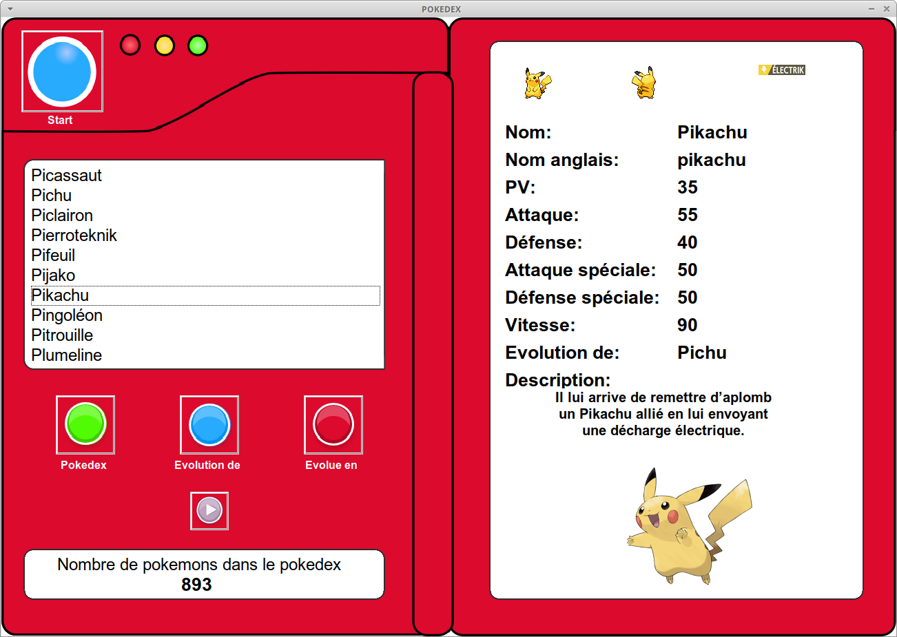

\huge \textbf{Projet}\normalsize  

\ 

\Large \textbf{Pokédex}\normalsize  

# Introduction
Vous allez devoir travailler sur le Pokedex suivant :  

\   

\ \   

Toute la partie interface utilisateur a été réalisé à l'aide du module `TKinter` et fonctionnera si elle reçoit les bonnes informations : il ne manque que le code des fonctions qui permettent de raccorder ce pokedex à la base de données `pokemon.db` qui vous a été donnée.  

# Travail à faire
Procéder en respectant les étapes suivantes :  

### Etape 1 :  

Ouvrir la base de données `pokemon.db` et en faire l'analyse. Vous pourrez par exemple produire le modèle physique des données ainsi que le schéma relationnel. Pour information cette base de données a été réalisée en se connectant à l'API du site pokeapi.  

### Etape 2

Ouvrir les répertoires `img`, `img_art`, `img_back`, `img_front`, `img_types` et `mp3` et observer attentivement comment sont nommés les fichiers dans ces répertoires. Retrouvez à quels attributs de la base correspondent ces noms de fichiers.  

### Etape 3

Ouvrir le fichier Python `pokedex.py`.  

Attention ce programme utilise le module `pygame` pour lire les fichiers au format `MP3` ainsi que  les modules `sqlite3` et `Tkinter`. Il faut donc les installer si ce n'est pas fait.  

Observez qu'il y a 2 parties dans le code, signalées par des commentaires. **Vous ne devez modifier que la partie élève**. En revanche si vous souhaitez regarder comment on peut créer une interface graphique avec `Tkinter`, je reste à votre disposition pour vous en parler mais ce n'est pas au programme.  

1. En regardant bien les spécifications requises dans le docstrings, codez la fonction `creer_connection`.
2. En regardant bien les spécifications requises dans le docstrings, codez la fonction `nombre_pokemons`.
3. En regardant bien les spécifications requises dans le docstrings, codez la fonction `recherche_pokemons`.
4. En regardant bien les spécifications requises dans le docstrings, codez la fonction `recherche_attributs_pokemon`.
5. En regardant bien les spécifications requises dans le docstrings, codez la fonction `recherche_evolutions`.
6. En regardant bien les spécifications requises dans le docstrings, codez la fonction `recherche_types`.  