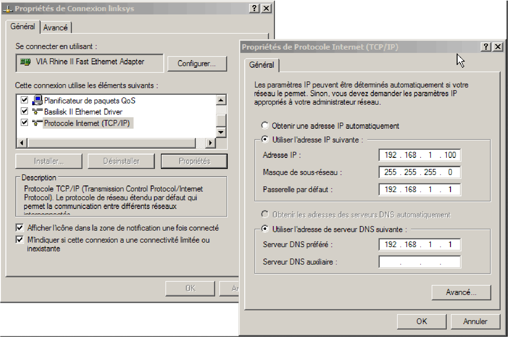
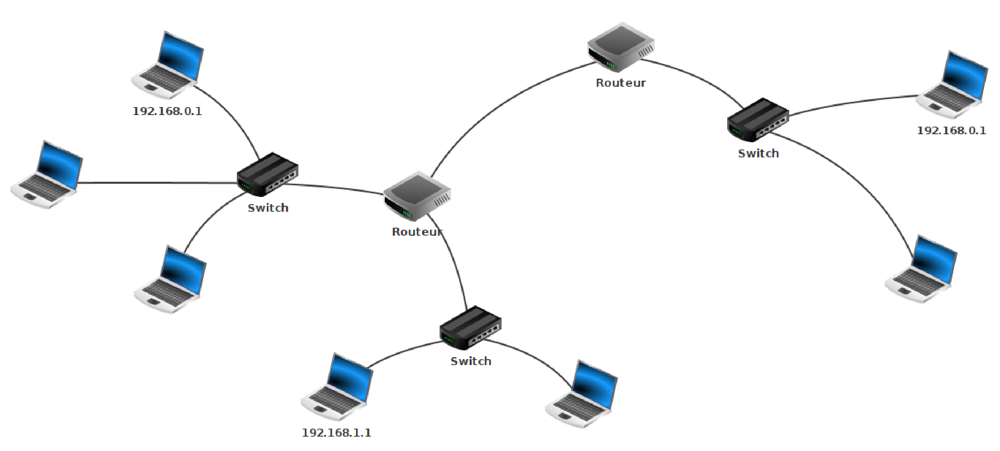
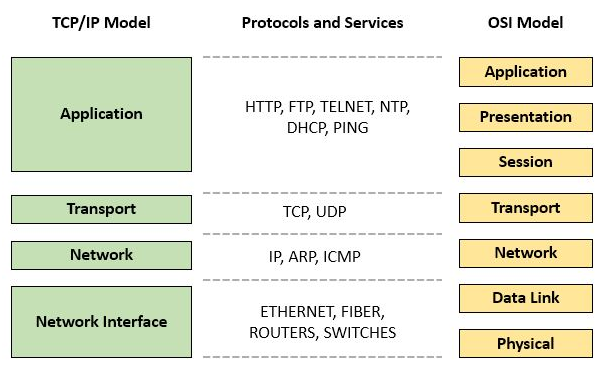
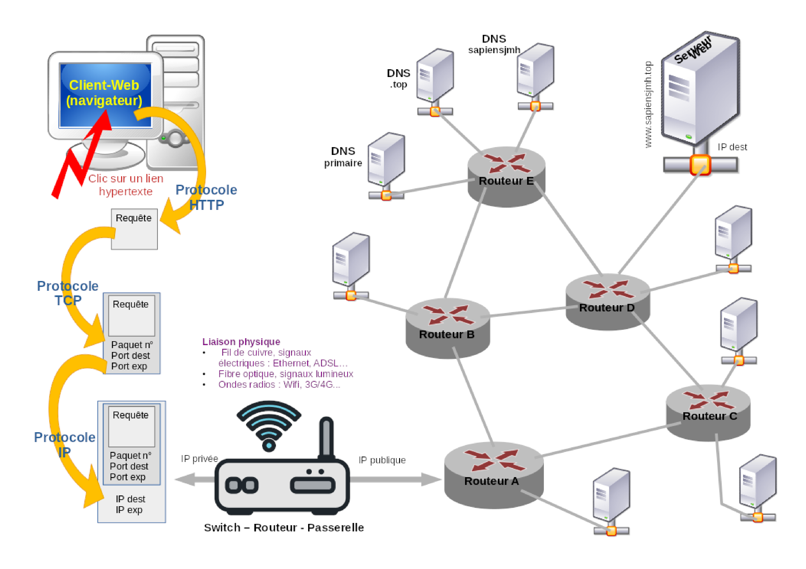

---
title: "Thème Internet - Chapitre 2 : Protocoles TCP et IP"
author: [Sébastien SAUVAGE]
date: "14/01/2023"
keywords: [SNT, Internet, TCP, IP, réseau]
discipline: SNT
...

\Huge \textbf{Thème 1 : Internet}\normalsize  

\ 

\huge \textbf{Chapitre 2 : Protocoles TCP et IP}\normalsize

\ 

# Activité
Les élèves sont dispersés dans la salle. Ils représentent des ordinateurs ou des routeurs.  

Quelques élèves vont mettre des messages sous enveloppe et on leur indique le destinataire. Il est interdit de parler. Le message de chacun doit arriver au bon destinataire.  

## Transmission d'un message court
Les messages tansmis sont courts.  
=> Nécessité de donner le destinataire et l'expéditeur.  
Entête IP / @IP source / @IP Destination / Données IP = Message

## Transmission d'un message long
Les messages sont plus longs et nécessite d'être écrits sur plusieurs morceaux et donc plusieurs enveloppes sont nécessaires.  
=> Nécessité de couper la feuille  
=> Nécessité de numéroter les paquets (dans l'entête)

## La perte de paquets
Quelques élèves ont pour mission de "kidnapper" des messages.  
=> Principe des bit alternés (pas le décrire)  
=> Durée de vie (TTL = Time To Live) = 255 ou 127 et décrémenté à chaque routeur.  

# Le protocole IP
## Paquets
Les données doivent emprunter un chemin physique entre l’émetteur et le destinataire. Deux modes sont possibles :  

\begin{itemize}
    \item Commutation de circuit :
    \begin{itemize}
        \item le chemin entre les deux équipements est réservé tout le temps de la communication ;
        \item ... y compris ses éventuels « silences » (coûteux en ressources) ;
        \item il faut de plus réussir à établir l’intégralité du chemin en amont.
    \end{itemize}
    \item Commutation de paquets
    \begin{itemize}
        \item chaque communication est découpée en petits paquets ;
        \item chaque paquet contient (encapsule) des informations permettant son acheminement ;
        \item le chemin n’est réservé que le temps de transfert un paquet (utilisation effective), il est ensuite libéré : plusieurs communications peuvent emprunter le même chemin simultanément (à tour de rôle).
    \end{itemize}
\end{itemize}

## Adresse IP et adresse MAC
Chaque équipement d’un réseau doit être doté par son adresse IP unique sur ce réseau afin d’y être identifié et d’y communiquer. La carte réseau d’un équipement possède de deux adresses :  

\medskip

\begin{center}
\begin{tabular}{l|l|l}
    -- adresse \textbf{physique} & \textbf{MAC} (\textit{Media Access Control}) & unique au monde (attribuée en usine)\\
    &&\\
    -- adresse \textbf{logique} & \textbf{IP} (\textit{Internet Protocol}) & paramétrable
\end{tabular}
\end{center}

\medskip

Dans une communication réseau,  

\begin{itemize}
    \item l’adresse IP permet la prise de contact : la carte réseau émettrice envoie un « signal de recherche » de l’adresse IP de destination ; si cette dernière est « trouvée », elle lui délivre en réponse son adresse MAC ;
    \item l’échange de données a ensuite lieu à l’aide des adresses MAC émettrice et destinataire.
\end{itemize}

## Adressage IPv4
La version \textbf{IPv4} du protocole IP permet de définir environ 4 milliards d’adresses, ce qui devient insuffisant à l’échelle d’internet. \textbf{IPv6} délivre plus d’adresses mais IPv4 va continuer à être utilisée dans les réseaux privés.  

\medskip

Un octet code sur 8 bits des valeurs de 0 à 255. \textbf{Une adresse IP} (v4) est un groupe de 4 octets (= 32 bits) séparés par un point :  

\begin{itemize}
    \item les 1 à 3 octets de gauche permettent d’identifier \textbf{le réseau} auquel appartiennent un ensemble de machines (toutes les machines situées sont un même réseau ont les mêmes valeurs pour ces octets) ;
    \item les 1 à 3 octets de droite (de façon complémentaire) désignent \textbf{les hôtes} (ordinateurs, routeurs, imprimantes, etc.) présent sur le réseau précédemment identifié.
\end{itemize}

Une adresse IP seule ne suffit pas à établir une configuration réseau. C’est le masque par défaut qui lui est associé qui permet de séparer, au sein de cette adresse, les parties réseau et hôte. Il se présente sous la forme d’un groupe de 4 octets qui, à notre niveau, ne feront appel qu’aux valeurs 255 (désignant la partie réseau) ou 0 (partie hôte).

### Exemple
Un ordinateur a pour adresse IPv4 : 192.168.0.1/16  
On pourrait aussi dire que l'adresse IPv4 de l'ordinateur est 192.168.0.1 et que le masque de sous-réseau est 255.255.0.0  

Cela signifie que la partie hôte est composé des 16 premiers bits, donc 2 premiers octets de droite.  
L'ordinateur est donc le matériel 0.1 du réseau 192.168  

\medskip

Une imprimante a pour adresse IPv4 : 162.213.0.3/8  
On pourrait aussi dire que l'adresse IPv4 de l'imprimante est 162.213.0.3 et que le masque de sous-réseau est 255.0.0.0  

Cela signifie que l'imprimante est le matériel 213.0.3 du réseau 162  

## Attribution d'une adresse IP
L’adresse IP (et son masque) sur un réseau respecte des règles fixées par l’administrateur du réseau. Elle peut être :  
\begin{itemize}
    \item fixée directement sur la machine (en ayant les droits) ;
    \item attribuée automatiquement par un serveur dédié utilisant le protocole DHCP (\textit{Dynamic Host Configuration Protocol}).
\end{itemize}

## Adresses publiques et adresses privées
L’ensemble des adresses IP se divisent en :  
\begin{itemize}
    \item \textbf{adresses privées}, non reconnues sur internet mais utilisables dans les réseaux privés (une même adresse peut-être utilisée dans plusieurs réseaux privés car elle reste unique dans son réseau) ;
    \item \textbf{adresses publiques}, uniques sur internet ; elles sont fournies par les FAI (fournisseurs d’accès à internet) qui se les répartissent à l’échelle mondiale.
\end{itemize}

Une box est un routeur internet doté d’une adresse IP publique attribuée par le FAI et qui délivre des adresses IP
privées au sein du réseau local.

## Passerelle
Dans une communication, lorsque l’équipement émetteur et l’équipement destinataire sont situés :  
\begin{itemize}
    \item sur le même réseau : il y a remise directe ;
    \item sur des réseaux différents : l’équipement émetteur doit connaître une « porte de sortie » de son réseau, c’est \textbf{l’adresse de passerelle} (il s’agit le plus souvent de l’adresse IP d’un routeur).
\end{itemize}

\ \   

### Exercice 1

1. Ouvrir une fenêtre de commande (_Exécuter/cmd_) et obtenir l’adresse IP de votre poste en saisissant la commande `ipconfig`.

..................................\par
2. La commande `ping` teste la connexion entre votre poste et un autre poste.\par

Tester `ping` _votre IP_, `ping 127.0.0.1`, `ping` _IPvoisin_, `ping qwant.fr` et comparer les temps de réponse (en ms) :\par

\ \  

.................................................................................................................................................

### Exercice 2
On considère un réseau représenté par la figure ci-dessous.

1. Combien de réseaux locaux, de réseaux distants dispose le  réseau ?  

..................................................................................................................................................  

2. Compléter les adresses IP des ordinateurs portables du réseau.

\ \   

## Routage IP
Le routage est la sélection de chemins pour acheminer des données entre émetteurs et destinataires (il n’y a aucun chemin prédéterminé, les paquets d’une même communication peuvent emprunter des chemins différents).  

\medskip

Il est assuré par \textbf{des routeurs} (équipement interconnecté à plusieurs réseaux et qui accepte de relayer des paquets qui ne lui sont pas destinés). Chaque routeur répertorie, dans \textbf{une table de routage}, une liste d’autres routeurs « voisins » qui lui permettent de transmettre des données à d’autres réseaux connus.  

\medskip

Le routage est un processus décentralisé : chaque routeur ne connaît pas forcément l’intégralité du chemin mais participe à sa recherche et échange des informations avec les routeurs voisins pour améliorer leur efficacité (routage dynamique : la table de routage se reconfigure automatiquement).

\bigskip

\textbf{Gilles Dowek - Quelles sont les origines d'Internet et de la numérisation ? (06:15)} :   \hfill \href{https://youtu.be/ehRZ7z2Yxuw?t=265}{https://youtu.be/ehRZ7z2Yxuw?t=265} (04:25 à 10:40)  

# Le protocole TCP
Le protocole IP fournit les paquets et leur chemin mais sans garantie quant aux risques durant leur transport :
\begin{itemize}
    \item perdre, destruction ou corruption (modification) de paquets ;
    \item arrivée dans le « désordre ».
\end{itemize}

\medskip

Cette absence de gestion de la fiabilité a pour objectif de réduire la complexité pour les routeurs et les rendre plus rapides. Le contrôle est déporté aux extrémités de la communication auprès des machines émettrice et destinataire à travers deux protocoles :

\begin{itemize}
    \item \textbf{TCP} (\textit{Transmission Control Protocol}), orienté connexion, il réalise un contrôle de transmission des paquets :
    \begin{itemize}
        \item la machine réceptrice envoie des accusés de réception à la machine émettrice (un paquet est renvoyé par l’émettrice si elle ne reçoit pas l’accusé de réception) ;
        \item et les remet en ordre (car ils ont pu être envoyés dans le désordre).
    \end{itemize}
    \item UDP (\textit{User Datagram Protocol}, non orienté connexion (sans accusé de réception, ni remise en ordre), il est choisi lorsque le temps de remise des paquets est prédominant (voix, streaming, ...).
\end{itemize}

IP, peu fiable, gère le routage « dans le réseau » ; TCP fiabilise l’échange entre les deux machines (et applications)
aux extrémités.  

\bigskip

\textbf{Internet, IP un protocole universel ? (06:33)} : \href{https://youtu.be/aX3z3JoVEdE}{https://youtu.be/aX3z3JoVEdE}  

# Le modèle TCP/IP

\ \   

\begin{center}
\textbf{\footnotesize{
\href{https://commons.wikimedia.org/wiki/File:TCPIP_Model.jpg}{https://commons.wikimedia.org/wiki/File:TCPIP\_Model.jpg}
}}
\end{center}

\bigskip

\ \   

\begin{center}
\textbf{\footnotesize{
\href{https://commons.wikimedia.org/wiki/File:Protocole_HTTP_TCP-IP_Passerelle_Routage.svg}{https://commons.wikimedia.org/wiki/File:Protocole\_HTTP\_TCP-IP\_Passerelle\_Routage.svg}
}}
\end{center}

\   

**Sources**  

- Cours de SNT de François DUREL