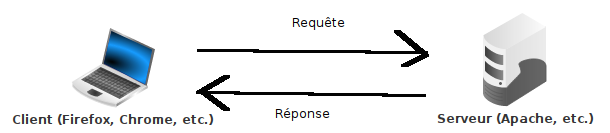

---
title: "Thème web - Chapitre 3 : Le Web"
author: [Sébastien SAUVAGE]
date: "06/09/2022"
keywords: [SNT, WEB, URL, HTTP]
discipline: SNT
...

[^DefLarousseHyper]: [https://www.larousse.fr/dictionnaires/francais/hypertexte/41106](https://www.larousse.fr/dictionnaires/francais/hypertexte/41106)

[^WikiHypertexte]: [https://fr.wikipedia.org/wiki/Hypertexte](https://fr.wikipedia.org/wiki/Hypertexte)

\Huge \textbf{Thème 2 : Le web}\normalsize  

\ 

\huge \textbf{Chapitre 3 : Le Web}\normalsize

\ 

Internet peut être vu comme une infrastructure qui permet des services et des usages. Il a été popularisé dans les années 1990 par la plus connue de ses applications, **le Web**, ensemble de pages associées par **des liens hypertextes** et lisibles par un navigateur.  

# Un peu d'histoire

**Hypertexte**  

Technique ou système permettant, dans une base documentaire de textes, de passer d'un document à un autre selon des chemins préétablis ou élaborés lors de la consultation.[^DefLarousseHyper]  

Étymologiquement, le terme implique un dépassement de la linéarité du texte. Une telle démarche est apparue dès le XIIème siècle avec les index (renvoi direct à une page), puis au XVème siècle avec les notes (de bas de page ou de fin). L’Encyclopédie de Diderot et D’Alembert (XVIIIème siècle propose un « enchainement des connaissances »). Des textes littéraire ont une lecture non linéaire ainsi que les livres-jeux (livres dont vous êtes le héros).
La première description du concept d’hypertexte est due en 1945 à l’ingénieur américain Vannevar Bush (1890-1974). Le terme est inventé en 1965 par le sociologue américain Ted Nelson (1937-).[^WikiHypertexte]  

\   

Robert Caillau et Tim Berners-Lee sont membres du World Wide Web Hall of Fame (1994). Tim Berners-Lee est titulaire du prix Turing (2017) et peut être appelé "sir Tim Berners-Lee" car la reine Élisabeth II lui a conféré l’Ordre du Mérite (13 juin 2007), seconde décoration du royaume britannique (24 personnes vivantes au total).  

Aujourd’hui Tim Berners-Lee se désole que le Net ne puisse "réaliser son vrai potentiel d’outil au service de toute l’humanité" en raison des fausses nouvelles (_fake news_), de la publicité politique et de l’usage abusif de données personnelles. Depuis octobre 2018, il mène un projet au sein de la startup Inrupt pour nous redonner la maîtrise de nos données.  

\  

La majorité du Web est invisible (métaphore de l’iceberg), c’est le Web profond (**deep web**) ou web caché (qui n’a pas de connotation négative) : partie du web qui n’est pas indexé par les moteurs de recherche : parties privées des sites, pages dynamiques (pages qui n’existent pas tant qu’elles n’ont pas été crées), pages non licées à d’autres, contenus (formats) non indexables ...  

Le **dark web** (internet clandestin) n’est pas visible non plus et a une réputation plus sulfureuse (mais tout n’y est pas illégal) : il s’agit de contenus accessible par des darknet, c’est-à-dire des réseaux qui utilisent Internet mais y ajoutent des protocoles spécifiques, notamment d’anonymisation. Ce n’est plus vraiment du web (d’où la coexistence de darknet et darkweb).

# Le langage HTML
## Définition du langage HTML
Une page Web est un simple fichier texte utilisant un langage interprétable par un navigateur Web, le **langage `HTML`**.  

Un document, en particulier textuel, se compose généralement :  

- d’un contenu (message),
- d’une structure (titre, chapitre, paragraphe, ...),
- d’une mise en forme (ou présentation, qui peut rendre apparente la structure).

\  

Le `HTML` est un **langage de description** de documents qui :  

- structure un contenu à l’aide de **balises**,
- et le met en forme à l’aide du langage associé des feuilles de style `CSS`.

\  

Un document `HTML` est au format texte ; ses balises sont interprétées par un navigateur pour l’afficher.  

Le `HTML` n’est pas un langage de programmation : il ne permet pas de traiter des données et de réaliser des actions. Il faudra l’associer avec d’autres langages :  

- côté serveur pour traiter les données (`PHP`, ...),
- côté navigateur pour mettre en oeuvre des interactions lors d’évènements (`JavaScript`, ...).

\   

## Exercice
Ecrire quelques exemples de balises utilisées dans le langage `HTML`. Vous pouvez revoir le TP sur la création d'une page Web.  

\  

..................................................................................................................................................  

# Les protocoles HTTP et HTTPS
## Le protocole HTTP
 \   

\   

`HTTP` est un **protocole de communication** entre un **client** (par exemple, Firefox ou Chrome) et un **serveur** (par exemple, un logiciel qui gère la transmission des pages Web d'un site) :  

- le client émet une requête `HTTP` par laquelle il demande une action au serveur, le plus généralement de lui délivrer une ressource stockée par ce serveur (et désignée par une URL), par exemple une page Web ;
- le serveur envoie une réponse `HTTP` qui correspond le plus généralement à la ressource demandée (et si la ressource n’a pas été trouvée, le serveur renvoie une erreur 404).  

\   

_Qu’est-ce qu’un protocole ? (3:23)_ : [https://www.youtube.com/watch?v=BUHUWZ_LoH0](https://www.youtube.com/watch?v=BUHUWZ_LoH0)  

## Exercice
Ouvrir le navigateur Web _Firefox_ puis se rendre dans les menus _Outils supplémentaires/Outils de développement_ (touche F12) puis choisir l'onglet _Réseau_.  

Se connecter au site wikipédia : [https://fr.wikipedia.org/wiki/Wikipédia](https://fr.wikipedia.org/wiki/Wikipédia)  

1) Combien de requêtes ont été effectuées ?  

..................................................................................................................................................  

2) a) Sur quelle ressource la première requête a-t-elle porté ?  

..................................................................................................................................................  

b) Quel est le code de l'état de cette requête ? Quelle est sa signification ?

..................................................................................................................................................  

4) A quoi correspondent la deuxième et la troisième requète ?

..................................................................................................................................................  

5) Observer maintenant les requêtes effectuées lors de la visualisation d'une vidéo (lien : [https://www.youtube.com/watch?v=GqD6AiaRo3U](https://www.youtube.com/watch?v=GqD6AiaRo3U)) afin de visualiser les requêtes HTTP en continu.

## Le protocole HTTPS
`HTTPS` (HTTP secured) est la version sécurisée d’`HTTP` : les données qui circulent entre le navigateur client et le serveur sont chiffrées (alors qu’elles sont "en clair" sous `HTTP`) ; elles sont donc inexploitables si elles sont interceptées.  

Attention, ce n'est que la transmission des données entre client et serveur qui est sécurisée, par leur stockage.  

\   

_Comment crypte-t-on les données sur internet ? (4:42)_	: [https://www.youtube.com/watch?v=PW_x5m08QRQ](https://www.youtube.com/watch?v=PW_x5m08QRQ)  

## Exercice
Dans cet exercice, nous allons étudier la sécurité de la page\  

[https://www.labanquepostale.fr/particulier/connexion-espace-client.html](https://www.labanquepostale.fr/particulier/connexion-espace-client.html)  

1) Citer deux éléments indiquant que cette page est sécurisée. Y a-t-il d'autres éléments de sécurité proposés par cet page Web ?  

..................................................................................................................................................  

2) Cliquer sur le **certificat** (le _cadenas_ dans la barre d'adresse du navigateur) puis sur _Connexion sécurisée_ puis _Plus d'informations_ et enfin _Afficher le certificat_.
a) Pour qui est émis ce certificat ?

..................................................................................................................................................  

b) Qui a attribué ce certificat ?

..................................................................................................................................................  

c) Durant quelle période (date de début et date de fin) est valable le certificat ?

..................................................................................................................................................  

## Quelques précautions à prendre sur le Web
**Hameçonnage** (filoutage, phishing) :	technique qui fait croire à la victime qu’elle s’adresse à un tiers de confiance (banque, administration, …), alors qu’il s’agit d’un faux (site, email, …), afin de lui soutirer des renseignements personnels, qui serviront ensuite à une usurpation d’identité.  

Parades : vérifier l’URL ou l’adresse mail de l’expéditeur, le certificat du site, l’orthographe, la vraisemblance (une organisation ne vous demande pas des informations sur vous qu’elle a déjà), logiciel de sécurité.  

\   

**Dévoiement** (pharming) :	technique de redirection d’une requête vers une adresse IP ne correspondant pas au nom de domaine demandé, soit par corruption du serveur DNS consulté, soit par infection du poste ou d’un routeur.  

Parades :	utiliser le protocole HTTPS et DNSSEC (DNS sécurisé), vérifier le certificat du site. Un certificat électronique authentifie l’émetteur d’une information (un tiers de confiance, celui qui délivre le certificat, assure que l’émetteur de l’information est bien celui qu’il prétend être).  

# Adressage réticulaire (URL)
## Elements d'une URL
Les adresses réticulaires ou URL (Uniform Resource Locator), identifient des ressources, les localisent sur un réseau et décrivent leur mode d’accès :  
$\underbrace{\text{https}}_{(1)}\text{://}\underbrace{\text{www}}_{(2)}\text{.}\underbrace{\text{gouvernement.fr}}_{(3)}\text{/}\underbrace{\text{actualite}}_{(4)}\text{/}\underbrace{\text{le-calendrier-scolaire-2022-2023.html}}_{(5)}$  
(1) : Nom du protocle (par exemple, `https`)  
(2) : `www` est un nom par défaut des serveurs Web des sites internet. Son absence est parfois possible, tout comme `www2`.  
(3) : Il s'agit du nom de domaine (par exemple, _gouvernement.fr_)  
(4) : Il s'agit du chemin où se trouve la ressource, la page Web (par exemple, dans le dossier _actualite_)  
(5) : Il s'agit de la ressource, la page Web (par exemple, la page Web _le-calendrier-scolaire-2022-2023.html_). Si ça n'est pas spécifié, il s'agit souvent de la page _index.html_  

\   

_Qu’est-ce qu’un nom de domaine ? (02:47)_ : [https://www.youtube.com/watch?v=si6XL306MiE](https://www.youtube.com/watch?v=si6XL306MiE)  

\newpage

## Exercice

1) Pour chacune de ces URL, entourer (ou surligner) de quatre couleurs différentes le protocole utilisé, le nom de domaine, le chemin vers la ressource et la ressource demandée :

a) http://www.onisep.fr/Choisir-mes-etudes/Au-lycee-au-CFA/Au-lycee-general-et-technologique/La-classe-de-seconde-generale-et-technologique/choisir-son-orientation-apres-la-seconde.html
b) http://www.lequipe.fr/Football/ligue-1/page-classement-equipes/general.html
c) https://www.google.fr/
d) https://www.education.gouv.fr/reussir-au-lycee/le-baccalaureat-general-10457
e) https://www.youtube.com/watch?v=By2gq3Urvxo
f) http://algoprog.fr/07-snt/main.pdf  

Légende :  

\   

..................................................................................................................................................  

2) Voici une URL : https://www.youtube.com/watch?time_continue=231&v=d40xyaBBw-M  

a) De combien de paramètres dispose-t-elle ?  

..................................................................................................................................................  

b) A partir de quel moment va débuter la lecture de la vidéo ?  

..................................................................................................................................................  

\   

_Le web, site internet ou site web ? (05:18)_ : [https://www.youtube.com/watch?v=GqD6AiaRo3U](https://www.youtube.com/watch?v=GqD6AiaRo3U)

\   

**Sources**  

- Cours de SNT de François DUREL  