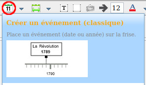
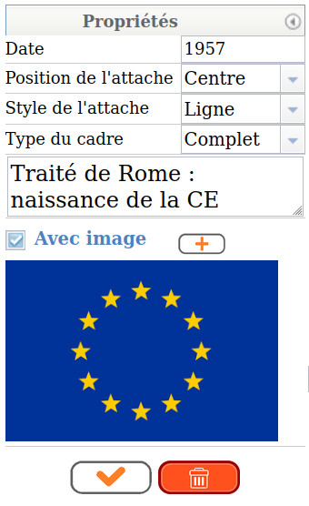
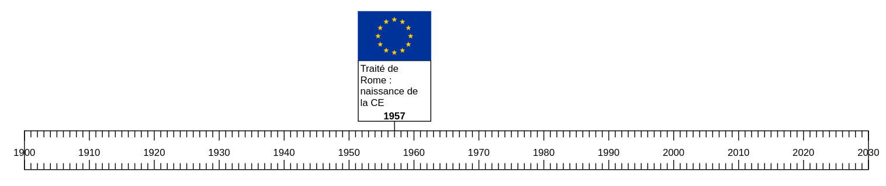
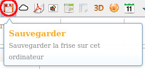
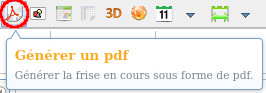

---
title: "Thème web - Chapitre 1 : Historique du web"
author: [Sébastien SAUVAGE]
date: "01/09/2022"
keywords: [SNT, WEB, historique]
discipline: SNT
...

\Huge \textbf{Thème 2 : Le web}\normalsize  

\ 

\huge \textbf{Chapitre 1 : Historique du web}\normalsize

# Mise en place d'une frise chronologique

## Consignes

**a)** Réalisez, à l’aide de l’outil situé à l’adresse [http://www.frisechronos.fr/dojomain.htm](http://www.frisechronos.fr/dojomain.htm), une frise chronologique comportant les dates des événements historiques et liés au web ci-dessous.

**b)** Ensuite, une fois l'ensemble des dates insérées, pour chacun de ces événements, illustrez-les par une image et un commentaire.

Pour les images, vous utiliserez un site d'images libres de droit, tel que [http,s://pixabay.com/fr/](https://pixabay.com/fr/)

**c)** Votre travail final sera un fichier au format PDF dont le nom du fichier aura le format **Classe_NOM_Prenom.pdf** sans accent.  Pensez également à conserver une sauvegarde de votre frise au format BIN afin de la réutiliser dans les thèmes suivants.

\

**Dates historiques**  

- 1957 : Traité de Rome/CEE
- 1961 : Mur de Berlin
- 1966 : Révolution culturelle en Chine
- Printemps/mai 1968 : Révolutions étudiantes à Paris, Rome, Prague...
- 1969 : Premiers pas sur la lune
- 1979 : Proclamation de la République islamique en Iran
- 1981 : Premier ordinateur portable
- 1986 : Catastrophe nucléaire de Tchernobyl
- 1989 : Chute du mur de Berlin et fin de la Guerre froide
- 1991 : Guerre du Golfe
- 1992 : Traité de Maastricht (citoyenneté européenne)
- 1994 : Fin de l’Apartheid
- 1999: Première mise en circulation de l’euro
- 2001 : Attentat du World Trade Center à New York
- 2003 : Guerre en Irak
- 2011 : Catastrophe nucléaire à FUKUSHIMA
- 2015 : Attentats meurtriers en France "Charlie Hebdo"

**Dates clés du web**  

- 1965 : invention et programmation du concept d’hypertexte par **Ted Nelson**
- 1989 : naissance du Web au CERN par **Tim Berners Lee**
- 1993 : mise dans le domaine public, disponibilité du premier navigateur **Mosaic**
- 1995 : mise à disposition de technologies pour le développement de site Web interactif (langage JavaScript) et dynamique (langage PHP)
- 1995 : **Jeff Bezos** lance la librairie en ligne **Amazon.com**, persuadé que le futur du commerce est sur le Web
- 1998 : apparition de **Google**
- 2001 : standardisation des pages grâce au DOM (Document Object Model)
- 2001 : lancement de **Wikipedia**, encyclopédie libre en ligne
- 2004 : première version stable de **Firefox**
- 2004 : **Thefacebook.com**, réseau social créé par Mark Zuckerberg
- 2005 : **YouTube**, site de partage de vidéos en ligne
- 2008 : lancement du navigateur **Chrome**, propriété de Google
- 2010 : mise à disposition de technologies pour le développement d’**applications sur mobiles**
- 2010 : Emmergence du **HTML5**
- 2014 : **le milliard de site web** est dépassé. Il s'élève à 1,60 milliard en 2022
- 2021 : plus de **4,8 milliards d'utilisateurs** du web. 

## Besoin d'aide ?

- Pour créer un événement, utiliser l'icône _Créer un événement_ : 
- Ainsi, la première date peu être saisie de la manière suivante :  
{
- Vous pouvez déplacer les événements verticalement et modifier leur largeur.
- On obtient alors la frise suivante :  

- Penser à enregistrer régulièrement votre travail au format BIN à l'aide de l'icône _Sauvegarder_ : 
- Pour sauvegarder votre travail final au format PDF, utiliser l'icône _Générer un PDF_ : 

# Ce qu'il faut savoir

- Connaître les dates clés du web.

\ 

\Large\textbf{Sources}\normalsize

- Ressources d'accompagnement par thématique du site Eduscol : Frise chronologique  
[https://eduscol.education.fr/1670/programmes-et-ressources-en-sciences-numeriques-et-technologie-voie-gt](https://eduscol.education.fr/1670/programmes-et-ressources-en-sciences-numeriques-et-technologie-voie-gt)