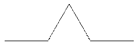
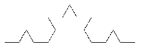
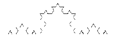
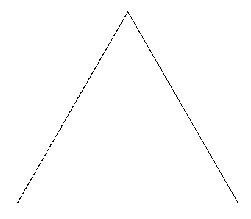
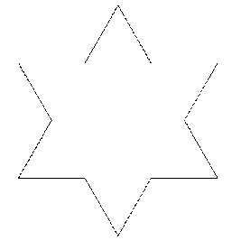
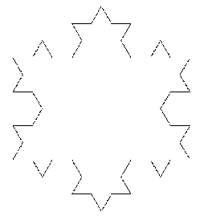
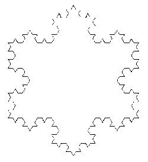

\huge \textbf{Thème 4}\normalsize  

\ 

\Large \textbf{Récursivité}\normalsize  

# Définition
## Introduction

Soit $n$ un entier naturel. On souhaite écrire un script qui permette de calculer la somme des $n$ premiers entiers naturels.  

\ 

Bien sûr, nous pourrions utiliser la formule générale : $\dfrac{n(n+1)}{2}$ mais l'objectif est de proposer un script qui soit plus proche de la somme définie, c'est à dire, ajouter un à un l'ensemble des sommes des $n$ premiers entiers.  

### Exercice 1

1) Calculer la somme $0 + 1 + 2 + ... + 10$.
2) Ecrire une fonction \textit{somme} en langage naturel puis en langage Python qui permette de répondre au problème. Cette fonction prendra un paramètre qui est la valeur de $n$.  

**Solution**  

1) $\mathscr{S}_{10} = 0 + 1 + 2 + 3 + 4 + 5 + 6 + 7 + 8 + 9 + 10 = 55$
2)   

**En langage naturel**  
```python
Fonction somme (n)
    r <- 0
    Pour k allant de 0 à n
        r <- r + k
    Fin du Pour
    Retourner r
    Fin de la fonction
```
**En langage Python**  
```python
def somme (n):
    r = 0
    for k in range(0, n + 1):
        r = r + k
    return r
```

Cette première façon de procéder effectue le calcul en prenant les entiers de manière croissante.  
Par exemple, si on cherche $\mathscr{S}_3$, on procède ainsi :  

$somme(3) = 0 + \text{"somme des termes de 1 à 3"}$  
$somme(3) = 0 + 1 + \text{"somme des termes de 2 à 3"}$  
$somme(3) = 0 + 1 + 2 + \text{"somme des termes de 3 à 3"}$  
$somme(3) = 0 + 1 + 2 + 3$  

\ 

On peut voir ce calcul autrement. En effet, on peut imaginer la manière suivante :  
  - $\text{ si } n = 0$, $\text{somme} (n) = 0$ ;  
  - $\text{ si } n \geqslant 1$, $\text{somme} (n) = n + \text{somme}(n - 1)$.  

\ 

Autrement dit, pour calculer la somme $\mathscr{S}_3$, cette fois, on effectue les calculs en prenant les entiers de manière décroissante :  
$somme(3) = 3 + somme(2)$  
$somme(3) = 3 + 2 + somme(1)$  
$somme(3) = 3 + 2 + 1 + somme(0)$  
$somme(3) = 3 + 2 + 1 + 0$  

\ 

Sur notre exemple, cette manière ne modifie pas la complexité des calculs, par contre, elle est fondamentalement différente dans l'approche du problème initial.  

\ 

Dans la seconde approche, on réduit notre problème à un problème plus simple, puisqu'au lieu de calculer la somme $somme(n)$, on le réduit à calculer $somme(n - 1)$.  

Cette manière de procéder est simple à comprendre et permet de résoudre parfois plus facilement des situations difficilement envisageables avec les techniques vues jusqu'ici.  

Comme on peut l'observer, on voit que la définition de $somme(n)$ va dépendre de $somme(n - 1)$. La fonction $somme$ va donc s'appeler elle-même. On appelle cela **une fonction récursive**.  

\ 

Pour définir une fonction récursive, il faut donc prévoir de quelle manière on passe de l'état pour $n$ à l'état pour $n - 1$. Il faut également prévoir le cas simple, souvent pour $n = 0$ ou $n = 1$, situation appelée cas de base.  

### Exercice 2
Rédiger en langage naturel puis en langage Python une fonction $somme\_rec (n)$ qui cette fois est récursive.  

\ 

**Solution**  

**En langage naturel**  
```python
Fonction somme_rec (n)
    Si n = 0
        Retourner 0
    Sinon
        Retourner n + somme_rec(n - 1)
    Fin du si
    Fin de la fonction
```

**En langage Python**  
```python
def somme_rec(n):
    if n == 0 :
        return 0
    else:
        return n + somme_rec(n - 1)
```

### Remarque
On peut observer le comportement de cette fonction à l'aide de l'outil en ligne [http://pythontutor.com/](http://pythontutor.com/)  

## Définition
### Définition
**Une fonction récursive**** est une fonction qui fait appelle à elle-même.  
On parle aussi d'algorithme récursif.  


### Principe
Pour bien écrire une fonction récursive, il faut :  

- traiter un (ou plusieurs) cas de base ;
- écrire un (ou plusieurs) cas général.

### Exemple
On considère la suite définie par : $u_0 = 1,5$ et  $\forall n \in \mathbb{N}^\star$, $u_{n+1} = 2u_n - 1$  
Ecrire en langage naturel, puis en langage Python deux algorithmes permettant de calculer un terme de la suite dont on considère le rang $n$ en paramètre.  
Le premier algorithme utilisera une boucle, le second utilisera une fonction récursive.  

\newpage

**Solution**  
**En langage naturel**  
```python
Fonction suite1 (n)
    u <- 1.5
    Pour indice allant de 1 à n
        u <- 2 * u - 1
    Fin du pour
    Retourner u
    Fin de la fonction
```

**En langage Python**  
```python
def suite1(n):
    u = 1.5
    for indice in range (n):
        u = 2 * u - 1
    return u
```

**En langage naturel**  
```python
Fonction suite2 (n)
    Si n = 0
        Retourner 1.5
    Sinon
        Retourner 2 * suite2(n - 1) - 1
    Fin du si
    Fin de la fonction
```

**En langage Python**  
```python
def suite2(n):
    if n == 0 :
        return 1.5
    else:
        return 2 * suite2(n - 1) - 1
```

# Formulations récursives
## Généralités
Une formulation récursive d'une fonction est toujours constituée de plusieurs cas : _**des cas de bases**_ et _**des cas récursifs**_.  

Les cas de bases sont les cas où l'on peut avoir le résultat simplement sans avoir recours au cas récursif.  

### Exemple
On considère la puissance $n$-ième d'un nombre$x$, c'est à dire le nombre : $x^n = \underbrace{x \times \text{...} \times x}_{n \text{ fois}}$.  
On souhaite écrire une fonction \textit{puissance ($x$, $n$)} qui permet de déterminer le nombre $x^n$ en passant en paramètre les nombres $x$ et $n$.  

1) Ecrire une formulation récursive de cette fonction.
2) Ecrire en langage naturel puis en langage Python cette fonction récursive.

**Solution**  

1) Si $n = 0$, _puissance ($x$, $n$)_ = 1 ;  
Si $n = 1$, _puissance ($x$, $n$)_ = 1 ;  
Si $n \geqslant 2$, _puissance ($x$, $n$)_ = $x \times$ _puissance ($x$, $n - 1$)_  
2)   
**En langage naturel**  
```python
Fonction puissance (x, n)
    Si n = 0
        Retourner 1
    Sinon
        Si n = 1
            Retourner x
        Sinon
            Retourner x * puissance(x, n - 1)
        Fin du si
    Fin du si
    Fin de la fonction
```

**En langage Python**  
```python
def puissance(x, n):
    if n == 0 :
        return 1
    elif n == 1 :
        return x
    else:
        return x * puissance(x, n - 1)
```

## Double récursion
Les expressions qui définissent une fonction peuvent aussi dépendre de _plusieurs_ appels à la fonction en cours de définition.  

### Exemple : Suite de Fibonacci
La fonction de Fibonacci, qui doit sont nom au mathématicien Léonardo Fibonacci, est définie récursivement, pour tout entier naturel $n$, de la manière suivante :  

- le premier terme est 0 ;
- le deuxième terme est 1 ;
- pour tous les autres termes, ils sont la somme des deux précédents.

1) Calculer à la main les 12 premiers termes de la suite de Fibonacci.
2) Ecrire une formulation récursive de la fonction _Fibonacci ($n$)_ qui retourne le terme de rang $n$ de la suite.
3) Ecrire en langage naturel, puis en langage Python une fonction permettant de calculer le terme de rang $n$, $n$ étant un entier passé en paramètre.

\   

**Solution**  

1) 0 ; 1 ; 1 ; 2 ; 3 ; 5 ; 8 ; 13 ; 21 ; 34 ; 55 ; 89.
2) Si $n = 0$, fibonacci ($n$) = 0  
Si $n = 1$, fibonacci ($n$) = 1  
Si $n\geqslant 2$, fibonacci ($n$) = fibonacci ($n - 1$) + fibonacci ($n - 2$)
3) \   

**En langage naturel**
```python
Fonction fibonacci (n)
    Si n = 0
        Retourner 0
    Sinon
        Si n = 1
            Retourner 1
        Sinon
            Retourner fibonacci(n - 1) + fibonacci (n - 2)
        Fin du si
    Fin du si
    Fin de la fonction
```

\newpage

**En langage Python**
```python
def fibonacci(n):
    if n == 0 :
        return 0
    elif n == 1 :
        return 1
    else:
        return fibonacci(n - 1) + fibonacci(n - 2)
```

## Définitions récursives bien formées
### Règles élémentaires
Il est important de respecter quelques règles élémentaires lorsque l'on écrit une définition récursive.  

- Tout d'abord, il faut s'assurer que **la récursion va bien se terminer**, c'est-à-dire que l'on va finir par "retomber" sur un cas de base de la définition ;
- ensuite, il faut que **les valeurs utilisées** pour appeler la fonction soient toujours **dans le domaine de la fonction** ;
- enfin, il convient de vérifier qu'il y a bien **une définition pour toutes les valeurs du domaine**.

# Complexité et Solution d'un algorithme récursif
## Complexité
### Propriété
La complexité d'un programme récursif est linéaire ou exponentielle.  
Autrement dit, $\mathscr{C}(n) = \mathscr{O}(n)$ ou $\mathscr{C}(n) = \mathscr{O}(e^n)$

### Exemple
On reprend l'algorithme récursif permettant de calculer la somme des $n$ premiers termes.  
Quelle est la complexité de ce dernier ?  

\   

**Solution**  
Si $n= 0$, il n'y a que le test \textit{n == 0} qui est effectué, donc $\mathscr{C}(0) = 1$  
Sinon, il y a le test, ainsi que la somme donc $\mathscr{C}(n) = 2 + \mathscr{C}(n - 1)$.  
La complexité de notre algorithme est une suite arithmétique, autrement dit, $\mathscr{C}(n) = \mathscr{C}(0) + n \times r = 1 + 2n$ donc ici, $\mathscr{C}(n) = \mathscr{O}(n)$, la complexité est linéaire.

## Correction
### Propriété
Pour qu'un algorithme récursif fonctionne correctement, il est nécessaire de vérifier deux propriétés :  

- l'algorithme doit se terminer (c'est ce qu'on appelle **le problème de la terminaison**) ;
- si l'algorithme se termine, il faut qu'il donne ce que l'on souhaite (c'est ce qu'on appelle \textbf{la correction partielle}).

### Terminaison
Sur l'exemple du calcul de la somme des $n$ premiers entiers naturel, la fonction récursive prend pour paramètre $n$, puis $n - 1$, puis $n - 2$, etc ... Autrement dit, la suit des paramètres est une suite d'entiers positifs strictement décroissante, donc elle va valoir 0 à un  moment donné,ce qui correspond au cas de base ce qui assure que la fonction se termine.

### Correction partielle
Dans ce même exemple, pour $n = 0$, la valeur retournée est correcte, et dans le cas $n > 0$, la partie récursive _n + somme(n - 1)_ est bien égale à _somme(n)_, ce qui correspond à la formulation récursive du problème. La fonction est bien correcte.

# Programmer avec des fonctions récursives
Une fois que l'on dispose d'une définition récursive pour une fonction, il est relativement simple d'implémenter le programme en langage naturel ou dans tout autre langage.  

\ 

Cependant, il faut faire attention à deux points importants :  

- le domaine mathématiques d'une fonction n'est pas toujours celui utilisé par la fonction implémenté dans un langage donné ;
- le choix de la définition récursive engendre des modèle d'exécution qui sont alors plus ou moins efficace.

## Domaine mathématiques et type de données
Si on considère la somme des $n$ premiers entiers naturels, la définition mathématiques peut s'écrire :  
- Si $n = 0$, somme($n$) = 0,  
- si $n > 0$, somme($n$) = $n$ + somme($n - 1$)  

\   

Cette définition est définie uniquement pour les entiers positifs (entiers naturels).  

Dans le cas de l'implémentation en Python, cette fois, le paramètre peut être quelconque, en particulier, un entier négatif :  
```python
def somme_rec(n):
    if n == 0 :
        return 0
    else:
        return n + somme_rec(n - 1)
```

Ainsi, _somme\_rec(-1)_ ne provoque pas d'erreur immédiate, et appelle _somme\_rec(-2)_ qui lui-même appelle _somme\_rec(-3)_ etc ...  

\   

Pour éviter ce comportement, la première façon est de remplacer le cas de base _n == 0_ par _$n \leqslant 0$_. Cette solution a pour avantage de garantir la terminaison, même pour les entiers négatifs, mais elle impose de manière arbitraire la valeur retournée pour ces valeurs de paramètres négatifs.  

\   

Une autre solution est de restreindre les appels à la fonction aux entiers positifs, c'est-à-dire de vérifier dès le début de l'appel de _somme(n)_ que le paramètre $n$ est bien un entier naturel.  
Pour cela, nous allons utiliser l'instruction **assert** :  

```python
def somme_rec(n):
    assert isinstance(n, int) and n >= 0, 'Le paramètre doit être un entier naturel.'
    if n == 0 :
        return 0
    else:
        return n + somme_rec(n - 1)
```

De cette manière, une erreur sera déclenchée pour tout appel de la fonction _somme\_rec(n)_ lorsque $n$ n'est pas un entier et que celui-ci n'est pas positif.  

Le texte _'Le paramètre doit être un entier naturel.'_ n'est pas obligatoire.  

### Remarque
Bien que cette solution soit correcte, la vérification du paramètre s'effectue à chaque appel de la fonction, alors que si lors du premier appel, le paramètre est valide, il est ensuite inutile de procéder à une vérification à chaque fois. La solution consiste à écrire deux fonctions, l'une qui sera appelée par l'utilisateur et qui appellera la seconde, qui elle, sera récursive :  

```python
def somme_rec(n):
    if n == 0 :
        return 0
    else:
        return n + somme_rec(n - 1)
        
def somme_bis(n):
    assert isinstance(n, int) and n >= 0, 'Le paramètre doit être un entier naturel.'
    return somme_rec(n)
```

Il faut alors appeler _somme\_bis(5)_ pour obtenir la somme des entiers inférieurs ou égaux à 5.  

## Modèle d'exécution
A chaque appel d'une fonction récursive, un nouvel environnement d'exécution se crée et vient s'empiler aux précédents. Ce procédé prend de la place en mémoire, et peut donc générer des dépassement de capacité !  

Pour contourner ce problème, il faut alors trouver une autre formulation récursive, qui, pour un paramètre donné, effectuera moins d'appels et donc aura un coût mémoire plus faible.  

On peut reprendre par exemple le calcul d'une puissance d'un nombre réel :  
Si $n$ = 0 ou si $n$ = 1, puissance ($x$, $n$) = 1  
si $n \geqslant 2$, puissance ($x$, $n$) = $x \times$ puissance ($x$, $n - 1$)  

\   

On peut remarquer que pour les valeurs de $n \geqslant 2$:  
si $n$ est pair, $x^n = x^2 \times x^{n / 2}$  
si $n$ est impair, $x^n = x \times \left(x^{(n - 1) / 2}\right)^2$  

\   

Ainsi, à chaque appel de la fonction \textit{puissance}, on divise par 2 le nombre de récursion.  

### Exercice 3
Ecrire en langage naturel puis en langage Python une nouvelle implémentation de la fonction puissance en prenant cette fois la nouvelle formulation récursive.  

\   

**Solution**  
**En langage naturel**  
```python
Fonction puissance (x, n)
    Si n = 0
        Retourner 1
    Sinon
        Si n = 1
            Retourner x
        Sinon
            Si n est pair
                Retourner (puissance(x, n / 2))^2
                # Attention à faire en sorte que n / 2
                # soit de type entier
            Sinon
                Retourner x * puissance(x, (n - 1) / 2))^2
                # Attention à faire en sorte que (n-1)/2
                # soit de type entier
            Fin du si
        Fin du si
    Fin du si
    Fin de la fonction
```

**En langage Python**  
```python
def puissance(x, n):
    if n == 0 :
        return 1
    elif n == 1:
        return x
    elif n % 2 :
        return (puissance(x, n // 2)) ** 2
    else:
        return x * ((puissance(x, n // 2)) ** 2)
```

### Remarque
Python limite explicitement le nombre d'appels récursifs dans une fonction. Cette valeur par défaut est 1 000.  

Il est possible de modifier cette valeur à l'aide de la fonction _sys.setrecursionlimite_. Par exemple pour limiter à 2000 récursion, on écrira :  
```python
import sys  
sys.setrecursionlimit(2000)
```

### Remarque
Certains langages de programmation, plus spécialisés que Python dans l'écriture de fonction récursives, permettent alors d'éviter de placer de trop nombreux environnements dans la pile d'appel. C'est le cas des langages fonctionnels comme par exemple \textit{OCaml}.

### Remarque
D'autres problèmes de mémoire peuvent subvenir en raison de calculs suspendus trop important.  
Pour optimiser l'espace mémoire, on stocke les résultats intermédiaires dans **des accumulateurs** que l'on passe alors en paramètre de la fonction. Cela nécessite alors de définir une valeur par défaut de cet accumulateur, puisqu'il n'y a pas nécessité de la part de l'utilisateur de le définir.  

### Exemple avec accumulateur
Pour calculer la puissance d'un nombre, on peut écrire en langage python la fonction suivante :  
```python
def puissance(x, n, acc = 1):
    if n == 0:
        return acc
    else:
        return puissance(x, n - 1, acc * x)
```

# Exercices
## Exercice

1) Donner une définition récursive qui correspond au calcul de la fonction factorielle $n!$ définie par $n! = 1 \times 2 \times ... \times n$, si $n > 0$ et $0! = 1$.
2) Ecrire un code en langage naturel puis en langage Python d'une fonction \textit{fact($n$)} qui implémente cette définition.

## Exercice
Soit $u_n$ la suite d'entiers définie par :  
- $u_0 = k$, où $k$ est un entier strictement supérieur à 1  
- si $u_n$ est pair, $u_{n+1} = u_n / 2$  
- si $u_n$ est impair, $u_{n + 1} = 3 \times u_n + 1$  

\   

Ecrire une fonction récursive _syracuse(u)_ qui affiche les valeurs successives de la suite $u_n$ tant que $u_n$ est plus grand que 1.  
_La conjecture de Syracuse affirme que, quelle que soit la valeur de $u_0$, il existe un indice $n$ dans la suite tel que $u_n = 1$. Cette conjecture défie toujours les mathématiciens._  

## Exercice
On considère la suite $(u_n)$ définie par la relation de récurrence suivante, où $a$ et $b$ sont des réels quelconques :  
- si $n$ = 0, $u_n$ = $a$, un nombre réel  
- si $n$ = 1, $u_n$ = $b$, un nombre réel  
- si $n > 1$, $u_{n} = 3 \times u_{n - 1} + 2 \times u_{n - 2} + 5$  

\   

Ecrire une fonction récursive _serie($n$, $a$, $b$)_ qui retourne le $n$-ième terme de cette suite pour des valeurs $a$ et $b$ données en paramètres.  

## Exercice
Ecrire une fonction récursive _pgcd($a$, $b$)_ qui renvoie le PGCD de deux entiers $a$ et $b$.

## Exercice
Que font les fonctions suivantes, implémentées en Python ? (répondre à la question sans tester le programme)  

```python
def mystere1(L):
    assert isinstance(L, list)
    if len(L) == 1:
        return L[0]
    if L[0] < L[1]:
        L.pop(1)
    else:
        L.pop(0)
    return mystere1(L)
```

```python
def mystere2(L, M = []):
    assert isinstance(L, list)
    if not(L):
        return M
    a = L.pop(0)
    if a not in M:
        M.append(a)
    return mystere2(L, M)
```

```python
def mystere3(a, b):
    assert (
        isinstance(a, int) and
        isinstance(a, int) and
        a >= 0 and
        b >= 0
        )
    if b == 1:
        return a
    return a + mystere3(a, b - 1)
```

## Exercice
Ecrire une fonction récursive _nombre\_de\_chiffres($n$)_ qui prend un entier positif ou nul $n$ en paramètre et renvoie son nombre de chiffres.  
Par exemple :  
```python
>>> nombre_de_chiffres(238966)
6
```

## Exercice
Reprendre l'exercice 1, mais cette fois, en utilisant un accumulateur.  

## Exercice
1) Ecrire une fonction récursive \textit{boucle($i$, $k$)} qui affiche les entiers entre $i$ et $k$.  
Par exemple, \textit{boucle(2, 5)} doit afficher : 2 3 4 5.  
2) Ecrire une fonction récursive \textit{boucle2($i$, $k$, t = [])} qui retourne un tableau (objet de type list) contenant tous les entiers entre $i$ et $k$.  
    \textit{Le tableau sera passé en troisième paramètre (accumulateur) et aura pour valeur [] par défaut.}

## Exercice
Ecrire une version récursive du programme ci-dessous implémenté en Python :  
```python
from turtle import *

couleurs = ['blue', 'green', 'yellow', 'orange', 'red', 'purple']
bgcolor('black')

def dessin():
    for i in range(180):
        color(couleurs[i % 6])
        forward(i)
        right(59)

dessin()
```

## Exercice
La courbe de Koch, du nom du mathématicien suédois Niels Fabian Helge von Koch, est une figure qui s'obtient de manière récursive.  

Le cas de base à l'ordre 0 de la récurrence est simplement le dessin d'un segment d'une certaine longueur _l_.  

 \  

Le cas récursif d'ordre $n$ s'obtient en divisant ce segment en trois morceaux de même longueur $l / 3$, puis en dessinant un triangle équilatéral dont la base est le morceau du milieu, en prenant soin de ne pas dessiner cette base. Cela forme une sorte de chapeau comme dessiné sur la figure ci-dessous.  

 \  

On réitère ce processus à l'ordre $n - 1$ pour chaque segment de ce chapeau (qui sont tous de longueur $l / 3$).  

Par exemple, les courbes obtenues à l'ordre 2 et 3 sont données ci-dessous.  

 \  \  

\   

1) Ecrire une fonction _koch(n , l)_ (documentation comprise) qui dessine avec le module _turtle_ un flocon de Koch de profondeur $n$ à partir d'un segment de longueur $l$.
2) **Méthodes de Turtle utiles** _(liste non exhaustive)_ : _hideturtle(), penup(), pendown(), setpos(..., ...), forward(...), left(...), right(...), exitonclick()._
3) Si l'on trace trois fois cette figure, on obtient successivement un triangle, une étoile, puis un flocon de plus en plus complexe :  
 \  \  \   
Ecrire une fonction \textit{flocon(n, l)} (pas forcément récursive) permettant de faire le flocon complet à partir de la fonction réalisée dans la question précédente.

\underline{{\textit{\textbf{Sources}}}}  

- _numérique et sciences informatiques, Tle_, Ed. ellipses. p3 à 17. ISBN 978-2-340-03855-4.
- _numérique et sciences informatiques, Term_, Collection INTERROS des LYCEES, Ed. Nathan. p46-47, 51-52. ISBN 978-2-091-57543-8.
- Serge Bays, _numérique et sciences informatiques, Tle_, Ed. ellipses. p35. ISBN 978-2-340-03844-8.  