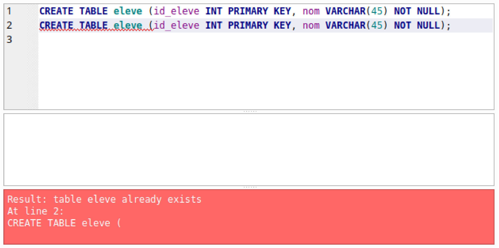
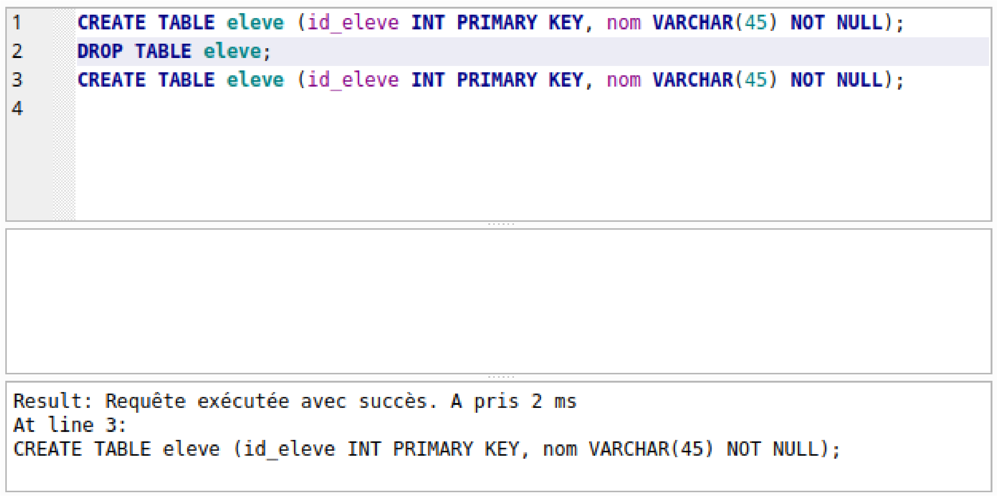
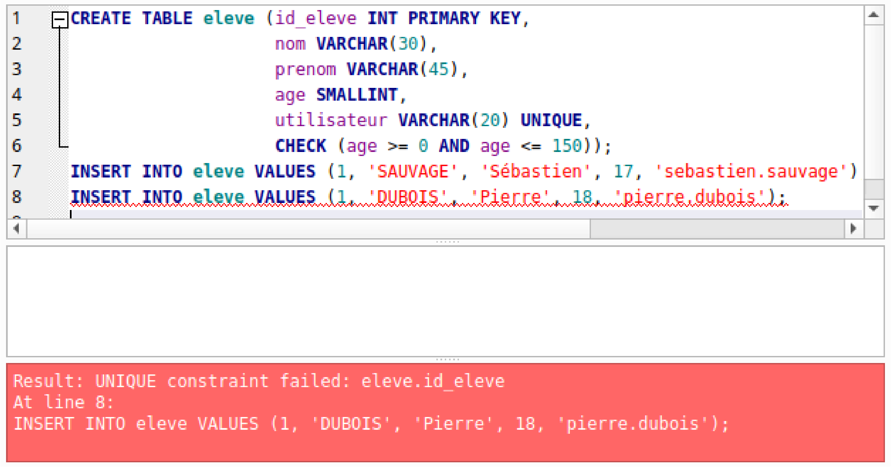

\huge \textbf{Thème 2}\normalsize  

\ 

\Large \textbf{Chapitre 2 : Bases de données relationnelles}\normalsize  

# Introduction
Le modèle relationnel étudié au chapitre précédent est un modèle mathématiques permettant de raisonner sur des données tabulées comme les données sauvegardées sous forme de fichiers `CSV`. Il est mis en oeuvre par un logiciel particulier, **le système de gestion de bases de données (_SGBD_)** relationnels. La plupart des SGBD relationnels utilisent **le langage SQL (_Structured Query Langage_)**.  

Le langage SQL permet d'envoyer des ordres au SGBD :  

- **des mises à jour** : création, ajout ou suppressions de relations ou d'entités ;
- **des requêtes** : récupération de données à partir de critères définis auparavant.

Dans le cadre de l'enseignement NSI de terminale, nous travaillerons avec le logiciel _DB Browser for SQLite_ [^DBBrowserSQLite]  

[^DBBrowserSQLite]:Logiciel libre et gratuit, disponible à l'adresse [https://sqlitebrowser.org/dl/](https://sqlitebrowser.org/dl/)

Il est gratuit et disponible sur différents OS. Quelques adaptations pourraient être nécessaires pour le langage `mySQL` par exemple.

# SQL : un langage de définition de données
Directement inspiré du modèle relationnel introduit par E.Codd, le langage SQL permet la création de **tables** dans une base de données relationnelle. Ce langage est bien sûr standardisé (sous la référence ISO/IEC 9075).  

Il suffit d'écrire une succession d'ordres pour interagir avec le SGBD.  

## Créer une table
Pour créer une table en langage SQL, il suffit d'utiliser les mots clés `CREATE TABLE`.  

La syntaxe est alors la suivante :

 $$\begin{array}{ll}
    \texttt{CREATE TABLE \textit{nom\_de\_la\_table} (} & \textit{\texttt{attribut}}_\textit{\texttt{1}}\textit{\texttt{ domaine}}_\textit{\texttt{1}}\textit{\texttt{ contrainte}}_\textit{\texttt{1}}\textit{\texttt{,}} \\
    & \texttt{...,} \\
    & \textit{\texttt{attribut}}_\textit{\texttt{n}}\textit{\texttt{ domaine}}_\textit{\texttt{n}}\textit{\texttt{ contrainte}}_\textit{\texttt{n}}\textit{\texttt{,}} \\
    & \textit{\texttt{contrainte\_globale}}_\textit{\texttt{1}}\textit{\texttt{,}} \\
    & \texttt{...,} \\
    & \textit{\texttt{contrainte\_globale}}_\textit{\texttt{k}}\texttt{);} \\
\end{array}$$

## Remarque

- La casse des mots importe peu en langage SQL :  
Ecrire `CREATE TABLE` ou `create table` ou `CrEaTe TaBlE` revient à effectuer le même ordre (créer une table).  
Malgré tout, pour faciliter la lisibilité des ordres donnés, il s'agira de respecter les normes : lettres capitales pour les mots clés SQL et lettres minuscules pour les noms d'attributs.
- Les contraintes ne sont pas obligatoires.

## Modèles relationnel et langage SQL : des concepts légèrement différents
Strictement parlant, un modèle relationnel et une table SQL ne sont pas des concept identiques. En effet, une table peut contenir des doublons, c'est à dire qu'il n'y a pas obligation lors de la création d'une table de définir une clé primaire.  

Aussi, même si les concepts sont différents, par la suite, nous pouvons malgré tout nous permettre d'assimiler **Modèle relationnel** et **table**, **Attributs** et **colonnes**, **Entités** et **lignes**.  

\newpage

# Types de données en SQL
Aux domaines des attributs dans le modèle relationnel correspond des types de données en SQL.  

## Types numériques
Pour les types numériques, le langage SQL propose plusieurs représentation pour des nombres de type d'entiers ou de flottants :  

\begin{tabular}{|c|c|c|}
    \hline
    \textbf{Nom du type} & \textbf{exact / approché} & \textbf{description} \\
    \hline \hline
    \texttt{SMALLINT} & exact & entier 16 bits signé \\
    && ($-32\ 768 \leqslant N \leqslant 32\ 767$) \\
    \hline
    \texttt{INTEGER} & exact & entier 32 bits signé \\
    && ($-2\ 147\ 483\ 648 \leqslant N \leqslant 2\ 147\ 483\ 647$) \\
    \texttt{INT} &  & alias pour \texttt{INTEGER} \\
    \hline
    \texttt{BIGINT} & exact & entier 64 bits signé \\
    && ($-9\ 223\ 372\ 036\ 854\ 775\ 808 \leqslant N \leqslant 9\ 223\ 372\ 036\ 854\ 775\ 807$) \\
    \hline
    \texttt{DECIMAL(\textit{t}, \textit{f})} & exact & décimal signé de \texttt{\textit{t}} chiffres dont \textit{\texttt{f}} après la virgule \\
    \hline
    \texttt{REAL} & approché & flottant 32 bits \\
    \hline
    \texttt{DOUBLE PRECISION} & approché & flottant 64 bits \\
    \hline
\end{tabular}

### Remarque
`DECIMAL` permet bien de définir un type de nombres décimaux de manière exacte. A la différence de `REAL`, les valeurs sont exactes mais nécessitent de définir à l'avance le nombre de chiffres après la virgule. Cela peut s'avérer très utile pour travailler avec des valeurs exactes (donc non approchées), comme dans le domaine banquaire.  

### A retenir
Avant de choisir un type décimal, il faut se poser les questions suivantes :  

- Quel est le plus grand nombre que je serai amené à stocker ?
- Quel est le plus petit nombre que je serai amené à stocker ?
- De quelle précision (nombre de chiffres après la virgule) aurais-je besoin ?

## Types textes
Le langage SQL permet de définir également des types alphanumériques pour les domaines de type `String`. Les principaux sont :  
\begin{tabular}{|c|c|c|}
    \hline
    \textbf{nom du type} & \textbf{description} & \textbf{taille (en bits)} \\
    \hline \hline
    \texttt{CHAR (\textit{n})} & Chaîne d'exactement \texttt{\textit{n}} caractères. & $32 + 8 n$ \\
    & Les caractères manquant sont complétés par des espaces.& \\
    \hline
    \texttt{VARCHAR (\textit{n})} & Chaîne d'au plus \texttt{\textit{n}} caractères. & $32 + 8 n$ maximum \\
    \hline
    \texttt{TEXT} & Chaîne de taille quelconque & $32 + 8 \times \text{taille de la chaîne}$ \\
    & (le maximum est supérieur à 8 000 caractères) & \\
    \hline
\end{tabular}

## Type Booléen
### Attention
Le type `BOOLEAN` est optionnel dans le standard SQL. Cela signifie que ce type peut ne pas exister dans certains SGDB. Si tel est le cas, on peut par exemple utiliser un type `CHAR(1)`, texte d'un seul caractère, et on ajoute la contrainte que les valeurs ne peuvent être que `'T'` ou `'F'`.  

## Type des dates, durées et instants
Afin de résoudre de nombreux problèmes complexes liés aux dates et durées, le standard SQL propose différents types, écrits comme de simples chaînes de caractères (mais avec des contraintes spécifiques) :  

\begin{center}
\begin{tabular}{|c|c|c|}
    \hline
    \textbf{nom du type} & \textbf{description} & \textbf{taille (en bits)} \\
    \hline \hline
    \texttt{DATE} & une date au format '\texttt{AAAA-MM-JJ}' & 32 \\
    \hline
    \texttt{TIME} & une heure au format '\texttt{hh:mm:ss}' & 32 \\
    \hline
    \texttt{TIMESTAMP} & un instant (date et heure) au format '\texttt{AAAA-MM-JJ hh:mm:ss}' & 64\\
    \hline
\end{tabular}
\end{center}

### Astuce
Il est possible d'opérer une addition de jours à un type `DATE`. Cela tient compte évidemment des changements de mois, d'année et des années bissextiles.  

Par exemple, si $d$ est un type `DATE`, $d + 10$ sera un type `DATE` contenant la date 10 jours après $d$.  

### Remarque
Selon les SGBD, les valeurs minimales et maximales peuvent varier pour les types `DATE` et `TIMESTAMP`.

## Valeur `NULL`
### NULL
Une valeur `NULL` existe en SQL. Elle représente une absence de valeur et peut être utilisée à la place de n'importe quelle valeur, quel que soit le type attendu.  

### Attention
La valeur `NULL` est à utiliser avec précautions car elle peut être une source d'erreur suite à une violation des contraintes d'intégrité (clé étrangère ayant comme valeur `NULL` par exemple).  

# Spécification des contraintes d'intégrité
## Clé primaire
### Clé primaire
Les mots clé `PRIMARY KEY` permettent d'indiquer qu'un attribut est une clé primaire.  

Si une clé primaire est constituée de plusieurs attributs, on spécifie cette contrainte après la définition de l'ensemble des attributs de la table.

### Exemple
Si on considère une relation `Elèves` modélisant les élèves d'une classe en supposant qu'aucun élève ne porte les mêmes NOM Prénom. On peut définir de deux manières une table `Elèves` :  

```SQL
CREATE TABLE eleve (id_eleve INT PRIMARY KEY,
                    nom VARCHAR(30),
                    prenom VARCHAR(45));
```
```SQL
CREATE TABLE eleve (nom VARCHAR(30),
                    prenom VARCHAR(45),
                    PRIMARY KEY (nom, prenom));
```

## Clé étrangère
### Clé étrangère
Un attribut peut être référencé comme une clé étrangère à l'aide du mot clé `REFERENCES` suivi de la table et de la clé primaire à laquelle elle est associée.  

### Exemple
Dans le cadre d'un modèle relationnel avec trois relations `eleve`, `classe` et `appatenance`, la relation `appartenance` contient deux clés étrangères liées aux clés primaires des deux autres tables. Dans ce cas, on peut créer les tables de la manière suivante :  

```SQL
CREATE TABLE eleve (id_eleve INT PRIMARY KEY,
                    nom VARCHAR(30),
                    prenom VARCHAR(45));
CREATE TABLE classe (id_classe INT PRIMARY KEY,
                     nom_cl CHAR(3));
CREATE TABLE appartenance (id_app INT PRIMARY KEY,
                           classe INT REFERENCES classe id_classe,
                           eleve INT REFERENCES eleve id_eleve);
```

## Unicité, non nullité
Il est parfois utile qu'un attribut, bien que non clé primaire, puisse être défini comme étant unique afin d'ajouter une contrainte au modèle relationnel.  

### Attribut unique
Pour indiquer qu'un attribut est unique, on utilise le mot clé `UNIQUE` comme contrainte de l'attribut.  

\   

**Exemple**  

Dans l'exemple précédent, on peut définir dans la table élève un attribut `utilisateur`, correspondant au code d'accès au réseau de l'établissement. Ce code est unique (deux élèves ne peuvent pas avoir le même code d'accès avec des comptes différents. La création de la table peut s'écrire comme ci-dessous :  

```SQL
CREATE TABLE eleve (id_eleve INT PRIMARY KEY,
                    nom VARCHAR(30),
                    prenom VARCHAR(45),
                    utilisateur VARCHAR(20) UNIQUE);
```

### Non nullité
Une bonne pratique consiste à indiquer qu'un attribut ne peut pas être `NULL`.  

Pour indiquer qu'un attribut ne peut prendre la valeur `NULL`, on utilise les mots clé `NOT NULL`.  

### Non nullité et clé primaire
`PRIMARY KEY` implique obligatoirement `NOT NULL` lors de la création d'une table.  

## Contraintes utilisateur
### Contraintes utilisateur
Il est possible de définir des contraintes utilisateur portant sur les attributs à l'aide du mot clé `CHECK`, suivi d'une formule booléenne.  

Ces contraintes sont à placer **obligatoirement** à la fin de la création de la table.  

### Exemple
On peut ajouter l'âge de l'élève dans la table `élève`. Cet âge doit être compris entre 0 et 150 ans ...  

La création de la table s'effectue de la manière ci-contre :

```SQL
CREATE TABLE eleve (id_eleve INT PRIMARY KEY,
                    nom VARCHAR(30),
                    prenom VARCHAR(45),
                    age SMALLINT,
                    utilisateur VARCHAR(20) UNIQUE,
                    CHECK (age >= 0 AND age <= 150));
```

# Suppression de tables
## Supprimer une table
Pour supprimer une table, on utilise les mots clé `DROP TABLE` suivi du nom de la table à supprimer.

## Astuce
Comme il ne peut pas y avoir deux tables portant le même nom, si l'on veut recréer une table existante selon un autre modèle, il faut penser à la supprimer avant de la créer de nouveau.  

De manière générale, penser à supprimer une table avant de la recréer permet d'éviter des messages d'erreurs inattendus.  

  \   

# Insertion dans une table
## Insertion dans une table
Une fois la table construite, pour insérer des valeurs, on utilise les mots clé `INSERT INTO` suivi du nom de la table, du mot clé `VALUES` et enfin des données écrites sous forme d'un _k_-uplet.  

On peut modifier l'ordre des attribut dans le _k_-uplet mais il faut le spécifier après le nom de la table.  

## Exemple
On peut définir une table élève puis y insérer des valeurs de la manière ci-dessous :  

```SQL
DROP TABLE eleve;
CREATE TABLE eleve (id_eleve INT PRIMARY KEY,
                    nom VARCHAR(30),
                    prenom VARCHAR(45),
                    age SMALLINT,
                    utilisateur VARCHAR(20) UNIQUE,
                    CHECK (age >= 0 AND age <= 150));
INSERT INTO eleve
    VALUES (1, 'SAUVAGE', 'Sébastien', 17, 'sebastien.sauvage');
INSERT INTO eleve (id_eleve, utilisateur, age, nom, prenom)
    VALUES (2, 'pierre.dubois', 18, 'DUBOIS', 'Pierre');
```

## Remarque
Les contraintes d'intégrité sont vérifiées au moment de l'insertion. Si une violation des contraintes a lieu, un message d'erreur apparaît et les données ne sont pas ajoutées à la table comme dans l'exemple ci-dessous où `id_eleve`, étant une clé primaire est unique :  

 \   

# Exercices
## Exercice
On considère le modèle relationnel d'un répertoire téléphonique suivant : $\texttt{répertoire}\left(\underline{\textit{num\_tel}\ \textbf{String}},\ \textit{nom}\ \textbf{Int},\ \textit{Prénom}\ \textbf{Int}\right)$  

Donner un ordre SQL permettant de créer une table correspondant à cette relation avec un maximum de contraintes d'intégrité.

## Exercice
On considère les modèles relationnels suivants modélisant le bulletin d'un élève :  

- $\textit{Eleves}\left(\textit{nom}\ \textbf{String},\ \textit{Prénom}\ \textbf{String},\ \underline{\textit{num}\ \textbf{String}}\right)$
- $\textit{Discipline}\left(\textit{intitulé}\ \textbf{String},\ \underline{\textit{m\_id}\ \textbf{INT}}\right)$
- $\textit{Note}\left(\underline{\#\textit{num}\ \textbf{String},\ \#\textit{m\_id}\ \textbf{INT}},\ \textit{note}\ \textbf{Float}\right)$

Donner les ordres SQL permettant de créer les tables correspondant à ces relations avec un maximum de contraintes d'intégrité.  

## Exercice
On considère les deux tables suivantes qui stockent des résultats de parties entre des joueurs :  

```SQL
CREATE TABLE joueur (jid INT PRIMARY KEY,
                     nom VARCHAR(100) NOT NULL);
CREATE TABLE partie (j1 INT REFERENCES joueur(jid),
                     j2 INT REFERENCES joueur(jid),
                     score1 INT NOT NULL,
                     score2 INT NOT NULL,
                     CHECK (j1 <> j2));
```

1. Ecrire le modèle relationnel correspondant.
2. Lister toutes les contraintes d'intégrité et pour chacune, donner des ordre SQL violant ces contraintes.  

## Exercice
Modifier les ordres de création de table de l'exercice précédent pour prendre en compte les modifications suivantes :  

- La table `partie` contient en plus une colonne `jour` non nulle, indiquant la date à laquelle la partie a eu lieu ;
- les scores ne peuvent pas être négatifs ;
- deux joueurs ne peuvent pas jouer plusieurs fois le même jour.

## Exercice
Ecrire un programme en langage Python qui lit un fichier `CSV` `infos.csv` au format suivant :  

- les champs sont séparés par des \guillemotleft;\guillemotright
- le fichier contient 4 colonnes \texttt{nom}, \texttt{prénom}, \texttt{annee\_naissance} et \texttt{taille} représentant le nom, prénom, l'année de naissance et la taille (en cm) de personnes.

Le programme doit écrire sur sa sortie standard un script SQL qui :  

- crée une table permettant de stocker ces informations ainsi qu'un identifiant unique (entier) servant de clé primaire ;
- remplit la table avec les données du fichier CSV.


\   

\   

\underline{{\textit{\textbf{Sources}}}}  

- _numérique et sciences informatiques, Tle_, Ed. ellipses. p297 à 306. ISBN 978-2-340-03855-4.
- (2020, 28 septembre). _Les types SQL_. SQL Facile !. [https://www.sqlfacile.com/apprendre_bases_de_donnees/les_types_sql](https://www.sqlfacile.com/apprendre\_bases\_de\_donnees/les\_types\_sql)