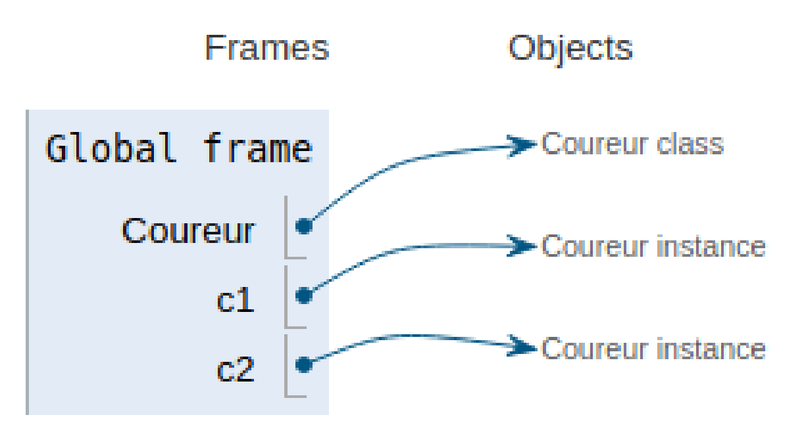
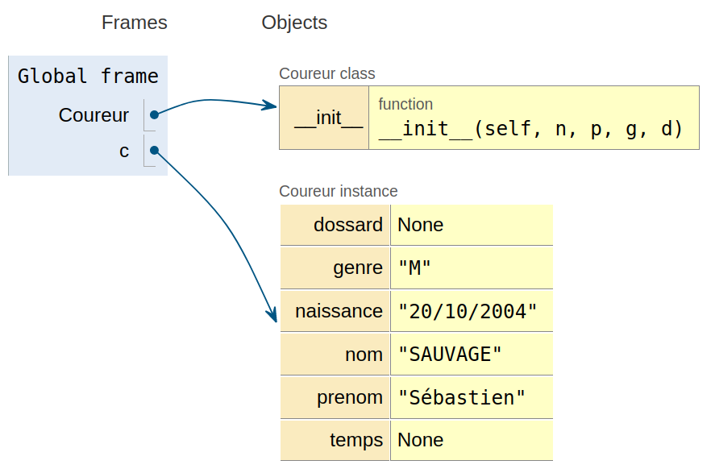

\huge \textbf{Thème 1}\normalsize  

\ 

\Large \textbf{Chapitre 2 : La programmation orientée objet}\normalsize  

# Introduction
## Description
### Définition
**La programmation orientée objet** (**_POO_**), est **un paradigme de programmation** comme l'est la programmation impérative (programmation structurée ou programmation procédurale).  

La programmation objet consiste à considérer un programme comme un ensemble d'**objets** en interaction.  

### Remarques

- Les objets peuvent représenter un concept du monde réel (comme une personne, ...).
- Pour faire de la programmation objet, on peut utiliser \textit{un langage à classes}, comme le langage Python.

## Historique
La programmation objet trouve son origine en Norvège au début des années 1960. Elle fût élaborée par les informaticiens Ole-Johan Dahl et Kristen Nygaard.  

Dans les années 1970, elle fut reprise par l'informaticien américain Alan Kay qui contribua à son essor. Cependant, il fallu attendre les années 1990 pour que ses principes soient clairement formalisés.  

# Les classes
## Introduction
Par la suite, nous allons considérer une personne qui participe à une course de running. Pour cela, nous allons créer un objet `Coureur` ainsi que d'autres objets qui nous seront nécessaires.  

Si l'on considère un objet `Coureur` qui représente une personne. Cette personne a plusieurs caractéristiques. Par exemple, son nom, son prénom, son genre, son age, etc. qui vont représenter _les variables_ de la personne.  

De plus, cette personne peut courir (et donc disposer d'un temps d'arrivée), manger, dormir, etc. qui vont représenter _des fonctions_ propres à elle-même.  

## Les classes
Pour définir ce coureur, ses variable et ses fonctions qui lui sont associées, nous allons définir une classe.  

### Définition
**Une classe** est une entité informatique qui définit en son sein :  

- des variables membres (appelées **attributs**) ;
- des fonctions membres (appelées **méthodes**).

### Remarque
Une classe représente donc une catégorie d'objets. Elle apparaît aussi comme un moule ou une usine à partir de laquelle il est possible de créer des objets ; c'est en quelque sorte une \guillemotleft{} boîte à outils \guillemotright{}{} qui permet de fabriquer un objet. On parle alors d'un objet en tant qu'**instance** d'une classe (création d'un objet ayant les propriétés de la classe).  

### En langage Python
Pour définir une classe en langage Python, on utilise le mot-clé `class` suivi du nom de la classe (on préférera coller tous les mots sans le caractère \_ en utilisant le cas échéant des majuscules).  

### Exemple
Pour définir une classe coureur, il suffit de saisir le code :  
```python
class Coureur():
    '''
    Une classe pour représenter une personne participant à une course de running
    '''
    pass

```

# Création d'un objet
## Instance
### Définition
**Une instance** (ou _objet_) d'une classe est un élément correspondant à la structure de cette classe.  

### En langage Python
Pour créer une instance d'une classe, on la définit directement avec le nom de la classe suivi de parenthèses.  

### Exemple
Dans le cadre de la classe `Coureur`, on peut construire des instances `c1` et `c2` de la classe `Coureur` :  

```python
>>> c1 = Coureur()
>>> c2 = Coureur()
>>> type(c1)
<class '__main__.Coureur'>
>>> type(c2)
<class '__main__.Coureur'>
>>> isinstance(c1, Coureur)
True
>>> isinstance(c2, Coureur)
True
```

On observe bien que les variables `c1` et `c2` sont des instances de la classe `Coureur`.  

### Remarque
Comme pour les tableaux par exemple, les variables `c1` et `c2` ne contiennent pas à proprement parlé l'objet qui vient d'être construit mais un pointeur vers le bloc de mémoire qui a été alloué pour l'objet.  

 \   

## Attribut
Maintenant que l'objet peut être créé, il faut lui définir ses variables.  

### Définition
**Un attribut** est une caractéristique propre à un objet.  

### Définition
**Un constructeur** est une fonction de la classe qui permet de définir les attributs de la classe.  

### En langage Python
Le constructeur d'une classe on utilise comme nom `__init__` et le premier paramètre est obligatoirement `self`.  

### Exemple
Pour définir le nom d'un coureur, on pourra procéder ainsi :  

```python
class Coureur():
    '''
    Une classe pour représenter une personne participant à une course de running
    '''
    def __init__(self, n):
        '''
        Constructeur de la classe Coureur.
        '''
        self.nom = n
```

### Exercice
Compléter le constructeur de la classe   `coureur` pour disposer des attributs   `nom`,   `prénom`,   `genre`,   `date de naissance`,   `dossard` et   `temps`. Les deux derniers attributs ne seront pas en paramètre mais auront comme valeur `None` dans un premier temps.  

### Remarque
On peut observer une illustration du pointage en mémoire vers l'espace aloué à l'instance lorsqu'on la crée :  

```python
>>> c = Coureur('SAUVAGE', 'Sébastien', 'M', '20/10/2004')
```

 \   

### Remarque
Une fois l'instance effectuée, on peut accéder aux attributs et les modifier :  

```python
>>> c = Coureur('SAUVAGE', 'Sébastien', 'M', '06/10/2004')
>>> c.dossard
>>> c.nom
'SAUVAGE'
>>> c.nom = 'DURAND'
>>> c.nom
'DURAND'
```

### Remarque
On ne peut pas accéder à un attribut inexistant :  

```python
>>> c.classement
Traceback (most recent call last):
  File "<pyshell>", line 1, in <module>
AttributeError: 'Coureur' object has no attribute 'classement'
```

### Remarque
Par contre,le langage Python permet de créer un attribut en dehors de la classe mais **c'est déconseillé** de le faire !  

```python
>>> c = Coureur('SAUVAGE', 'Sébastien', 'M', '06/10/2004')
>>> c.coord = (6, 9)
>>> c.coord
(6, 9)
```

## Méthodes
### Définition
**Une méthode d'une classe** peut être vue comme une fonction ordinaire, pouvant dépendre d'un nombre arbitraire de paramètres, mais dont le premier est obligatoirement un objet de cette classe.  

### Propriété
Une méthode peut ne pas avoir d'autres paramètres qu'un objet de cette classe.

### En langage Python
L'objet de la classe devant être placé comme premier paramètre d'une méthode est nommé `self`[^self_autres_langages]

[^self_autres_langages]: Dans certains langages de programmation, il s'appelle `this` et/ou peut ne pas apparaître explicitement comme paramètre de la méthode.  

Pour accéder à un attribut `A` de l'objet, il suffira d'utiliser `self.A`  

### Attention !
Les méthodes sont liées à la classe. Il faudra donc penser à indenter de quatre espaces chaque définition de méthode.  

### Remarque
Le constructeur (`__init__` en langage Python) est une méthode particulière permettant la création de l'objet.  

### Exemple
On peut considérer avoir besoin d'une méthode qui permette de savoir si un coureur est arrivé ou non (selon si son temps est nul ou non).  

```python
    def est_arrive(self):
        '''
        Permet de savoir si le coureur est arrivé ou non.
        >>> c = Coureur('SAUVAGE', 'Sébastien', 'M', '06/10/2004')
        >>> c.est_arrive() == False
        True
        >>> c.temps = 3335
        >>> c.est_arrive() == True
        True
        '''
        return not (self.temps == None)
```

### Exercice
Ecrire une méthode `temps_en_str` permettant de retourner une chaîne de caractère contenant le temps au format _hh:mm:ss_ alors que l'attribut `temps` est exprimé en secondes.  

### Méthodes particulières
Il existe en Python des méthodes particulières, chacune avec un nom fixé et toujours entourée, comme la méthode `__init__`, de deux caractère `_` de chaque côté.  

Ces méthode sont appelées par certaines opérations prédéfinies de Python, permettant parfois d'alléger ou d'uniformiser la syntaxe. Le tableau ci-dessous en donne quelques unes[^Methodes_particulieres]  

[^Methodes_particulieres]:D'autres méthodes : [https://openclassrooms.com/fr/courses/235344-apprenez-a-programmer-en-python/233046-appliquez-des-methodes-speciales](https://openclassrooms.com/fr/courses/235344-apprenez-a-programmer-en-python/233046-appliquez-des-methodes-speciales)

\newpage

\begin{tabular}{|c|c|c|}
    \hline
    \textbf{méthode} & \textbf{appel} & \textbf{effet} \\
    \hline \hline
    \texttt{\_\_str\_\_(self)} & \texttt{str(t)} & renvoie une chaîne de caractères décrivant \texttt{t} \\
    \hline
    \texttt{\_\_repr\_\_(self, u)} & \texttt{} & renvoie une chaîne obtenue quand on saisit l'objet dans le terminal \\
    \hline
    \texttt{\_\_lt\_\_(self, u)} & \texttt{t < u} & renvoie \texttt{True} si \texttt{t} est strictement inférieur à \texttt{u} \\
    \hline
    \texttt{\_\_eq\_\_(self, u)} & \texttt{t == u} & renvoie \texttt{True} si et seulement si t et u sont égaux \\
    \hline
    \texttt{\_\_hash\_\_(self)} & \texttt{hash(t)} & Donne le code de hashage pour \texttt{t} \\
    \hline
    \texttt{\_\_len\_\_(self)} & \texttt{len(t)}& renvoie un nombre entier définissant la taille de \texttt{t} \\
    \hline
    \texttt{\_\_contains\_\_(self, x)} & \texttt{x in t} & renvoie \texttt{True} si et seulement si \texttt{x} est dans la collection \texttt{t} \\
    \hline
    \texttt{\_\_getitem\_\_(self, i)} & \texttt{t[i]} & renvoie le \texttt{i}-ième élément de \texttt{t} \\
    %\hline
    \texttt{\_\_setitem\_\_(self, i, v)} & \texttt{t[i] = v} & attribue la valeur \texttt{v} au  \texttt{i}-ième élément de \texttt{t} \\
    %\hline
    \texttt{\_\_delitem\_\_(self, i)} & \texttt{del(t[i])} & supprime le \texttt{i}-ième élément de \texttt{t} \\
    \hline
    \texttt{\_\_del\_\_(self, u)} & \texttt{del(t)} & supprime l'instance \texttt{t} \\
    \hline
    \texttt{\_\_add\_\_(self, u)} & \texttt{t + u} & renvoie la somme de \texttt{t} et \texttt{u}\\
    \texttt{\_\_sub\_\_(self, u)} & \texttt{t - u} & renvoie la différence de \texttt{t} et \texttt{u}\\
    \texttt{\_\_mul\_\_(self, u)} & \texttt{t * u} & renvoie le produit de \texttt{t} et \texttt{u}\\
    \texttt{\_\_truediv\_\_(self, u)} & \texttt{t / u} & renvoie le quotient exact de \texttt{t} et \texttt{u}\\
    \texttt{\_\_floordiv\_\_(self, u)} & \texttt{t // u} & renvoie le quotient entier de \texttt{t} et \texttt{u}\\
    \texttt{\_\_mod\_\_(self, u)} & \texttt{t \% u} & renvoie le reste de la division de \texttt{t} et \texttt{u}\\
    \texttt{\_\_pow\_\_(self, u)} & \texttt{t ** u} & renvoie la puissance \texttt{u}-ième de \texttt{t}\\
    \hline
\end{tabular}  

### Exemple
Pour générer une affichage particulier lors de l'appel d'un `print(c)`, on pourra écrire la méthode suivante :  

```python
    def __str__(self):
        '''
        Renvoie une description sous forme de chaîne de caractères des attributs
        du coureur.
        >>> c = Coureur('SAUVAGE', 'Sébastien', 'M', '06/10/2004')
        >>> c.temps = 3556
        >>> print(c)
        (None) SAUVAGE Sébastien -- Temps : 0:59:16
        '''
        #txt = "(" + str(self.dossard) + ") " + self.nom + " " + self.prenom +\
        #        " -- Temps : " + self.temps_en_str()
        txt = "({}) {} {} -- Temps : {}".format(self.dossard, self.nom,
                                                self.prenom, self.temps_en_str())
        return txt
```

# Interface et implémentation
Dans la philosophie objet, l'interaction avec les objets d'une classe se fait essentiellement avec les méthodes, et les attributs sont considérés par défaut comme relevant du détail de l'implémentation. Ainsi, concernant la classe `Coureur`, il est fondamental de savoir que l'on peut afficher, modifier et récupérer les valeurs des attributs mais la manière dont cela est implémenté importe peu, du moment que le nom des méthodes permettant ce que l'on souhaite ne change pas.  

### En langage Python
Pour rendre privée un attribut ou une méthode (c'est à dire la rendre inaccessible par l'utilisateur), il suffit de faire précéder son nom par un caractère `_`  

### Définition
**L'interface de programmation** est un ensemble normalisé de classes, de méthodes, de fonctions et de constantes qui sert de façade par laquelle un utilisateur peut utiliser un programme.  

L'interface d'un programme est donc constitué des classes, méthodes, fonctions et constantes définies de manière publique.  

### Exemple
Dans le cadre de la classe `Coureur`, nous pourrions définir l'interface suivante :  

- Attributs (privés) : nom, prénom, genre, date de naissance, numéro de dossard et temps de parcours de la course (l'implémentation peut se faire de différentes manières) ;
- Méthodes :  
        - Constructeur `__init__` ;  
        - Méthode privée `__str__` pour l'affichage ;  
        - Méthodes publiques pour disposer des différentes informations : `get_nom`, `get_prenom`, ...  

Ainsi, l'interface de notre classe sera constituée du constructeur et des méthodes publiques `get_...`.  

Dans le cadre de notre classe `Coureur`, nous pourrions aussi implémenter les attributs dans un tableau (type _list_) ou encore dans un p-uplet nommé (type _dic_). Dans tous les cas, lorsque les attributs deviennent privés, il convient de créer des méthodes permettant d'y accéder ou de les modifier si besoin :  

\   

**En passant les attributs en privé :**  
```python
class Coureur():
    def __init__(self, n, p, g, d):
        '''Constructeur d'un Coureur'''
        self.__nom = n
        self.__prenom = p
        self.__genre = g
        self.__naissance = d
        self.__dossard = None
        self.__temps = None
    
    def get_nom(self):
        '''Permet de récupérer le nom du coureur'''
        return self.__nom
        
    # etc ...
```

\   

**Un seul attribut privé de type _list_ :**  
```python
class Coureur():
    def __init__(self, n, p, g, d):
        '''Constructeur d'un Coureur'''
        self.__donnees = [n, p, g, d, None, None]

    def get_nom(self):
        '''Permet de récupérer le nom du coureur'''
        return self.__donnees[0]
        
    # etc ...
```

\   

**Un seul attribut privé de type _dic_ :**  
```python
class Coureur():
    def __init__(self, n, p, g, d):
        '''Constructeur d'un Coureur'''
        self.__donnees = {'nom' : n, 'prenom' : p, 'genre' : g,
               'naissance' : d, 'dossard' : None, 'temps' : None}
    
    def get_nom(self):
        '''Permet de récupérer le nom du coureur'''
        return self.__donnees['nom']
        
    # etc ...
```

### Remarque
Avec les trois classes définies ci-dessus, nous créons une instance de la classe `Coureur` et nous accédons au nom du coureur de la même façon, bien que l'implémentation soit différente. L'utilisateur ne détecte aucune différence entre ces trois manières d'implémenter la classe `Coureur` :  

```python
>>> c = Coureur('SAUVAGE', 'Sébastien', 'M', '06/10/2004')
>>> c.get_nom()
'SAUVAGE'
```

# Exercices
## Exercice
Définir une classe `Angle` pour représenter un angle en degrés. Cette classe contient un unique attribut, `angle`, qui est un entier. On demande que, quoi qu'il arrive, l'égalité $0 \leqslant \texttt{angle} < 360$ soit vérifiée.  

- Ecrire le constructeur de cette classe ;
- ajouter une méthode `__str__` qui renvoie une chaîne de caractères de la forme \guillemotleft{} 60 degrés \guillemotright{}{} ;
- ajouter une méthode `ajoute` qui reçoit un autre angle en argument (un objet de la classe `Angle`) et l'ajoute au champ `angle` de l'objet. Attention à ce que la valeur d'angle reste bien dans le bon intervalle.
- ajouter deux méthodes `cos` et `sin` pour calculer respectivement le cosinus et le sinus de l'angle. On utilisera les fonctions `cos` et `sin` de la bibliothèque `math`. Attention, il faut convertir l'angle en radian (en multipliant par $\pi / 180)$ avant d'appeler les fonctions trigonométriques.

## Exercice
Définir une classe `Date` pour représenter une date, avec trois attributs privés `jour`, `mois` et `annee`.  

- Ecrire son constructeur ;
- ajouter une méthode `__str__` qui renvoie une chaîne de caractères de la forme \guillemotleft{} _6 octobre 2004_ \guillemotright{} ;
- ajouter une méthode `__lt__` qui permet de déterminer si une date `d1` est antérieure à une date `d2` en écrivant `d1 < d2` ;
- ajouter des méthodes qui vous semblent intéressantes dans la gestion d'une classe modélisant une date.

## Exercice
S'inspirer de l'exercice précédent pour définir une classe `Temps` pour représenter un temps en heures, minutes et secondes.  

Cette fois, la classe ne disposera que d'un seul attribut qui sera un dictionnaire dont les clés permettront l'accès aux trois données du temps.

## Exercice
- Construire une classe `Carte` qui représentera une carte à jouer d'un jeu.  
La classe disposera de :  
        - trois attributs privés : valeur (2 à 14), couleur (Carreau, ...) et figure (Aucune, Valet, Dame ou Roi) qui sera déterminée en fonction de la valeur.  
        - 5 méthodes : le constructeur, `get_valeur`, `get_couleur`, `get_figure`, `afficher_carte` dont les dénominations sont assez explicites.  
- Construire une classe `JeuDeCartes` qui premettra de créer des objets `Jeux de cartes` de 32 cartes et `Jeux de cartes` de 52 cartes.  
La classe contiendra :  
        - deux attributs privés : `nb_cartes` et `paquet`, contenant des objets de la classe définies au 1/.  
        - quatre méthodes : le constructeur, `get_nb_cartes`, `get_paquet`, `melanger_paquet`.  
- Compléter les deux classes par des méthodes qui pourraient s'avérer utiles dans la gestion d'un jeu utilisant un paquet de cartes.  

## Exercice
En Mathématiques, dans un plan rapporté à un repère orthonormé $\left(O~;~\vec{u}, \vec{v}\right)$, tout point $M$ de coordonnées $(x~;~y)$ peut être représenté par ce que l'on nomme un _nombre complexe_, qui peut s'écrire sous la forme : $z = x + iy$.  

On dit que $x$ est la _partie réelle_ de $z$ et $y$, sa _partie imaginaire_.  

En posant $z = x + iy$ et $z' = x' + iy'$, on définit alors les opérations suivantes :  

- $z + z' = (x + x') + i(y + y')$
- $z - z' = (x - x') + i(y - y')$
- $z \times z' = (xx' - yy') + i(xy' + x'y)$

De plus, on dit que $z = z'$ si et seulement si $x = x'$ et $y = y'$.  

Ecrire en langage Python une classe `Complexe` :  

- qui définit un nombre complexe (le constructeur devra initialiser un tuple de deux nombres : la partie réelle et la partie imaginaire ;
- ayant une méthode permettant d'afficher le nombre complexe sous forme d'une chaîne de caractères de la forme \guillemotleft{} \textit{$x + iy$} \guillemotright{} ;
- permettant d'ajouter, soustraire, multiplier et comparer (en terme d'égalité) deux nombres complexes ;
- permettant de donner la distance de l'origine du repère au point représenté par le nombre complexe (on appelle cette distance le _module_, qui est égal à $\sqrt{x^2 + y^2}$.

## Exercice
Dans cet exercice, on se propose de construire une classe nommée `Polynome` représentant un polynôme, c'est-à-dire une expression de la forme : $a_0 + a_1X + a_2X^2 + \ldots + a_nX^n$.  

Dans cet exemple, $n$ est appelé le `degré` du polynôme, et $(a_0, a_1, \ldots, a_n)$ sont ses coefficients.  

On souhaite pouvoir ajouter, soustraire et multiplier deux polynômes à l'aide de la classe Polynôme.  

Pour faciliter le travail, nous allons devoir créer une deuxième classe nommée `monome` permettant de définir un monôme avec son coefficient et son degré.  

1. _La classe `monome`_  
        - Ecrire le constructeur de la classe `monome` qui permet d'initialiser les attributs `coef` et `deg`.  
        - Ecrire une méthode `affiche` qui retourne un affichage correct du monôme. On devra notamment éviter les affichages \guillemotleft{} $1X^1$ \guillemotright{} ou \guillemotleft{} $X^0$ \guillemotright{} ou encore \guillemotleft{} $0X$ \guillemotright{}.  
        - Ecrire ensuite trois méthodes`__add__`, `__sub__` et `__mul__` permettant de respectivement additionner, soustraire et multiplier deux monômes entre eux.  
2. \textit{La classe `polynome`}  
        - Ecrire le constructeur de la classe `polynome` qui permet d'initialiser un attribut `liste_monomes` de tous les monômes composant le polynôme, du monôme de plus bas degré à celui de plus haut degré.  
        _Aide : Le constructeur devra être de la forme `__init__(self, *args)`, dans lequel `args` sera la liste de tous les coefficients._  
        - Ecrire une méthode `affiche` retournant une chaîne de caractères correspondant à l'affichage du polynôme. Attention à ne pas afficher de \guillemotleft{} +\guillemotright{} au début de la chaîne.  
        - Ecrire une méthode privée `standardise` qui retourne deux polynômes ayant le même nombre de monômes.  
        - Ecrire trois méthodes`__add__`, `__sub__` et `__mul__` permettant de respectivement additionner, soustraire et multiplier deux polynômes entre eux.  

\   

\   

\underline{{\textit{\textbf{Sources}}}}  

- _numérique et sciences informatiques, Term_, Collection INTERROS des LYCEES, Ed. Nathan. p91 à 96. ISBN 978-2-091-57543-8.
- _numérique et sciences informatiques, Tle_, Ed. ellipses. p45 à 58. ISBN 978-2-340-03855-4.
- (2020, 3 octobre). _Classe (informatique)_. Wikipédia. [https://fr.wikipedia.org/wiki/Classe_(informatique)](https://fr.wikipedia.org/wiki/Classe\_(informatique))
- (2020, 3 octobre). Python Tutor. [http://pythontutor.com/visualize.html#mode=edit](http://pythontutor.com/visualize.html\#mode=edit)