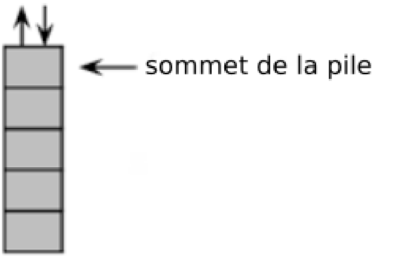
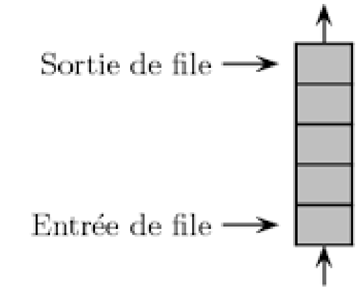
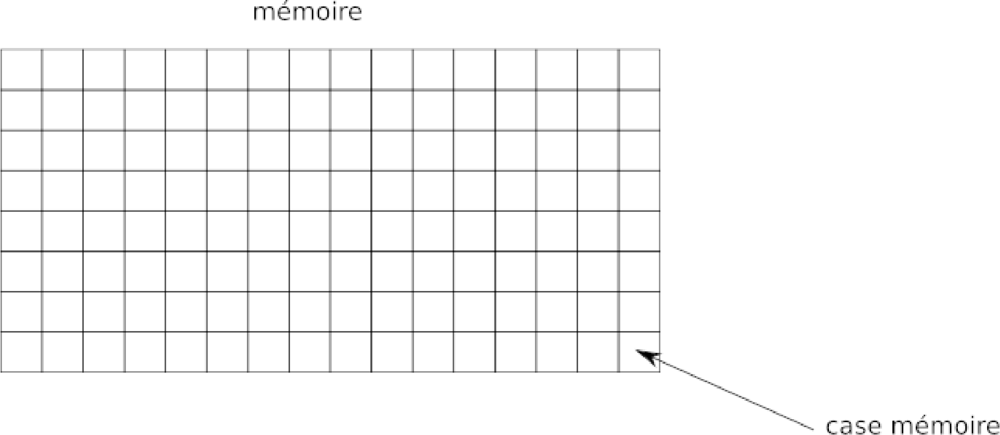
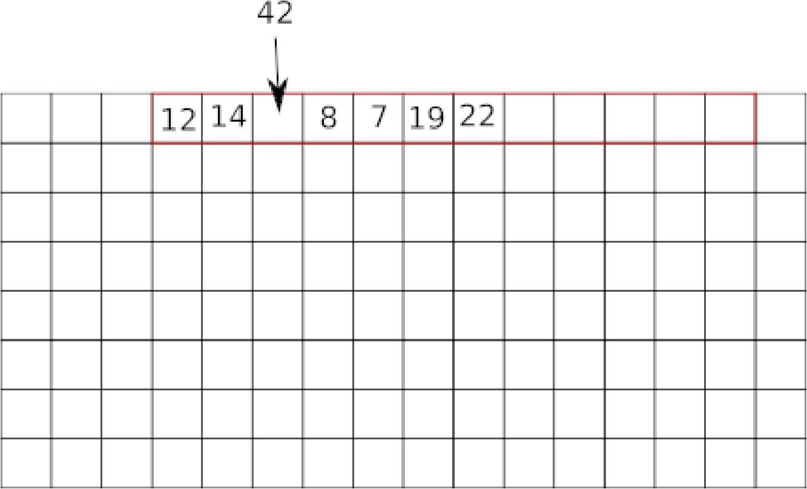
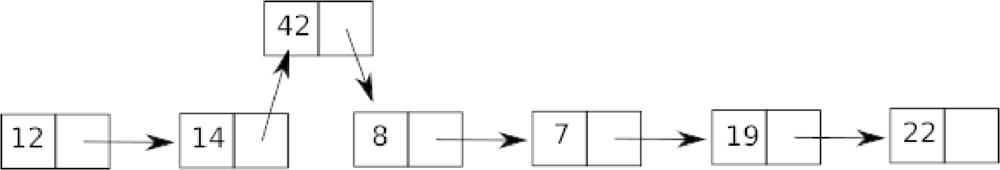

\huge \textbf{Thème 1}\normalsize  

\ 

\Large \textbf{Chapitre 3 : Liste, pile, file et dictionnaire}\normalsize  

\  

\  

De nombreux algorithmes "classiques" manipulent des structures de données plus complexes que des simples nombres (nous aurons l'occasion d'en voir plusieurs cette année). Nous allons ici voir quelques-unes de ces structures de données. Nous allons commencer par des types de structures relativement simples : \textbf{les listes, les piles et les files}. Ces trois types de structures sont qualifiés de \textbf{linéaires}.  

# Les listes
Une liste est une structure de données permettant de regrouper des données. Une liste L est composée de 2 parties : sa tête (souvent noté \textit{car}), qui correspond au dernier élément ajouté à la liste, et sa queue (souvent noté _cdr_) qui correspond au reste de la liste. Le langage de programmation Lisp (inventé par John McCarthy en 1958) a été un des premiers langages de programmation à introduire cette notion de liste (Lisp signifie "list processing").  

Voici les opérations qui peuvent être effectuées sur une liste :  

- créer une liste vide (\texttt{L = vide()} on a créé une liste L vide)
- tester si une liste est vide (\texttt{estVide(L)} renvoie vrai si la liste L est vide)
- ajouter un élément en tête de liste (\texttt{ajouteEnTete (x,L)} avec L une liste et x l'élément à ajouter)
- supprimer la tête x d'une liste L et renvoyer cette tête x (\texttt{supprEnTete(L)})
- Compter le nombre d'éléments présents dans une liste (\texttt{compte(L)} renvoie le nombre d'éléments présents dans la liste L)

Une dernière fonction \texttt{cons} permet d'obtenir une nouvelle liste à partir d'une liste et d'un élément (\texttt{L1 = cons(x,L)}). Il est possible "d'enchaîner" les \texttt{cons} et d'obtenir ce genre de structure : \texttt{cons(x, cons(y, cons(z,L)))}  

### Exemple
Voici une série d'instructions (les instructions ci-dessous s'enchaînent) :  

\begin{tabular}{lllll}
    \textbf{Instruction} & \  & \textbf{Que se passe-t-il ?}\\
    \hline
    \texttt{L=vide()} & \ & On a créé une liste vide\\
    \hline
    \texttt{estVide(L)} & \ & Renvoie vrai\\
    \hline
    \texttt{ajoutEnTete(3,L)} & \ & La liste L contient maintenant l'élément 3\\
    \hline
    \texttt{estVide(L)} & \ & Renvoie faux\\
    \hline
    \texttt{ajoutEnTete(5,L)} & \ & La tête de la liste L correspond à 5, la queue contient l'élément 3\\
    \hline
    \texttt{ajoutEnTete(8,L)} & \ & la tête de la liste L correspond à 8, la queue contient les éléments 3 et 5\\
    \hline
    \texttt{t = supprEnTete(L)} & \ & la variable t vaut 8, la tête de L correspond à 5 et la queue contient l'élément 3\\
    \hline
    \texttt{L1 = vide()} & \ & \\
    \hline
    \texttt{L2 = cons(8, cons(5, cons(3, L1)))} & \ & La tête de L2 correspond à 8 et la queue contient les éléments 3 et 5\\
\end{tabular}

### Exercice 1
Voici une série d'instructions (les instructions ci-dessous s'enchaînent), expliquez ce qui se passe à chacune des étapes :  

\texttt{L = vide()}  
\texttt{ajoutEnTete(10,L)}  
\texttt{ajoutEnTete(9,L)}  
\texttt{ajoutEnTete(7,L)}  
\texttt{L1 = vide()}  
\texttt{L2 = cons(5, cons(4, cons(3, cons (2, cons(1, cons(0,L1))))))}  

# Les piles
On retrouve dans les piles (\textbf{stack} en anglais) une partie des propriétés vues sur les listes. Dans les piles, il est uniquement possible de manipuler le dernier élément introduit dans la pile. On prend souvent l'analogie avec une pile d'assiettes : dans une pile d'assiettes la seule assiette directement accessible et la dernière assiette qui a été déposée sur la pile.  

\   

Les piles sont basées sur le principe \textbf{LIFO (\textit{Last In First Out : le dernier rentré sera le premier à sortir})}. On retrouve souvent ce principe LIFO en informatique.  

Voici les opérations que l'on peut réaliser sur une pile :  

- on peut savoir si une pile est vide (\texttt{pile\_vide})
- on peut empiler un nouvel élément sur la pile (\texttt{push})
- on peut récupérer l'élément au sommet de la pile tout en le supprimant. On dit que l'on dépile (\texttt{pop})
- on peut accéder à l'élément situé au sommet de la pile sans le supprimer de la pile (\texttt{sommet})
- on peut connaître le nombre d'éléments présents dans la pile (\texttt{taille})
    
### Exemples
Soit une pile P composée des éléments suivants : 12, 14, 8, 7, 19 et 22 (le sommet de la pile est 22). Pour chaque exemple ci-dessous on repart de la pile d'origine :  

\begin{tabular}{lllll}
    \textbf{Instruction} & \  & \textbf{Que se passe-t-il ?}\\
    \hline
    \texttt{pop(P)} & \ & renvoie 22 \\
    && et la pile P est maintenant composée des éléments suivants : 12, 14, 8, 7 et 19 (le sommet de la pile est 19)\\
    \hline
    \texttt{push(P,42)} & \ & la pile P est maintenant composée des éléments suivants : 12, 14, 8, 7, 19, 22 et 42\\
    \hline
    \texttt{sommet(P)} & \ & renvoie 22, la pile P n'est pas modifiée\\
    \hline
    \texttt{pop(P)} & \ & \\
    \texttt{pop(P)} & \ & \\
    \texttt{pop(P)} & \ & \\
    \texttt{pop(P)} & \ & \\
    \texttt{pop(P)} & \ & \\
    \texttt{pop(P)} & \ & \texttt{pile\_vide(P)} renvoie vrai\\
    \hline
    \texttt{pop(P)} & \ & \\
    \texttt{taille(P)} & \ & renvoie 5\\
    \hline
    \texttt{} & \ & \\
\end{tabular}

### Exercice 2
Soit une pile P composée des éléments suivants : 15, 11, 32, 45 et 67 (le sommet de la pile est 67). Quel est l'effet de l'instruction pop(P) ?  

# Les files
Comme les piles, les files(\textbf{queue} en anglais) ont des points communs avec les listes. Différences majeures : dans une file on ajoute des éléments à une extrémité de la file et on supprime des éléments à l'autre extrémité. On prend souvent l'analogie de la file d'attente devant un magasin pour décrire une file de données.  

\ \   

Les files sont basées sur le principe \textbf{FIFO (\textit{First In First Out} : le premier qui est rentré sera le premier à sortir)}. Ici aussi, on retrouve souvent ce principe FIFO en informatique.  

Voici les opérations que l'on peut réaliser sur une file :  

- on peut savoir si une file est vide (\texttt{file\_vide})
- on peut ajouter un nouvel élément à la file (\texttt{ajout})
- on peut récupérer l'élément situé en bout de file tout en le supprimant (\texttt{retire})
- on peut accéder à l'élément situé en bout de file sans le supprimer de la file (\texttt{premier})
- on peut connaître le nombre d'éléments présents dans la file (\texttt{taille})

### Exemples
Soit une file F composée des éléments suivants : 12, 14, 8, 7, 19 et 22 (le premier élément rentré dans la file est 22 ; le dernier élément rentré dans la file est 12). Pour chaque exemple ci-dessous on repart de la file d'origine :  

\begin{tabular}{lllll}
    \textbf{Instruction} & \  & \textbf{Que se passe-t-il ?}\\
    \hline
    \texttt{ajout(F,42)} & \ & la file F est maintenant composée des éléments suivants : 42, 12, 14, 8, 7, 19 et 22 \\
    && (le premier élément rentré dans la file est 22 ; le dernier élément rentré dans la file est 42) \\
    \hline
    \texttt{retire(F)} & \ & la file F est maintenant composée des éléments suivants : 12, 14, 8, 7, et 19 \\
    && (le premier élément rentré dans la file est 19 ; le dernier élément rentré dans la file est 12) \\
    \hline
    \texttt{premier(F)} & \ &  renvoie 22, la file F n'est pas modifiée\\
    \hline
    \texttt{retire(F)} & \ &  \\
    \texttt{retire(F)} & \ &  \\
    \texttt{retire(F)} & \ &  \\
    \texttt{retire(F)} & \ &  \\
    \texttt{retire(F)} & \ &  \\
    \texttt{retire(F)} & \ & \texttt {file\_vide(F)} renvoie vrai \\
    \hline
    \texttt{retire(F)} & \ & \texttt{taille(F)} renvoie 5\\
\end{tabular}

### Exercice 3
Soit une file F composée des éléments suivants : 1, 12, 24, 17, 21 et 72 (le premier élément rentré dans la file est 72 ; le dernier élément rentré dans la file est 1). Quel est l'effet de l'instruction \texttt{ajout(F,25)}  

# Types abstraits et représentation concrète des données

Nous avons évoqué ci-dessus la manipulation des types de données (liste, pile et file) par des algorithmes, mais, au-delà de la beauté intellectuelle de réfléchir sur ces algorithmes, le but de l'opération est souvent, à un moment ou un autre, de "traduire" ces algorithmes dans un langage compréhensible pour un ordinateur (Python, Java, C,...). On dit alors que l'on implémente un algorithme. Il est donc aussi nécessaire d'implémenter les types de données comme les listes, les piles ou les files afin qu'ils soient utilisables par les ordinateurs. Les listes, les piles ou les files sont des "vues de l'esprit" présent uniquement dans la tête des informaticiens, on dit que ce sont des types abstraits de données (ou plus simplement **des types abstraits**). L'implémentation de ces types abstrait, afin qu'ils soient utilisables par une machine, est loin d'être une chose triviale. L'implémentation d'un type de données dépend du langage de programmation. Il faut, quel que soit le langage utilisé, que le programmeur retrouve les fonctions qui ont été définies pour le type abstrait (pour les listes, les piles et les files cela correspond aux fonctions définies ci-dessus). Certains types abstraits ne sont pas forcément implémentés dans un langage donné, si le programmeur veut utiliser ce type abstrait, il faudra qu'il le programme par lui-même en utilisant les "outils" fournis par son langage de programmation.  

Pour implémenter les listes (ou les piles et les files), beaucoup de langages de programmation utilisent 2 structures : les tableaux et les listes chaînées.  

## les tableaux
**Un tableau** est une suite contiguë de cases mémoires (les adresses des cases mémoire se suivent) :  

\   

Le système réserve une plage d'adresse mémoire afin de stocker des éléments.  

\   

La taille d'un tableau est fixe : une fois que l'on a défini le nombre d'éléments que le tableau peut accueillir, il n'est pas possible modifier sa taille. Si l'on veut insérer une donnée, on doit créer un nouveau tableau plus grand et déplacer les éléments du premier tableau vers le second tout en ajoutant la donnée au bon endroit !  

Dans certains langages de programmation, on trouve une version "évoluée" des tableaux : les tableaux dynamiques. Les tableaux dynamiques ont une taille qui peut varier. Il est donc relativement simple d'insérer des éléments dans le tableau. Ce type de tableaux permet d'implémenter facilement le type abstrait liste (de même pour les piles et les files)  

À noter que les "`list` Python"\footnote{[https://docs.python.org/fr/3/tutorial/datastructures.html](https://docs.python.org/fr/3/tutorial/datastructures.html)} sont des tableaux dynamiques. Attention de ne pas confondre avec le type abstrait `liste` défini ci-dessus, ce sont de "faux amis".  

\   

## les listes chaînées
Autre type de structure que l'on rencontre souvent et qui permet d'implémenter les listes, les piles et les files : **les listes chaînées**.  

Dans une liste chaînée, à chaque élément de la liste on associe 2 cases mémoire : la première case contient l'élément et la deuxième contient l'adresse mémoire de l'élément suivant.  

\   

Il est relativement facile d'insérer un élément dans une liste chaînée :  

\   

Il est aussi possible d'implémenter les types abstraits en utilisant des structures plus complexes que les tableaux et les listes chaînées. Par exemple, en Python, il est possible d'utiliser les tuples pour implémenter le type abstrait liste :  

### Exercice 4
Étudiez attentivement les fonctions suivantes, c'est-à-dire, pour chacune d'entre elle, expliquer quel est son rôle :  

```Python
def vide():
    return tuple()
def cons(x,L):
    return(x,L)
def ajouteEnTete(L,x):
    return cons(x,L)
def supprEnTete(L):
    return (L[0],L[1])
def estVide(L):
    return L is None
def compte(L):
    if estVide(L):
        return 0
    return 1 + compte(L[1])
```

### Exercice 5
Après avoir saisi et exécuté le programme étudié à l'exercice 4, tapez successivement les commandes suivantes dans une console Python et deviner la réponse :  

```Python
L = vide()
estVide(L)
L = cons(5, cons(4, cons(3, cons(2, cons(1, cons(0,L))))))
estVide(L)
compte(L)
L = ajouteEnTete(L,6)
compte(L)
x, L = supprEnTete(L)
x
compte(L)
x, L = supprEnTete(L)
x
compte(L)
```

# Les dictionnaires
Voir cours de première.  

\   

\   

\underline{{\textit{\textbf{Sources}}}}  

- ROCHE D. (2020, 17 septembre). \textit{Structures de données : les listes, les piles et les files}. Informatique au lycée.   [https://pixees.fr/informatiquelycee/n_site/nsi_term_structDo_liste.html](https://pixees.fr/informatiquelycee/n\_site/nsi\_term\_structDo\_liste.html)