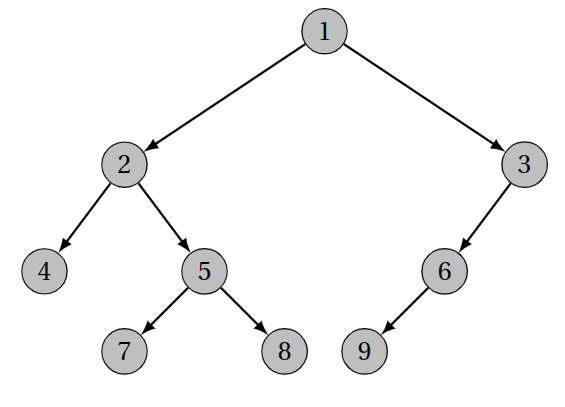

\huge \textbf{Thème 1}\normalsize  

\ 

\Large \textbf{Chapitre 4 : Arbres}\normalsize  

\  

\  

\section{Qu'est-ce qu'un arbre ?}
\subsection{Arbre en informatique}
### Définition
Les \textit{arbres} sont des structures de données
\footnote{Le terme d'arbre recouvre plusieurs notions
distinctes : arbres libres, arbres enracinés, arbres binaires, etc.\par
Nous nous intéresserons aux \textit{arbres enracinés} que nous nommerons plus
simplement \textit{arbres}, et aux \textit{arbres binaires}, un cas particulier de
ces arbres enracinés.}  

- hiérarchiques,
 - naturellement récursives,  

utilisées pour représenter des ensembles de données structurées hiérarchiquement.

### Représentation
Exemple de représentation d'un arbre :  

\ \  

### Exemples
Par exemple :
\footnote{voir \href{https://runestone.academy/runestone/books/published/pythonds/Trees/ExamplesofTrees.html}{https://runestone.academy/runestone/books/published/pythonds/Trees/ExamplesofTrees.html} pour plus de détails.}  

- système de fichiers,
- base de données,
- sites web,
- fichiers XML.  

### Propriété
Un arbre est \textbf{une structure de données non-linéaire} (comparée aux tableaux, listes, piles, et files qui sont des structures linéaires).

### Remarque
Une structure de données arborescente peut être définie récursivement comme un ensemble de noeuds accessibles depuis un noeud racine.\par
\medskip
Chaque noeud étant une structure composée d'une valeur et d'une liste de références vers d'autres noeuds, avec les contraintes suivantes : aucune référence n'est dupliquée (chaque noeud a un unique parent), et
aucune référence ne désigne le noeud racine (qui n'a donc pas de parent).  

Nous allons nous restreindre aux \textit{arbres binaires} pour lesquels la liste des références vers d'autres noeuds comporte au plus deux éléments.\par

\medskip

Ces arbres binaires sont largement utilisés, par exemple sous forme d'ABR\footnote{\href{https://fr.wikipedia.org/wiki/Arbre_binaire_de_recherche}{https://fr.wikipedia.org/wiki/Arbre\_binaire\_de\_recherche}} (arbres binaires de recherche), de tas \footnote{\href{https://fr.wikipedia.org/wiki/Tas_binaire}{https://fr.wikipedia.org/wiki/Tas\_binaire}}, d'arbres équilibrés comme les AVL\footnote{\href{https://fr.wikipedia.org/wiki/Arbre_AVL}{https://fr.wikipedia.org/wiki/Arbre\_AVL}}ou encore d'arbres bicolores rouge-noir\footnote{\href{https://fr.wikipedia.org/wiki/Arbre_bicolore}{https://fr.wikipedia.org/wiki/Arbre\_bicolore}}

\subsection{Un peu (beaucoup...) de vocabulaire préliminaire}
\subsubsection{Terminologie}
### Définitions
\begin{itemize}
    \item un \textbf{noeud} est caractérisé par :
    \begin{itemize}
        \item une donnée (on parle aussi d'étiquette),
        \item un nombre fini de fils.
    \end{itemize}
    \item une \textbf{arête} relie deux noeuds. Chaque noeud, à l'exception de la racine, est relié à un autre noeud, son père, par exactement une arête entrante. Chaque noeud peut avoir une ou plusieurs arêtes sortantes le reliant à ses fils. On parle aussi de \textbf{lien}.
    \item la \textbf{racine} d'un arbre est le seul noeud sans père.
    \item un \textbf{chemin} est une liste de noeuds reliés par des arêtes.
    \item une \textbf{branche} est le chemin le plus court reliant un noeud à la racine.
    \item les \textbf{fils} sont l'ensemble des noeuds reliés à un même noeud par des arêtes entrantes.
    \item le \textbf{père} ou \textbf{parent} est le noeud relié à ses noeuds fils par une arête sortante.
    \item un \textbf{sous-arbre} est l'ensemble des noeuds et arêtes d'un noeud parent et de ses descendants.
    \item une \textbf{feuille} est un noeud sans fils.
    \item un \textbf{noeud interne} est un noeud qui n'est pas une feuille.
    \item Pour assurer la cohérence de ces définitions, on considère que \textbf{l'arbre vide n'est pas un noeud}.
\end{itemize}

\subsubsection{Quelques mesures sur les arbres}
### Définitions
\begin{itemize}
    \item la \textbf{taille} d'un arbre est le nombre de noeuds de l'arbre.
    \item la \textbf{profondeur} d'un noeud est le nombre d'arêtes sur la branche qui le relie à la racine. La profondeur de la racine est nulle.
    \item la \textbf{hauteur} d'un arbre est la profondeur maximale de l'ensemble des noeuds de l'arbre.
    \item l'\textbf{arité d'un noeud} est le nombre de fils du noeud.
    \item l'\textbf{arité d'un arbre} est le nombre maximal de fils des noeuds de l'arbre.
\end{itemize}

\subsubsection{Arbre binaire}
### Définition
Un \textbf{arbre binaire} est un arbre d'arité maximale deux.

### Propriété
Un arbre binaire est :
\begin{itemize}
    \item soit l'arbre vide, noté $\Delta$ ;
    \item soit un triplet ($e$, $g$, $d$), appelée \textbf{noeud}, dans lequel
    \begin{itemize}
        \item $e$ est l'élément, ou encore \textbf{étiquette}, de la racine de l'arbre,
        \item $g$ est le sous-arbre gauche de l'arbre, et
        \item $d$ est le sous-arbre droit de l'arbre.
    \end{itemize}
\end{itemize}

### Propriété
Les sous-arbres gauche et droit d’un arbre binaire non vide sont eux-mêmes des arbres binaires. La structure d’arbre binaire est donc une structure récursive.

### Définition
On appelle \textbf{fils gauche}, resp. \textbf{fils droit}, le sous-arbre gauche, resp. droit, d'un noeud.

\subsection{Exercices}
### Exercice 1
\textit{Quelques arbres binaires}\par

Dessinez chacun des arbres ci-dessous, donnez sa taille et sa hauteur, le nombre de feuilles, le nombre de noeuds à chaque profondeur.
\begin{enumerate}
    \item (1, $\Delta$, $\Delta$)
    \item (3, (1, $\Delta$, (4, (1, $\Delta$, (5, $\Delta$, $\Delta$)), $\Delta$)), $\Delta$)
    \item (3, (1, (1, $\Delta$, $\Delta$), $\Delta$), (4, (5, $\Delta$, $\Delta$), (9, $\Delta$, $\Delta$)))
    \item (3, (1, (1, $\Delta$, $\Delta$), (5, $\Delta$, $\Delta$)), (4, (9, $\Delta$, $\Delta$), (2, $\Delta$, $\Delta$)))
\end{enumerate}

### Exercice 2
\textit{Des arbres binaires}\par

\begin{enumerate}
    \item Combien de feuilles au minimum comporte un arbre binaire de hauteur \textit{h} ?\par
    Au maximum ?\par
    \textit{Le premier arbre est appelé \textbf{arbre filiforme}, le second \textbf{arbre complet}}
    \item Combien de noeuds au minimum comporte un arbre binaire de hauteur \textit{h} ?\par
    Au maximum ?\par
    \textit{Le premier arbre est appelé \textbf{arbre localement complet}}
\end{enumerate}

### Exercice 3
\textit{Squelettes d'arbres binaires}\par

On appelle \textbf{squelette ou forme d'arbres binaires} tout arbre binaire dans lequel on ne tient pas compte des étiquettes.\par
\begin{enumerate}
    \item Combien y a-t-il de squelettes d'arbres binaires de taille 0, de taille 1 ?
    \item Dessinez tous les squelettes d'arbres binaires de taille 2, 3, 4 ;\par
    donnez-en le nombre.
\end{enumerate}

### Exercice 4
\textit{Taille et hauteur}\par

Proposez des algorithmes pour calculer :
\begin{enumerate}
    \item la taille d'un arbre binaire
    \item la hauteur d'un arbre binaire. On conviendra conventionnellement que la hauteur de l'arbre vide $\Delta$ est -1.
\end{enumerate}

\section{Caractériser les arbres binaires}
Les arbres binaires sont caractérisés par le fait que chaque noeud possède au plus deux fils.\par

\medskip

D'autres caractéristiques sont définies, qui permettent par exemple d'identifier des arbres pour lesquels le coût de certaines opérations sera minimal, ou de définir des algorithmes spécifiques à ces arbres.

\begin{itemize}
    \item Un arbre binaire \textit{\textbf{filiforme}} ou \textit{dégénéré} est un arbre dans lequel tous les \textit{noeuds internes} n'ont qu'un seul \textit{fils}. \textit{(Un arbre filiforme ne possède donc qu'une unique feuille.)}
    \item Un arbre binaire \textit{\textbf{localement complet}} ou arbre binaire \textit{strict} est un arbre dont tous les \textit{noeuds internes} possèdent exactement deux \textit{fils}. \textit{(Autrement dit, un arbre binaire localement complet est un arbre dont chaque noeud possède zéro ou 2 fils. L'arbre vide n'est pas localement complet.)}
    \item Un arbre binaire \textit{\textbf{complet}} est un arbre binaire \textit{localement complet} dans lequel toutes les \textit{feuilles} sont à la même \textit{profondeur}. \textit{(Il s'agit d'un arbre dont tous les niveaux sont remplis.)}
    \item Un arbre binaire \textit{\textbf{parfait}} est un arbre dans lequel tous les niveaux sont remplis à l'exception \textit{éventuelle} du dernier, et dans ce cas les feuilles du dernier niveau sont alignées à gauche.
    \item Un arbre binaire \textit{\textbf{équilibré}} est un arbre dont les deux fils sont des arbres équilibrés dont les hauteurs diffèrent d'au plus une unité. Ainsi, l'accès à n'importe lequel des \textit{noeuds} est en moyenne minimisé.
\end{itemize}

Comme le mentionne la page \href{https://fr.wikipedia.org/wiki/Arbre_binaire#Types_d'arbres_binaires}{https://fr.wikipedia.org/wiki/Arbre\_binaire\#Types\_d'arbres\_binaires}, il existe des usages contradictoires des termes \textbf{complet} et \textbf{parfait} qui peuvent parfois être intervertis. Des confusions peuvent aussi exister entre le français et l'anglais, dans lequel on trouve les termes \textbf{perfect} et \textbf{complete}.

\subsection*{Se repérer dans cette forêt d'arbres}
### Exercice 5
\textit{Compter ces arbres}\par

\begin{enumerate}
    \item Combien de noeuds au maximum comporte un arbre localement complet de hauteur \textit{h} ?\par
    Au minimum ?
    \item Combien de noeuds comporte un arbre complet de hauteur \textit{h} ?
    \item Combien de squelettes d'arbres parfaits de hauteur \textit{h} existe-t-il ?
    \item Combien de squelettes d'arbres filiformes de hauteur \textit{h} existe-t-il ?
\end{enumerate}  

### Exercice 6
\textit{Reconnaître ces arbres}\par

Proposez des algorithmes pour les prédicats (fonction renvoyant \texttt{True} ou \texttt{False}) :
\begin{enumerate}
    \item reconnaître un arbre binaire filiforme.
    \item reconnaître un arbre binaire localement complet.
    \item reconnaître un arbre binaire complet.
    \item reconnaître un arbre binaire parfait.
\end{enumerate}  

### Exercice 7
\textit{Superposer deux arbres}\par

Proposez un prédicat pour tester l'égalité du squelette de deux arbres binaires.  

### Exercice 8
\textit{Numéroter les noeuds}\par

La numérotation de Sosa-Stradonitz des noeuds d'un arbre binaire, utilisée notamment en généalogie, est la suivante :
\begin{itemize}
    \item le noeud racine est numéroté par 1,
    \item si un noeud numéroté par $i$
    \begin{itemize}
        \item son fils gauche est numéroté par $2i$,
        \item son fils droit est numéroté par $2i + 1$.
    \end{itemize}
\end{itemize}
\medskip
Cette numérotation peut être utilisée pour représenter un arbre dans un tableau : l'élément $j$ du tableau mémorise le noeud numéroté par $j$.\par
\medskip
Combien d'éléments doit contenir un tableau utilisé pour représenter :
\begin{enumerate}
    \item un arbre binaire complet de $n$ noeuds ?
    \item un arbre binaire parfait de $n$ noeuds ?
    \item un arbre binaire quelconque de $n$ noeuds (dans le pire des cas) ?
\end{enumerate}  

\   

\   

\underline{{\textit{\textbf{Sources}}}}  

- Université de LILLE (2020, 16 novembre). _Arbres_. DIU EIL.  

[https://gitlab-fil.univ-lille.fr/diu-eil-lil/portail/-/blob/master/bloc4-5/arbres/arbre1.md](https://gitlab-fil.univ-lille.fr/diu-eil-lil/portail/-/blob/master/bloc4-5/arbres/arbre1.md)
