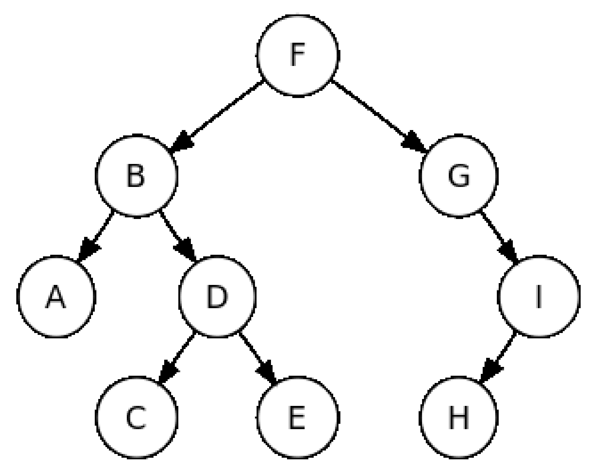
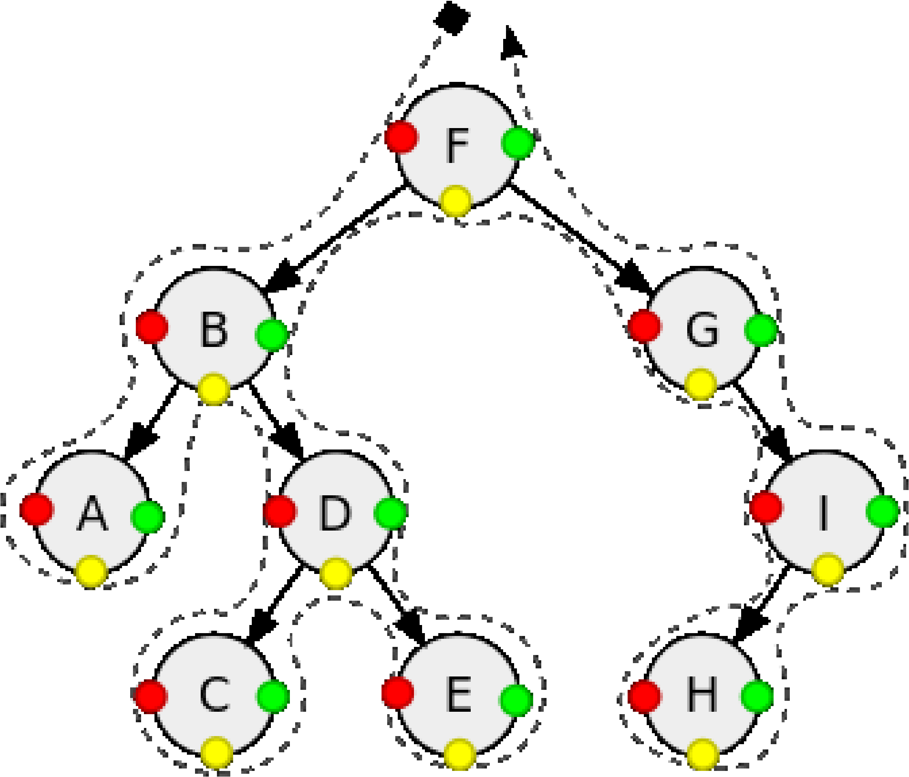
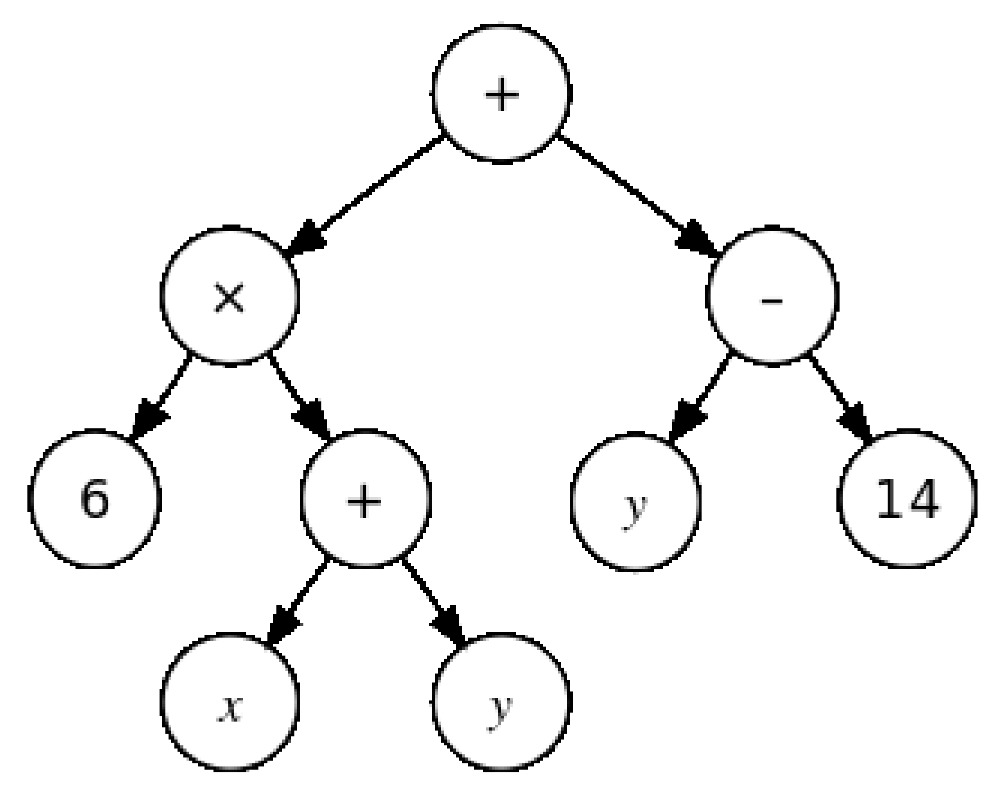
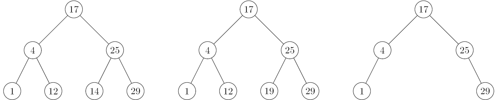
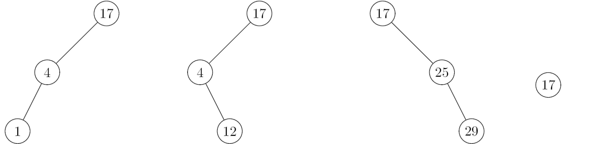
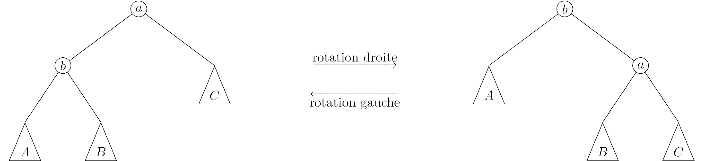

\huge \textbf{Thème 5}\normalsize  

\ 

\Large \textbf{Chapitre 1 : Algorithmes sur les arbres binaires et sur les ABR}\normalsize  

\  

\  

# Pour débuter
Créer un fichier `PY` vide, afin d'y écrire l'ensemble des fonctions et tests demandés dans ce chapitre.  

\   

La classe `BinaryTree`, définie dans le module `binary_tree.py` proposé ici, permet de représenter des arbres binaires.  

Cette classe fournit :  

- "deux" constructeurs : `BinaryTree()` et `BinaryTree(data, left, right)`
- trois accesseurs : `get_data()`, `get_left_subtree()`, et `get_right_subtree()`
- deux reconnaisseurs : `is_empty()` et `is_leaf() ` 

Pour afficher l'aide associée à cette classe, essayez :  

```python
    >>> import binary_tree as bt
    >>> help(bt.BinaryTree)
```

Ce module propose aussi des fonctionnalités de visualisation d'arbres binaires, et d'exportation aux formats DOT et PNG, via les méthodes `to_dot` et `show`.  

### Exercice 1 : prise en main
1. Créer une constante `ARBRE_VIDE` contenant une représentation d'un arbre vide.  
Ainsi,
```python
    >>> ARBRE_VIDE.is_empty()
    True
```
2. Ecrire une fonction `feuille` qui renvoie un objet de type `BinaryTree` représentant une feuille dont l'étiquette de la racine est passée en paramètre.  
Ainsi,
```python
    >>> f = feuille('C')
    >>> f.is_leaf()
    True
```
3. Créer une variable `exemple_arbre` qui contiendra une représentation de l'arbre ci-dessous.  

\ \   

Afficher l'arbre de cette manière :
```python
    >>> exemple_arbre.show()
```
Cet arbre pourra servir pour tester les différentes fonctions programmées dans les exercices suivants.  

### Exercice 2
En utilisant la classe `BinaryTree`, écrire deux fonctions `taille` et `hauteur` permettant de calculer respectivement la taille et la hauteur d'un arbre passé en paramètre.  
Vous pouvez reprendre les algorithmes écrits dans le chapitre sur les arbres.  
Ainsi,
```python
    >>> taille(ARBRE_VIDE)
    0
    >>> taille(feuille('B'))
    1
    >>> taille(exemple_arbre)
    9
    >>> hauteur(ARBRE_VIDE)
    -1
    >>> hauteur(feuille('B'))
    0
    >>> hauteur(exemple_arbre)
    3
```

# Parcourir les arbres
Parcourir un arbre consiste à visiter chacun des noeuds de l'arbre, à effectuer un traitement sur chacune des étiquettes des noeuds de l'arbre.  

On distingue différents parcours selon l'ordre dans lequel les noeuds seront visités.  

On distingue principalement **les parcours en profondeur d'abord** et **le parcours en largeur**.  

## Trois parcours en profondeur d'abord

Le principe des parcours en profondeur est de visiter récursivement les noeuds de l'arbre.  

### Définitions
On distingue trois parcours, selon que l'on traite l'étiquette d'un noeud :  

- **préfixe** : avant la visite de ses fils gauche et droit ;
- **infixe** : après la visite de son fils gauche (et avant la visite de son fils droit) ;
- **postfixe** : après la visite des ses fils gauche et droit.

### Exercice 3
On considère l'arbre binaire ci-dessous.  

Pour chacun des parcours préfixe, infixe et postfixe :  

- Ecrire la liste ordonnées des étiquettes lues ;
- Reconnaître la couleur correspondant au parcours ;
- Ecrire un algorithme en langage naturel permettant d'obtenir le parcours ;
- Programmer cet algorithme pour qu'il renvoie une chaîne de caractères contenant les étiquettes des noeuds traités.

\ \  

## Représentation d'expressions arithmétiques
Une expression arithmétique construite avec des opérateurs binaires - c'est-à-dire à deux opérandes telles l'addition, la soustraction, la multiplication, la division -, peut être représentée par un arbre binaire dont les noeuds internes portent les opérateurs et les feuilles des symboles de variables - $x$, $y$, $z$ ... -, ou des constantes - 6, 14, etc. -.  

Ainsi, l'arbre suivant représente l'expression $6 (x + y) + (y - 14)$.  

\ \  

### Des expressions
Cet arbre, et d'autres exemples peuvent être construits avec les instructions suivantes :  

```python   
# 6 * (x + y) + (y - 14)
expression1 = bt.BinaryTree('+',
                            bt.BinaryTree('*', feuille(6), bt.BinaryTree('+', feuille('x'), feuille('y'))),
                            bt.BinaryTree('-', feuille('y'), feuille(14)))

# (x + 5) * (y / 2)
expression2 = bt.BinaryTree('*',
                            bt.BinaryTree('+', feuille('x'), feuille(5)),
                            bt.BinaryTree('/', feuille('y'), feuille(2)))

# 4 * (x - 1)
expression3 = bt.BinaryTree('*',
                            feuille(4),
                            bt.BinaryTree('-', feuille('x'), feuille(1)))

# (x - 1) * 4
expression4 = bt.BinaryTree('*',
                            bt.BinaryTree('-', feuille('x'), feuille(1)),
                            feuille(4))
```

### Evaluer une expression
### Exercice 4
1. Ecrire une fonction `arbre_en_expr` qui prend en paramètre un arbre représentant une expression arithmétique, et renvoie cette expression sous forme de chaîne de caractères.  
Exemples:
```python
        >>> arbre_en_expr(expression1)
        '((6*(x+y))+(y-14))'
        >>> arbre_en_expr(expression2)
        '((x+5)*(y/2))'
        >>> arbre_en_expr(expression3)
        '(4*(x-1))'
        >>> arbre_en_expr(expression4)
        '((x-1)*4)'
```
\newpage

2. Ecrire une fonction `evalue_expr` qui prend deux paramètres : `expression` qui est une chaîne de caractères et `valeurs` qui est un dictionnaire.  
La fonction `evalue_expr` renvoie l'évaluation de l'expression contenue dans `expression` en remplaçant chacune des variables par leurs valeurs situées dans `valeurs`.  
Penser à utiliser la fonction `eval` : ```eval('(5 + 1) * 3')```renvoie ```18```  
Exemples :
```python
        >>> evalue_expr('((6*(x+y))+(y-14))', {'x': 7, 'y': 2})
        42
        >>> evalue_expr('((x+5)*(y/2))', {'x': 7, 'y': 6})
        36.0
        >>> evalue_expr('((x-1)*4)', {'x': 6})
        20
        >>> evalue_expr('((x-1)*4)', {'x': 7})
        24
```
3. Ecrire une fonction `evalue_arbre` qui renvoie l'évaluation d'un arbre passé en premier paramètre et dont les valeurs des variables sont contenues dans le second paramètre.  
Exemples :
```python
        >>> evalue_arbre(expression1, {'x': 7, 'y': 2})
        42
        >>> evalue_arbre(expression2, {'x': 7, 'y': 6})
        36.0
        >>> evalue_arbre(expression3, {'x': 6})
        20
        >>> evalue_arbre(expression4, {'x': 7})
        24
```

### Écriture polonaise inverse
Quels affichages produit un parcours postfixe des arbres représentant les quatre expressions arithmétiques utilisées ci-dessus ?  

Remarquez que cette expression non-ambiguë ne nécessite pas de parenthèses.  

Sachez que cette forme est exploitée pour produire le code machine d'évaluation de l'expression pour une machine à pile.  

## Parcours en largeur
### Définition
**Un parcours en largeur** visite les noeuds d'un arbre niveau par niveau :  

- le noeud racine de profondeur nulle, les noeuds de profondeur 1, puis les noeuds de profondeur 2, etc.
- Pour une profondeur donnée, on visite les noeuds de gauche à droite.  

Le principe est que lors de la visite du niveau de profondeur $i$, on mémorise dans une structure ad hoc les noeuds fils, qui sont donc des noeuds de profondeur $i+1$ qui seront à visiter une fois la visite de la profondeur $i$ terminée.  

La structure dans laquelle mémoriser les noeuds fils doit permettre :  

- d'ajouter un élément (un noeud) à la structure ;
- de récupérer un élément ; plus précisément de récupérer l'élément le plus anciennement inséré ;
- de tester que la structure est vide — notre algorithme est terminé.  

On reconnaît là l'interface du type de données abstrait _file_ qui met en oeuvre le principe _FIFO_ : premier arrivé, premier sorti.  

Pour la réalisation de notre parcours en largeur, les éléments de cette file sont des arbres : l'arbre à parcourir, puis l'arbre fils gauche de sa racine, puis l'arbre fils droit de sa racine, etc.  

### Parcourir en largeur
### Exercice 5
Ecrire une fonction `parcours_largeur` qui renvoie une chaîne de caractère contenant dans l'ordre les étiquettes selon un parcours en largeur de l'arbre passé en paramètre.  
Exemple :  
```python
    >>> parcours_largeur(exemple_arbre)
    'FBGADICEH'
```

### Parcourir avec une pile
### Exercice 6

1. Quel parcours de l'arbre obtient-on si on remplace la _file_ utilisé dans l'algorithme précédent par une _pile_, donc une structure _LIFO_, dernier arrivé, dernier sorti ?
2. Que faut-il modifier pour obtenir un des trois classiques parcours en profondeur d'abord ?  

# Arbres de recherche
## Caractériser les arbres binaires de recherche
### Définition
**Un arbre binaire de recherche** est un arbre binaire tel que pour tout noeud d'étiquette `e` :  

- les étiquettes de tous les noeuds de son sous-arbre gauche sont inférieures ou égales à `e`, et
- les étiquettes de tous les noeuds de son sous-arbre droit sont supérieures à `e`.  

### Des arbres binaires de recherche
### Exercice 7
Indiquez quels sont parmi les arbres suivants ceux qui sont des arbres binaires de recherche.  

\ \  

\ \  

### Les plus petite et plus grande étiquettes
### Exercice 8
1. Dans quel noeud d'un arbre binaire de recherche se trouve la plus petite étiquette ?  
La plus grande ?
2. Dans quel noeud d'un arbre binaire de recherche se trouve l'étiquette médiane ?  

### Parcours ordonné
### Exercice 9
Lequel des classiques parcours d'arbres binaires permet de visiter les noeuds d'un ABR dans l'ordre des étiquettes ?  
 
### Reconnaître un arbre binaire de recherche
### Exercice 10
Proposez un prédicat Python qui reconnaît si un arbre binaire donné est un arbre binaire de recherche.  

Deux pistes possibles pour cela sont :  

1. De réaliser un parcours de l'arbre qui devrait visiter les noeuds dans l'ordre croissant (exercice précédent), et vérifier que les étiquettes sont bien dans l'ordre croissant. (On suppose qu'il n'y a pas de doublons dans l'arbre.)
2. De proposer une fonction récursive qui renvoie la plus petite et la plus grande des valeurs des étiquettes d'un arbre, et vérifie qu'il est un ABR.  

## Recherche d'une valeur dans un arbre binaire de recherche
### Exercice 11
Proposez une fonction Python qui renvoie le noeud d'un arbre binaire de recherche dont l'étiquette est égale à une valeur donnée.  

La fonction pourra retourner \texttt{None} si la valeur n'était pas présente dans l'arbre.  

## Insertion d'une valeur dans un arbre binaire de recherche
L'insertion d'une valeur $v$ dans un arbre binaire de recherche peut reposer sur le déroulé récursif suivant :  

- si l'arbre est vide, renvoyer l'arbre arbre constitué d'une unique feuille portant la valeur $v$
- si la valeur à insérer $v$ est inférieure ou égale à la valeur de la racine, renvoyer l'arbre formé de  
    - la racine
    - l'arbre formé du fils gauche dans lequel aura été inséré la valeur $v$ 
    - le fils droit  
- sinon - la valeur $v$ est supérieur à la valeur de la racine -, renvoyer l'arbre formé de  
    - la racine
    - le fils gauche
    - l'arbre formé du fils droit dans lequel aura été inséré la valeur $v$  

### Insérer une valeur dans un ABR
### Exercice 12
Proposez une fonction Python qui renvoie un arbre binaire de recherche donné augmenté d'une valeur donnée.  

## Suppression d'une valeur dans un arbre binaire de recherche
Soit une valeur $v$, nous cherchons à supprimer, s'il existe, le noeud d'étiquette $v$ dans un arbre binaire de recherche donné.  

Passons en revue les différents cas de figure :  

- si l'arbre est vide, il n'y a rien à faire
- si l'arbre est réduit à une feuille, selon qu'elle porte cette valeur $v$ ou non, il s'agit de renvoyer l'arbre vide ou la feuille
- si la valeur $v$ est inférieure à la racine, à la manière de ce que nous avons fait pour l'insertion, reconstruire l'arbre formé de  
    - la racine,
    - le fils gauche amputé de la valeur $v$
    - le fils droit  
- si la valeur est supérieure à la racine, on agit de même, symétriquement pour les fils gauche et droit
- si la racine porte la valeur $v$ et ne possède qu'un unique fils, ce noeud fils devient le nouvel arbre
- Reste à traiter la cas où la racine porte la valeur $v$ et possède deux fils.  
    - considérons \textit{le successeur} de la racine ; il s'agit du noeud portant la plus petite des valeurs supérieures à $v$
    - par définition d'un ABR, ce successeur est le noeud le plus à gauche du fils droit de la racine
    - l'arbre amputé de $v$ est donc formé :  
        - de la valeur de ce successeur
        - du fils gauche
        - du fils droit amputé de la valeur du successeur.  

Une implémentation "efficace" évite de parcourir le fils droit à la recherche de la valeur du successeur, puis de parcourir le fils droit pour supprimer le noeud portant cette valeur.  

## Coût des opérations
Les arbres binaires de recherche sont introduits pour répondre au besoin de réaliser \textbf{avec la même efficacité} les trois opérations de \textbf{recherche}, \textbf{ajout}, et \textbf{suppression} d'une valeur.  

Chacun des algorithmes que nous avons définis pour ces trois opérations nécessite de visiter un arbre de sa racine à une feuille, comparant une valeur à l'étiquette des noeuds visités.  

Le nombre de comparaisons sera donc égal à \textbf{la hauteur} de l'arbre.  

Les parcours de la racine à une feuille peuvent être interrompus dans le cas ou le noeud recherché est un noeud interne.  

L'analyse du coût de ces algorithmes se ramène dont à l'étude de la hauteur des arbres binaires des recherche.  

\textbf{Dans le meilleur des cas}, un arbre binaire de recherche est \textbf{équilibré}. Sa hauteur est alors $\lfloor\log_2 n\rfloor$, $n$ étant la taille, nombre d'éléments, de l'arbre.  
\textbf{Le coût des algorithmes} pour nos trois opérations est alors \textbf{au pire logarithmique}.  

\textbf{Dans le pire des cas}, un arbre binaire de recherche est \textbf{filiforme}. Sa hauteur est alors égale à $n-1$.  

\textbf{Le coût des algorithmes} pour nos trois opérations est alors \textbf{au pire linéaire}.  

L'analyse du coût en moyenne des algorithmes nécessite de considérer :  

- la profondeur moyenne d'un noeud dans un arbre binaire de recherche   quelconque, et
- la hauteur d'un arbre "moyen" parmi tous les arbres binaires.  

Nous ne mènerons pas cette étude ici.  

### Résultat. Complexité des algorithmes sur les arbres binaires de recherche
### Propriété
La complexité des algorithmes de recherche, insertion, et suppression d'une valeur dans un arbre binaire de recherche est :  

- en moyenne logarithmique,
- au pire linéaire.  

Le coût de ces opérations est au pire logarithmique dans le cas d'arbres de recherche équilibrés.  

## Maintenir l'équilibre
Le coût au pire logarithmique des opérations sur les arbres de recherche équilibrés motive la modification de nos algorithmes pour tenter de conserver cette propriété d'équilibre des arbres.  

Le principe général repose sur des rotations opérées lors de l'insertion ou la suppression d'une valeur.  

On opère des rotations simples comme celles illustrées ci-dessous, et des rotations doubles.  

\ \  

Ces arbres binaires de recherche équilibrés sont nommés AVL d'après le nom de leurs inventeurs, Georgii Adelson-Velsky et Evguenii Landis en 1962.  

\   

\underline{{\textit{\textbf{Sources}}}}  

- Cours du DIU EIL de l'université de Lille : [https://gitlab-fil.univ-lille.fr/diu-eil-lil/portail/-/blob/master/bloc4-5/arbres/arbre2.md](https://gitlab-fil.univ-lille.fr/diu-eil-lil/portail/-/blob/master/bloc4-5/arbres/arbre2.md)