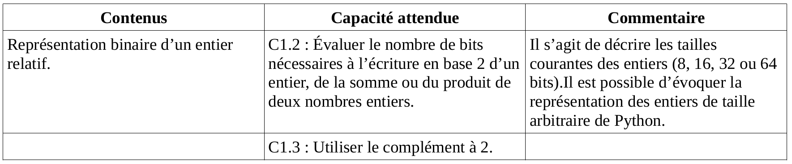
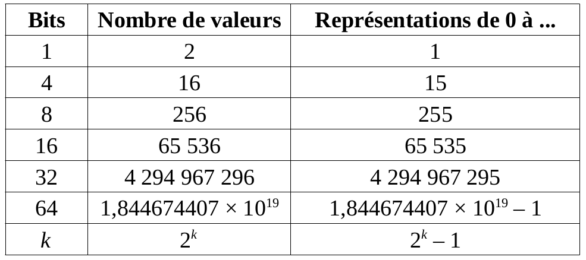

[^hist-info.org]: François GUILLIER. *Histoire de l'informatique* [en ligne]. 2016 [consulté le 18 juillet 2019]. [histoire-informatique.org](https://histoire-informatique.org/grandes_dates/)  

[^hist-info.online]: Serge ROSSI. *Histoire de l'informatique* [en ligne]. 20 novembre 2004 [consulté le 18 juillet 2019]. [histoire.info.online.fr](http://histoire.info.online.fr/)  

[^NSI-Nathan]: L'ensemble des exercices de cette partie est issu de (c) PASQUET, Stéphane. *Numérique et Sciences Informatiques*. Nathan, 2019. 224p. ISBN 978-209-157465-3  

\huge \textbf{Thème 1}\normalsize  

\ 

\Large \textbf{Chapitre 2 : Représentation des entiers}\normalsize  

# Eléments du programme  

 \   

# Un peu d'histoire [^hist-info.online] [^hist-info.org]  
**_1614_** : John NAPIER publie `les première tables de logarithmes`. Grace à ses travaux, la multiplication et la division peuvent être ramenées à deux opérations très simples : l'addition et la soustraction.  
**_1666_** : L'anglais MORELAND invente le `principe de la multiplication par additions successives`.  
**_1948_** : Claude SHANNON publie un mémoire intitulé "Théorie mathématique de l'information". Issu de ses travaux pour sa thèse, ce mémoire décrit l'application de la théorie de BOOLE. Dans cet ouvrage, SHANNON introduit un terme nouveau : "`le bit`" (contraction de Binary digIT) qui fournit une mesure de la quantité d'information.  

# Les entiers naturels  
## Bits, mots et octets  
### Définitions  
Contraction de *Binary digIT*, `le bit` est une information élémentaire ayant deux valeurs, souvent 0 et 1.  

Les systèmes informatiques actuels sont construits à partir de circuits intégrant de nombreux transistors (nous verrons cela plus tard dans l'année) dont leur rôle se limite à avoir deux états : une tension basse (0) ou une tension haute (1).  

`Un mot` (`word` en anglais) est un ensemble de bits de longueur définie et fixe. Par exemple, cela peut être 4 bits, 8 bits, 16 bits, 32 bits, 64 bits voir bientôt 128 bits.  

Au début de l'informatique, l'information était codée sur 8 bits, c'est ce que l'on appelle `un octet`.  

**Attention**, en anglais, on parle de `bytes` (avec un Y et non un I) pour parler d'octets. Autrement dit : *8 bits = 1 byte*.  

### Exercice  
1. Voici quelques entiers naturels représentés sur 8 bits, c'est à dire 1 octets. Quelles sont leurs écritures décimales   
  A = 10000000  
  B = 00110011
2. Ecrire la représentation sur 16 bits, c'est à dire 2 octets, des entiers naturels suivants :  
  C = 2 019  
  D = 32 769  

## Capacités de représentation  
### Exercice  
1. Quel est le plus grand entier naturel que l'on peut représenter sur quatre bits ? Un octet ? Deux octets ? Quatre octets ? Huit octets ?
2. Soit _n_ un entier naturel.
    a. Combien de nombres entiers peut-on représenter avec un mot de _n_ bits ?
    b. Quel est le plus grand entier naturel que l'on peut représenter avec un mot de _n_ bits ?  

### Capacités de représentation  

 \   

Pour déterminer le nombre de bits nécessaires à la représentation d'un entier naturel, deux méthodes sont possibles :  

#### A l'aide des puissances de 2 :  
On encadre l'entier naturel entre deux puissances de 2. Le nombre de bits est l'exposant le plus grand des deux exposants :  

* $16 \leqslant 20 < 32$ c'est à dire $2^4 \leqslant 20 < 2^5$ donc il faut 5 bits pour représenter 20 en binaire ;
* $128 \leqslant 128 < 256$ c'est à dire $2^7 \leqslant 128 < 2^8$ donc il faut 8 bits pour représenter 128 en binaire.  

#### Avec le logarithme népérien :  

Le nombre de bits nécessaire à l'écriture d'un nombre *n* est le premier entier strictement supérieur au nombre $\frac{ln(n)}{ln(2)}$ où *ln* représente la fonction *logarithme népérien* :  

* $\frac{ln(20)}{ln(2)} \approx 4,32$ donc il faut 5 bits pour représenter 20 en binaire ;  
* $\frac{ln(128)}{ln(2)} = 7$ donc il faut 8 bits pour représenter 128 en binaire.  

### Exercice  
*Combien faut-il de bits pour représenter les nombres suivants (utiliser chacune des deux méthodes) :*  
*E = 2 019*  
*F = 4 540 000 000 (âge approximatif de la Terre)*  

# Les entiers relatifs  
## Bit fort, bit faible
Dans une représentation binaire donnée, `le bit de poids fort` (most significant bit, noté `MSB`, en anglais) est celui ayant le plus grand poids, ou la plus forte position. Dans la manière habituelle de noter, il s'agit du bit le plus à gauche dans l'écriture.  
Par exemple, le nombre entier 13 a pour représentation binaire sur quatre bits : **1** 1 0 1. Le **1** représente 8 et est le plus grand poids dans cette écriture. Si on représente 13 sur huit bits, cela donne : **0** 0 0 0 1 1 0 1. Cette fois, le bit de poids fort est **0**.  


Dans une représentation binaire donnée, `le bit de poids faible` (least significant bit, noté `LSB`, en anglais) est celui ayant le plus petit poids, ou la plus petite position. Dans la manière habituelle de noter, il s'agit du bit le plus à droite dans l'écriture.  
Par exemple, le nombre entier 13 a pour représentation binaire sur quatre bits : 1 1 0 **1**. Le **1** est le plus petit poids dans cette écriture.  

## Représentation des entiers relatifs  
Une première possibilité pour représenter un entier (relatif) sur un octet est d'utiliser le bit de poids fort pour indiquer le signe. On prendrait alors 0 pour les nombres positifs et 1 pour les négatifs. Ainsi, sur un octet, le nombre 13 s'écrirait 00001101 et -13 s'écrirait 10001101. Le problème est qu'en additionnant 13 et -13 dans cette écriture, on obtiendrait : 0 0 0 0 1 1 0 1 + 1 0 0 0 1 1 0 1 = 1 0 0 1 1 0 1 0 (poser l'opération pour s'en convaincre)  
Or 1011010 est la représentation de l'entier relatif -26, autrement dit, on arrive à : 13 + (-13) = -26 ! ... Peu satisfaisant donc.  

### Le complément à 2  
Pour pouvoir avoir une représentation assez simple des entiers tout en ayant une faciliter pour les utiliser dans les opérations, il faut utiliser le complément à deux.  
Pour cela, deux méthodes s'offre à nous :  

#### Méthode 1 :  

* Si le nombre est positif, on ne change rien, le bit de poids fort est 0, puisque le nombre est positif ;
* pour représenter l’opposé d’un nombre positif par son complément à deux, on inverse les bits 0 et 1 (on fait dit que l'on fait *un complément à 1*) et on ajoute 1 au mot binaire obtenu (on obtient alors le complément à 2).  

Exemple :  
Sur un octet, 13 est représenté par : 0 0 0 0 1 1 0 1  
Pour écrire -13 :

* on inverse les bits 0 et 1 : 1 1 1 1 0 0 1 0 ;
* on ajoute 1 au mot binaire obtenu : 1 1 1 1 0 0 1 1.  

Ainsi, -13 est représenté sur un octet par 11110011.

#### Méthode 2 :  
On souhaite représenter un nombre entier sur *n* bits.

* Si le nombre est positif, on ne change rien, le bit de poids fort est 0, puisque le nombre est positif ;
* on représente sur *n* bits le nombre auquel on ajoute $2^n$.  

Exemple :  
Sur un octet, pour représenter -13, on représente le nombre positif $-13 + 2^8$ (1 octet = 8 bits, d'où le $2^8$) :  
$-13 + 2^8 = -13 + 256 = 243$  
Or la représentation binaire de 243 est $\overline{11110011}^2$, donc -13 est représenté par 11110011 sur un octet.  

### Remarque  
La représentation d'un entier relatif avec le complément à 2 dépend du nombre de bits pour sa représentation.  

### Exercice  
1. Par ces deux méthodes, donner la représentation des nombres suivants sur le nombre d'octets indiqués :  
G = -190 sur un octet  
H = -2019 sur deux octets  
I = 137 sur un octet  
J = -100 sur un octet
2. Quel est le plus petit et le plus grand entier relatif que l'on peut écrire sur un octet ? Sur deux octets ? Sur n bits ?
3. Déterminer les entiers relatifs dont les représentations par complément à deux sur un octet sont les suivantes :  
K = 00010101  
L = 10101010  

# Et dans différents langages de programmation ? *(pour information)*  
Selon les langages de programmation, voir selon les types de processeurs, une variable référant à un entier naturel ou un entier relatif peut être déclarée de différentes manières et correspond alors à des plages de valeurs possibles différentes. Selon l'usage de ces variables, il sera judicieux pour optimiser la mémoire en particulier, de choisir un type correspondant au mieux à l'usage que l'on en a.  

## En C++  
En C++ par exemple, il existe différents type d'entiers :  

* Les entiers courts (`short int`). Codés sur 2 octets, ils vont de -32 768 à 32 767 ;
* les entiers non signés (`unsigned short int`). Codés sur 2 octets, ils vont de 0 à 65 535 ;
* les entiers (`int`). Codés sur 2 octets (processeurs 16 bits) ou sur 4 octets (processeurs 32 bit), ils vont de -32 768 à 32 767 ou de -2 147 483 648 à 2 147 483 647 ;
* les entiers non signés (`unsigned int`). Codés sur 2 octets (processeurs 16 bits) ou sur 4 octets (processeurs 32 bit), ils vont de 0 à 65 535 ou de 0 à 4 294 976 295 ;
* les entiers longs (`long int`). Codés sur 4 octets, ils vont de -2 147 483 648 à 2 147 483 647 ;
* les entiers longs non signés (`unsigned long int`). Ils vont de 0 à 4 294 967 295.  

Pour déclarer une variable *n* de type *int* (entier) par exemple, il faudra écrire :  
```c++
typedef int n ;
```

## En python  
En langage python c'est différent. En effet, le principe de codage des entiers naturels n'est pas exactement comme cela, et, sans rentrer dans le détail, il permet de travailler avec des entiers aussi grand que l'on souhaite. Pour s'en persuader, il suffit de tester le calcul de "un million exposant dix" :  
$-1 000 000^{10} = -1 000 000 000 000 000 000 000 000 000 000 000 000 000 000 000 000 000 000 000 000 = -10^{60}$  
En python, voilà ce qu'on obtient :  
```python
>>> -1000000**10
-1000000000000000000000000000000000000000000000000000000000000
```
Cette particularité donne un très gros intérêt à l'usage du langage python dans le traitement de données entières.  
Autre aspect, il n'est pas nécessaire d'effectuer la moindre déclaration de variable au préalable, le langage l'effectue de lui même au moment de la compilation. Attention donc, car cela peut être source d'erreur de programme si on n'a pas en tête le type de chacune des variables utilisées.  

*Chaque langage de programmation a donc sa manière de gérer les nombres entiers, signés ou non. Lorsque l'on programme, il est donc nécessaire de bien faire attention à cela pour éviter tout problème d'affectation de variable ou de dépassement de capacité (voir plus loin).*  

# L'addition de deux entiers  
Le principe de le même qu'en base 10. Simplement, comme $\overline{1}^2 + \overline{1}^2 = \overline{10}^2$, il suffit alors de "*poser 0 et retenir 1*".

### Exemple  
On cherche la somme $\overline{10100101} + \overline{1110001}$.  

 \   

### Exemple  
Poser et effectuer les sommes de nombres représentés sur huit octets :  
M = 00101010 + 01000101  
N = 11010101 + 00101101  
O = 10010010 + 11011101  

### Dépassement de capacité (overflow)
### Activité  
1. Quels sont les nombres relatifs dont les représentations par complément à 2 sur un octet sont respectivement 00000001 et 01111111 ?
2. Calculer sur un octet la somme : P = 00000001 + 01111111. Quel est le nombre relatif obtenu dont la somme est la représentation ?
3. Reprendre les questions 1. et 2. avec les nombres 10000000 et 11111111.
4. Expliquer ces deux constats.  

### Théorème  
Dans une représentation en complément à deux sur *n* bits, le successeur de $2^{n-1}-1$ est $-2^{n-1}$.   

 \   

# Soustraction de deux entiers  
## Première méthode  
Il suffit de poser la soustraction avec les retenues comme on en a l'habitude.  

\   

**Exercice**  

1. Poser et effectuer la soustraction $01101101 - 00101011$.
2. Vérifier que $(-5)-(-7) = 2$ à l'aide de la représentation avec le complément à 2 sur un octet en posant et en effectuant l'opération.  

## Seconde méthode  
Soustraire un nombre revient à ajouter son opposé.  
Or l'opposé d'un nombre *B* est tout simplement son complément à 1 (on écrit des 0 à la place des 1 et réciproquement) auquel on ajoute 1.  
Pour soustraire deux nombres *A* et *B* non signés (donc représentant des entiers naturels), il suffit d'ajouter à *A*, le *complément à 1 de B* et *1*.  

### Exemple  
On cherche à calculer $01101101 - 00101011$.

* On cherche le complément à 1 de $00101011$ : $11010100$ ;
* On effectue $01101101 + 11010100 + 1$ : $01000010$ (on travaille sur un octet donc, le 9è bit de gauche est oublié)

### Exercice  
Par cette méthode, vérifier que $(-5)-(-7) = 2$ à l'aide de la représentation avec le complément à 2 sur un octet.  

# Multiplication de deux entiers 
## Méthode  
Le plus difficile est passé ! Pour effectuer une multiplication, il faut faire comme on en a l'habitude avec les écriture décimales, décalages à chaque rang compris.  

## Exemple  
 \   

## Exercice  
Poser et effectuer le produit $000001010 \times 000101010$. (On peut se passer des zéro écrits à gauche des nombre mais ne pas oublier que l'on travaille avec une écriture sur 9 bits)

# Pour s'entraîner ...[^NSI-Nathan]  
##  Complément à 2
Donner le complément à 2 des nombres suivants avec une mémoire de 8 bits :  

1. 100
2. 75
3. -50
4. -89  

##  Somme de deux entiers  
Pour chacune des questions suivantes, avec une mémoire d'un octet,  

* donner le complément à 2 des deux nombres a et b ;
* calculer la somme des compléments à 2 de a et b ;
* vérifier que le résultat trouvé est bien le complément à 2 de la somme de a.  

1. *a* = 35 et *b* = 65.
2. *a* = -12 et *b* = 45.
3. *a* = -84 et *b* = 29.
4. *a* = -17 et *b* = -111.  

##  A partir du complément à 2  
Trouver le nombre en base 10 dont le complément à 2 est :  

1. $\overline{11001011}^2$
2. $\overline{11010100}^2$
3. $\overline{10000010}^2$
4. $\overline{10101010}^2$  

\   

**Source**  

- Timo VAN NEERDEN. *Binaire et hexadécimal* [en ligne]. Page créée en avril 2009,  mise à jour le 13 septembre 2017 [Consulté le 18 juillet 2019]. [Le Hollandais Vollant : lehollandaisvolant.net/tuto/bin/](https://lehollandaisvolant.net/tuto/bin/)  

- Damien ICETA et Xavier PESSOLES. *Cours : représentation des entiers* [en ligne]. Page créée en juin 2013,  mise à jour le décembre 2014 [Consulté le 25 août 2019]. [xpessoles.ptsi.free.fr/fichiers/PDF/Informatique/CI_01_03_RepresentationEntiers_Cours.pdf](http://xpessoles.ptsi.free.fr/fichiers/PDF/Informatique/CI_01_03_RepresentationEntiers_Cours.pdf)  

- Jean-Pierre BECIRSPAHIC. *Représentation des nombres* [en ligne]. [Consulté le 10 septembre 2019]. [https://info-llg.fr/commun-mpsi/pdf/04.nombres.pdf](https://info-llg.fr/commun-mpsi/pdf/04.nombres.pdf)  


