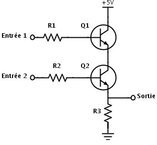
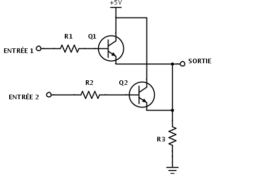

\huge \textbf{Thème 1}\normalsize  

\ 

\Large \textbf{Chapitre 4 : Algèbre de Bool}\normalsize  

# Eléments du programme  
\   

# Un peu d'histoire [^hist-info.online] [^hist-info.org]  
**-300** : Le philosophe Grec Aristote définit dans son œuvre ce qu'est `la logique`.  
**1854** : `Boole` publie un ouvrage dans lequel il démontre que tout processus logique peut être décomposé en une suite d'opérations logiques (ET, OU, NON) appliquées sur deux états (ZERO-UN, OUI-NON, VRAI-FAUX, OUVERT-FERME).

[^hist-info.org]: François GUILLIER. *Histoire de l'informatique* [en ligne]. 2016 [consulté le 18 juillet 2019]. [histoire-informatique.org](https://histoire-informatique.org/grandes_dates/)  
[^hist-info.online]: Serge ROSSI. *Histoire de l'informatique* [en ligne]. 20 novembre 2004 [consulté le 18 juillet 2019]. [histoire.info.online.fr](http://histoire.info.online.fr/)  

# Portes logiques  
Les circuits d'un ordinateur manipulent, certes des 0 et des 1, mais surtout, ces valeurs sont tous simplement représentés par des tensions électriques : si la tension est basse, cela représente 0, si la tension est haute (variable selon les composants), cela représente un 1.  

## La porte `NON`  
Ces circuits électroniques sont construit à partir de transistors.  
[^transistor] \ \ 
[^electroniqueamateur] \   

[^transistor]: Evan-Amos [Public domain], via [Wikimedia Common](https://commons.wikimedia.org/)  
[^electroniqueamateur]: Image [http://electroniqueamateur.blogspot.com/2014/09/explorons-les-portes-logiques.html](http://electroniqueamateur.blogspot.com/2014/09/explorons-les-portes-logiques.html)  

Ces derniers se comportent comme des interrupteurs : si la tension en Entrée est basse, le courant ne passe pas et la tension est haute en Sortie. Si la tension est haute en Entrée, le courant passe (vers la masse) et la tension en Sortie devient basse.  

Ainsi, un transistor permet d'obtenir `une porte logique NON` (`NOT` en anglais) puisqu'une tension en Entrée conduit à la tension contraire en Sortie.  

La porte NOT possède un bit en entrée (E), et un bit en sortie (S).  

On la représente par le schéma suivant :  \   

\   

Pour représenter le calcul réalisé par une porte logique, on écrit ce que l'on appelle `une table logique`. Cette dernière est constituée d'autant de colonnes que d'entrées et de sorties. On écrit en entrée, toutes les possibilités et on indique alors en sortie les valeurs obtenues.  

Pour la porte `NOT`, nous obtenons donc :  

 \   

\newpage

En combinant plusieurs transistors, on peut ainsi obtenir d'autres portes.  

Par exemple :  

- en combinant deux transistors en série, obtient une porte logique `NON ET` (`NAND` en anglais) :  
[^electroniqueamateur]  
- en combinant deux transistors en parallèle, on obtient une porte logique `NON OU` (`NOR` en anglais):  
[^electroniqueamateur]  

Ces deux portes suffisent à concevoir n'importe quel circuit. On dit qu'elles forment `une base complète`.  

## La porte `ET`  
Une autre porte logique très importante est `la porte logique ET` (`AND` en anglais).  

[^electroniqueamateur]  

Elle a deux bits en entrées (`E0` et `E1`) et un seul en sortie (`S`).  

On la représente par le schéma suivant :  \   

Sa table logique est alors la suivante :  

 \   

On peut remarquer que cette porte permet d'obtenir en sortie le produit des deux bits donnés en entrée.  

## La porte `OU`  
Une troisième porte logique tout aussi importante est `la porte logique OU` (`OR` en anglais).  

[^electroniqueamateur]  

Elle a deux bits en entrées (`E0` et `E1`) et un seul en sortie (`S`).  

On la représente par le schéma suivant :  \   

Sa table logique est alors la suivante :  

 \   

Les trois portes `NOT`, `AND` et `OU` permettent également de concevoir n'importe quel circuit électronique.  

# Fonctions booléennes  
## Définition  
**Une fonction booléennes** est une fonction qui prend en entrée un ou plusieurs bits mais qui ne produit qu'un seul bit.  

## Fonctions booléennes associées aux portes logiques  
Certaine circuits électroniques peuvent donc être décrits comme des fonctions booléennes. Les portes logiques du paragraphe précédent en font partie.  

Ainsi :  

- la fonction associée à la porte NOT est **la négation**. On la note $\lnot x$ ;
- la fonction associée à la porte AND est **la conjonction**. On la note $x \land y$ ;
- la fonction associée à la porte OR est **la disjonction**. On la note $x \lor y$.  

## Table de vérité  
### Propriété  
**Une table de vérité** d'une fonction booléennes avec *n* bits en entrée aura $2^n$ lignes, correspondant aux $2^n$ combinaisons possibles d'entrées.  

### Tables de vérité des fonctions booléennes étudiées  

   \   

# Expressions booléennes  
En utilisant les opérateurs ci-dessus, on peut définir n'importe quelle fonction booléenne comme expression booléenne sur ses entrées.  

## La porte logique XOR  
**Définition**  
Le `ou exclusif` (`XOR` en anglais), noté $x \oplus y$ est défini par la table de vérité suivante :  

 \   

Ce "ou exclusif" est à comprendre comme "soit l'un, soit l'autre".  

On le représente par le schéma suivant :  \   

### Exercice
Vérifier que $a \oplus b = (a \lor b) \land \lnot(a \land b)$.  

\   

\   

\   

\   

\   

## Exemple  
### Exercice
On considère la fonction définie par l'expression booléenne appliquée à un triplet $(x ; y ; z)$ : $f(x ; y ; z) = (x \land y) \oplus (\lnot y \lor z)$.  
Compléter la table de vérité :  
 \   

## Identités élémentaires  
Hormis quelques évidences (commutativité, associativité, ...), les identités élémentaires ont quelques propriétés intéressantes :  

### Distributivité  
**Propriété**  
$x \land (y \lor z) = (x \land y) \lor (x \land z)$  

$x \lor (y \land z) = (x \lor y) \land (x \lor z)$

\   

**Exercice**  

Démontrer cette propriété à l'aide de tables de vérité.  

\   

\   

\   

\   

\   

\   

\   

\   

\   

\   

### Lois de Morgan  
**Propriété**  
$\lnot(x \land y) = \lnot x \lor \lnot y$  

$\lnot(x \lor y) = \lnot x \land \lnot y$

\   

**Exercice**  
Démontrer cette propriété à l'aide de tables de vérité.  

\   

\   

\   

\   

\   

### Exercice  
Sans table de vérité, démontrer que $\lnot (y \land(x \lor \lnot y)) = \lnot x \lor \lnot y$.  

\   

\   

\   

\   

\   

\   

\   

\   

\   

\   

# Circuits combinatoires  
**Un circuit combinatoire** est un circuit électronique qui possède des entrées et des sorties mais dont ces dernières ne dépendent que des entrées.  

Lorsque les sorties dépendent de valeurs d'entrées précédentes, il s'agira de **circuits séquentiels**, nécessitant une mémoire.  

## Le décodeur  
Un décodeur *n* bits possède *n* entrées et $2^n$ sorties. Les *n* bits en entrée sont utilisées pour mettre à 1 la sortie dont le numéro est égal au nombre codé (en binaire) par les entrées et mettre les autres sorties à 0.  

Avec des portes logiques, il peut être construit de la manière suivante (décodeur 2 bits) :  

 \   

1. Ecrire la table de vérité d'un décodeur 2 bits (Ecrire les entrées et les sorties dans l'ordre décroissant des indices).
2. Ecrire les quatre expressions booléennes correspondant aux quatre sorties.  

\   

\   

\   

\   

\   

\   

\   

\   

\   

\   

\   

\   

## Le demi-additionneur 1 bit  
Un circuit pour additionner *n* bits est construit à partir d'additionneurs de 1 bit en cascade.  

Ce dernier doit avoir deux bits en sortie : l'unité (`S`) et la retenue (`C`).  

Dans un premier temps, un demi-additionneur possède deux entrées (`E0` et `E1`), les deux bits à ajouter.  

1. Dresser la table de vérité du demi-additionneur 1 bit.
2. Ecrire les expressions booléennes correspondant aux sorties S et C.
3. Dessiner un schéma de portes logiques d'un demi-additionneur 1 bit.  

\   

\   

\   

\   

\   

\   

\   

\   

\   

\   

\   

\   

\   

\   

\   

\   

\   


## L'additionneur 1 bit  
Le demi-additionneur sert pour l'addition des deux premiers bits. Ensuite, pour les additions des bits suivants, il faut tenir compte de la retenue éventuelle de l'addition précédente. Pour cela, il faut donc cette fois, trois entrées (`E0`, `E1` et `C0`) et deux sorties (`S` et `C`).  

1. Dresser la table de vérité d'un additionneur 1 bit.
2. Ecrire les expressions booléennes correspondant aux sorties s et c.
3. Dessiner un schéma de portes logiques d'un demi-additionneur 1 bit.  

\   

\   

\   

\   

\   

\   

\   

\   

\   

\   

\   

\   

\   

\   

\   

\   

\   

\   

\   

\   

# En langage python ...  
## True, False, 0, 1 et les autres  
Dans une expression booléenne, les opérandes peuvent être de différents types. Pour python, ce qui est nul ou vide est interprété comme `False` : `0`, `0.0` , `""`,`''`, `[ ]`, `{ }`, ... Le reste est considéré comme `True`.  

### Exemple
```python
def multiple_3(nb):
  if nb % 3:
    # le reste nb % 3 vaut 1 ou 2 (True)
    rep = 'pas multiple de trois'
  else:
    # nb % 3 vaut 0 (False)
    rep = 'multiple de trois'
  return rep
```
### Conséquences
Si on note `0` et `1` à la place de `False` et `True` :  

- `a and b` équivaut au produit `a * b` ;
- `a or b` équivaut à `a + b - a * b`.  

## Séquentialité/paresse des opérateurs AND et OR  
Dans une expression `a and b` ou `a or b`, si `a` est faux, l'expression prend la valeur de `a`, sinon, elle prend la valeur de `b`.  

La valeur d'une expression `a and b` ou `a or b` est la dernière valeur évaluée.

## Priorité  
Parmi les opérateurs booléens, la préséance, du plus fort au plus faible, est la suivante:

- is not ; not in
- not x
- and
- or  

On peut s'en rendre compte avec les instructions suivantes :  
```python
>>> 1 or 0 and 0
1
>>> (1 or 0) and 0
0
```

En cas de doute, **ne pas hésiter dans une expression booléenne à ajouter des parenthèses**, même si elles peuvent être inutiles.  

## Opération sur les bits  
Le langage python dispose d'opérateurs qui agissent directement sur les bits :  

### `NOT`  
Pour effectuer un `NON` (`NOT`) bit à bit, il suffit d'utiliser le caractère `~` :  
```python
>>> bin (~0b1001)
'-0b1010'
>>> ~9
-10
>>> hex(~0x9)
'-0xa'
```

### `AND`  
Pour effectuer un `ET` (`AND`) bit à bit, il suffit d'utiliser le caractère `&`.  

Voici trois manières d'effectuer le même travail :    
```python
>>> bin (0b1010 & 0b1100)
'0b1000'
>>> 10 & 12
8
>>> hex(0xA & 0xC)
'0x8'
```

### `OR`  
Pour le `OU` (`OR`), il suffit d'utiliser le caractère `|` :  
```python
>>> bin (0b1010 | 0b1100)
'0b1110'
>>> 10 | 12
14
>>> hex(0xA | 0xC)
'0xe'
```

### `XOR`
Pour le `OU exclusif` (`XOR`), il suffit d'utiliser le caractère `^` :  
```python
>>> bin (0b1010 ^ 0b1100)
'0b110'
>>> 10 ^ 12
6
>>> hex(0xA ^ 0xC)
'0x6'
```

### Décaler des bits vers la droite ou la gauche  
Pour décaler des bits vers la droite ou la gauche de *n* rangs, on utilise `>>` ou `<<` suivi du nombre de rangs *n* :  
```python
>>> bin(0b0001010 << 3)
'0b1010000'
>>> bin(0b01001010 >> 4)
'0b100'
```

**Remarque**  
C'est une manière très rapide d'effectuer des multiplications ou des divisions par des puissances de 2.  

# Pour s'entraîner  
## Exercice  
Montrer à l'aide d'une table de vérité mais aussi à l'aide des propriétés des identités élémentaires l'égalité :  

$(x \land y) \lor (\lnot y \land z) = (x \lor \lnot y) \land (y \lor z)$.  

## Exercice  
On souhaite définir une fonction booléenne à deux variables *x* et *y* qui vaut 1 si les deux variables ont la même valeur.  

1. Dresser la table de vérité de cette fonction.
2. Ecrire l'expression booléenne correspondant à cette fonction.
3. Dessiner un schéma de portes logiques de cette fonction.
4. Ecrire une fonction en langage python, à l'aide d'expressions booléennes, répondant à la définition de cette fonction booléenne.  

## Exercice  
On considère la fonction booléenne à trois variables suivante : $f(x ; y ; z) = (x \land \lnot y \land \lnot z) \lor (\lnot x \land y \land \lnot z) \lor (\lnot x \land \lnot y \land z)$  

1. Donner la table de vérité de cette fonction.
2. Quel est le rôle de cette fonction ?
3. Simplifier son écriture.  

## Exercice  
Dessiner un additionneur deux bits, combinaison d'un semi-additionneur et d'un additionneur.  

## Exercice : opérateur NAND  
1. Ecrire une fonction `nand` en langage python correspondant à la fonction à deux variables : $f(x ; y) = \lnot(x \land y)$.
```python
def nand(x: bool, y: bool)-> bool:
  '''
  Fonction qui renvoie (x nand y).
  '''
  sortie = ... # <--- A compléter
  return sortie
```
2. Ecrire la table de vérité de cet opérateur logique.  

## Exercice : opérateur NOR  
1. Ecrire une fonction `nor` en langage python correspondant à la fonction à deux variables : $f(x ; y) = \lnot(x \lor y)$.
2. Ecrire la table de vérité de cet opérateur logique.  

## Exercice  
Ecrire les tables de vérité puis simplifier les expressions suivantes :  

- (a or b) and (a and b)
- (a or b) or (a and b)  

\   

\   

\   

**Source**  

- T. Balabonski, S. Conchon, J.-C. Filliâtre, K. Nguyen. Circuits et logique booléenne. In *Numérique et sciences informatiques*. ellipses, 2019. pp. 275-285. ISBN 978-2-34-003364-1
- S. Bays. Types simples. In *Numérique et sciences informatiques*. ellipses, 2019. pp. 101, 103, 118. ISBN 978-2-34-0031772-2
- [http://www.cburch.com/logisim/](http://www.cburch.com/logisim/) (pour le tracé des portes et circuits logiques)  
