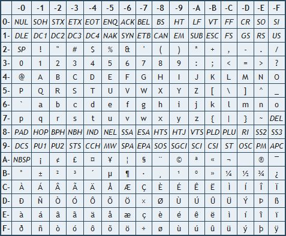
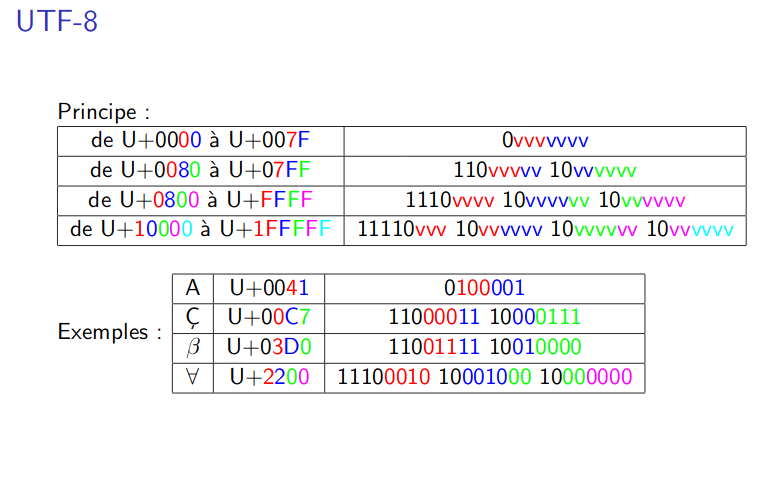

[^hist-info.org]: François GUILLIER. *Histoire de l'informatique* [en ligne]. 2016 [consulté le 18 juillet 2019]. [histoire-informatique.org](https://histoire-informatique.org/grandes_dates/)  
[^hist-info.online]: Serge ROSSI. *Histoire de l'informatique* [en ligne]. 20 novembre 2004 [consulté le 18 juillet 2019]. [histoire.info.online.fr](http://histoire.info.online.fr/)  

\huge \textbf{Thème 1}\normalsize  

\ 

\Large \textbf{Chapitre 5 : Encodage des caractères}\normalsize  

# Eléments du programme  
\   

# Un peu d'histoire [^hist-info.online] [^hist-info.org]  
**_1623_** : Le philosophe Francis Bacon invente le `Code Bilitère` à deux lettres qui permet en utilisant 5 caractères de coder les lettres de l'Alphabet.  
**_1832_** : Le peintre Américain Samuel `Morse` invente le code qui porte son nom utilisant des points et des traits pour représenter les caractères à transmettre.  
**_1867_** : Inventée par deux américains et commercialisée par la firme `Remington`, la machine à écrire mettra beaucoup de temps à se développer. La disposition des lettres (QWERTY ...) vient du fait que les premières machines ne suivaient pas la cadence de certaines secrétaires ; on a donc placé les lettres les plus utilisées sous les doigts les plus faibles.  
**_1964_** : Création du `code ASCII` (American Standard Code for Information Interchange), normalisé en 1966 par l'ISO pour simplifier l'échange de données entre ordinateurs. Malgré cela, IBM maintient sa propre norme propriétaire EBCDIC (Extended Binary Coded Decimal Interchange Code).  
**_1991_** : Afin de résoudre une fois pour toute les problèmes de codage de caractères et de ses différents jeux (ex: ISO 8859-1/Latin 1 etc...) incompatibles, l'Unicode a été créé pour être un sur-ensemble de tous les autres. Il est capable, en théorie, de supporter tous les langages existants (et disparus) avec leurs particularités. Il existe plusieurs formats de représentation : `UTF-8` est de plus en plus utilisé pour les transmissions de documents (par exemple cette page web) et sur les serveurs UNIX. Il a l'inconvénient d'avoir une longueur par caractère qui est variable (1 caractère = 1,2,3 ou 4 octets) mais il a l'avantage d'être très compact pour l'alphabet occidental non accentué et n'a pas le problème d'ordre des octets comme `UTF-16` (utilisé par Windows). Si la première version de la norme a été publiée en 1991, sa complexité rend son adoption très lente.  

# L'ASCII ...  
## Pourquoi encoder les caractères ?  
L'ordinateur ne fonctionne qu'avec des 0 et des 1. Que ce soit pour le stockage ou pour le traitement, il faut donc représenter les caractères par des suites de 0 et de 1. La solution immédiate est de construire une table de correspondance entre chaque caractère et une valeur binaire. Une telle table est appelée `système de codage des caractères`.  

## L'encodage ASCII  
Jusqu'en 1960, chacun utilisait son propre système d'encodage, rendant difficile la lisibilité des documents échangés.  En 1960, l'ISO (Organisation internationale de normalisation) crée la norme ASCII (American Standard Code for Information Interchange). A chaque caractère correspond un nombre codé en binaire sur 8 bits, dont seulement 7 étaient réellement utilisés pour le codage à proprement parlé du caractère. En effet, le stockage et la transmission n'étant pas à l'époque aussi fiable qu'aujourd'hui, le bit de poids fort servait à indiquer si le nombre de 1 sur les sept autres bits était pair ou impair.  Comme $\overline{10000000}^2 = \overline{80}^{16} = 128$, il n'est alors possible de coder que 128 caractères, codés de 0 à 127 (ou encore $\overline{7F}^{16}$, c'est à dire $\overline{1111111}^2$) :  

\newpage

\     
Les caractères codés de 0 à 31 $\left( \overline{1F}^{16} \right)$, ainsi que le caractère codé par 127 $\left( \overline{7F}^{16} \right)$ ne sont pas des caractères imprimables (comme par exemple, le `retour à la ligne`, la touche `ESC`, etc ...). Les autres valeurs correspondent à des caractères imprimables. Par exemple, le caractère A correspond au code 65 $\left( \overline{41}^{16} \right)$.  

## Exercice  
1. Quel est le code correspondant au caractère *r* ? Au caractère *R* ?  
\ \  
2. Quel est le caractère codé par $3F$ ?  
\ \  
3. Coder en ASCII le mot *Codage*. Les codes seront écrits en hexadécimal.  
\ \  
4. Quel est l'expression codée en ASCII ci-dessous ? (les valeurs sont écrite en hexadécimal)  
"50 72 65 6E 65 7A 20 75 6E 20 63 68 65 77 69 6E 67 2D 67 75 6D 20 45 6D 69 6C 65 20 21"  
\ \  

# ... l'ISO/CEI 8859-1 ...  
## Les limites de l'ASCII  
Ce codage des caractères est créé par dans anglophone, pour des anglophones ! En effet, comment coder les caractères accentués de l'alphabet d'Europe occidentale ?  
Ainsi, en 1986 apparaît la `norme ISO/CEI 8859-1`, couramment appelé `Latin-1` ou encore `Europe occidentale`.  

## L'ISO/CEI 8859-1  
L'ISO/CEI 8859-1 s'effectue cette fois sur un octet complet (les mémoires étant bien plus sûres qu'auparavant) et permet alors de disposer de 256 caractères allant de 0 à 255 (c'est à dire de 0 à $\overline{11111111}^2$, ou encore $\overline{FF}^{16}$).  
Afin d'éviter tout problème de compatibilité avec l'ASCII, les 128 premiers caractères de la norme ISO/CEI 8859-1 reprennent exactement les caractères encodé par la norme ASCII, même si beaucoup des caractères non imprimables ne sont plus tellement utilisés :  
**Table ASCII**  
\   

**Table Latin-1**  
\   

## Exercice  
1. Quel est le code correspondant à la lettre *à* ?  
\ \  
2. Coder avec la norme Latin-1 les deux phrases suivantes : "On veut pas y aller ! On préfère rester couché !" (Chanson *Pour louper l'école* d'Aldebert).  

\ \  

\ \  

\ \  

3. Décoder les phrases suivantes :  
4C 65 73 20 63 61 68 69 65 72 73 20 61 75 20 66 61 75 20 21 20 4C 61 20 6D 61 EE 74 72 65 73 73 65 2C 20 61 75 20 6D 69 6C 69 65 75 20 21  

\ \  

\ \  

# ... et l'Unicode !  
## La multiplication des normes tue les normes ...  
La norme `ISO/CEI 8859-1` utilise essentiellement des caractères des langues occidentales, et chaque zone géographie va créer sa norme correspondant à son alphabet. Ainsi, la norme GB2312 sera celle pour le chinois simplifié, la norme JIS_X_0208, celle du japonnais.  
La multiplication de ces normes va créer de nombreux problèmes, puisqu'un européen qui écrit en Latin-1 verra son document décodé dans une autre norme si ce dernier est lue dans des pays asiatiques ou de certains pays d'Europe orientale (qui utilisent l'alphabet cyrillique).  

\newpage

## Exercice  
1. Coder en Latin-1 la phrase : "N’avez vous jamais réfléchi à la vraie liberté ?"(*Apocalypse now* de Francis Ford Coppola).  

\ \   

\ \   
2. Décoder le résultat de la question précédente à l'aide de la norme ISO 8895-4 correspondant à l'alphabet cyrillique :  
\   

\ \  

\ \  

## ... mais donne naissance à d'autres !  
En 1991, une nouvelle norme voit le jour : `l'Unicode`. Le but est de rassembler l'ensemble des caractères existant afin de ne pas devoir changer de table pour lire un document, quel qu'en soit sa provenance.  
Afin de répondre à cette norme et afin de tenir compte de la fréquence d'utilisation de certains caractères, furent créés plusieurs systèmes d'encodage : `UTF-8`, `UTF-16`, `UTF-32`.  
L'UTF-8 est actuellement le plus utilisé, en particulier sur le web. Il code sur un, deux, trois voir quatre octets les caractères selon le besoin. La taille occupé par l'encodage permet d'être le plus économe en terme de mémoire.  
L'UTF-16, codage fixe sur deux octets, et l'UTF-32, codage fixe sur 4 octets sont bien plus gourmands en ressources mémoire mais permettent de disposer de manière rapide à de nombreux caractères, même rares (hiéroglyphe égyptiens, etc ...).  

## Exercice  
Un texte codé en ASCII se code de la même manière sur 7 bits en UTF-8. A ce code, on ajoute un 0 sur le bit de poids fort pour compléter à l'octet.  
Le caractère *é* se code C3 A9.  
Quelle est la taille d'un fichier TXT contenant uniquement la phrase : "Quand les types de 130 kilos disent certaines choses, ceux de 60 kilos les écoutent." ? (*100 000 dollars au soleil*, Michel Audiard)  

\ \  

\ \  

## Exercice  
L’encodage UTF-8 utilise 1, 2, 3 ou 4 octets en respectant certaines règles :  

* un texte en ASCII de base (appelé aussi US-ASCII) est codé de manière identique en UTF-8. On utilise un octet commençant par un bit de poids fort égale à 0.  
Par exemple, le caractère "A" est codé par $\overline{41}^{16}$ (65) ou encore $\overline{1000001}^2$.  
En UTF-8, le binaire devient alors 0100001 sur un octet.  
* Les octets ne sont pas remplis entièrement. Les bits de poids fort du premier octet forment une suite de 1 indiquant le nombre d'octets utilisés pour coder le caractère. Les octets suivants commencent tous par le bloc binaire 10.  
\   
\   

Par exemple, le caractère "é" correspond à la valeur 233, c'est à dire 11101001, ou encore E9 selon la base utilisée.  
EN UTF-8, il sera donc codé sur 2 octets (entre 0080 et 07FF) : **110**00011 **10**101001 c'est à dire C3 A9.  

Le symbole € correspond à la valeur décimale 8 364 en UTF-8.  

1. Convertir 8 364 en binaire et en hexadécimal.  

\ \  

\ \  

\ \  

\ \  

\ \  

\ \  

\ \  

\ \  

\ \  

2. Donner le codage UTF-8 de ce caractère.  

\ \  

\ \  

3. Etant donné un caractère codé en binaire sur *n* bits, combien d'octets sont nécessaires pour le coder en UTF-8 ?  

\ \  

\ \  

\ \  

\ \  

4. Ecrire un programme en python qui permet, à partir de la valeur décimale d'un caractère, de trouver le nombre d'octets nécessaires pour coder ce caractère en UTF-8.  

\ \  

\ \  

\ \  

\ \  

\ \  

\ \  

\ \  

\ \  

\ \  

\ \  

\ \  

\ \  

\ \  

\ \  

\ \  

\ \  

\ \  

\ \  

# Et en langage python ?  
## Obtenir le code d'un caractère  
Pour obtenir le code d'un caractère, il suffit d'utiliser la fonction `chr` :  
```python
>>> chr(65)
'A'
```

## Obtenir le caractère correspondant à un code  
Pour effectuer l'opération contraire, on utilise la fonction `ord` :  
```python
>>> ord('A')
65
```

\   

\   

\   

**Sources**  

- PASQUET, Stéphane. *Numérique et Sciences Informatiques*. Nathan, 2019. 224p. ISBN 978-209-157465-3
- David Roche. *Représentation d'un texte en machine* [en ligne]. Page créée en 2019 [Consulté le 4 novembre 2019]. [https://pixees.fr/informatiquelycee/n_site/nsi_prem_texte.html](https://pixees.fr/informatiquelycee/n_site/nsi_prem_texte.html)
- S. Aicardi. *Codages de caractères ASCII, latin-1, UTF-8, etc.* [en ligne]. Page créée en mars 2006 [Consulté le 31 octobre 2019]. [http://mathrice.org/rencontres/mars.2006/codages.pdf](http://mathrice.org/rencontres/mars.2006/codages.pdf)
- [https://fr.wikipedia.org/wiki/ISO/CEI_8859-1](https://fr.wikipedia.org/wiki/ISO/CEI_8859-1)
- [https://fr.wikipedia.org/wiki/UTF-8](https://fr.wikipedia.org/wiki/UTF-8)