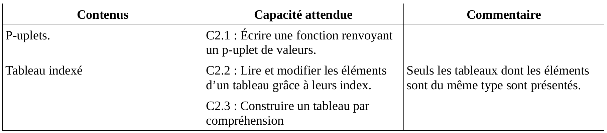

\huge \textbf{Thème 2}\normalsize  

\ 

\Large \textbf{Chapitre 1 : p-uplets et tableaux}\normalsize  

# Eléments du programme  
\ \   

# Définitions  
## Le p-uplet  
Un `p-uplet` est une collection ordonnée d'objets. Ces objets peuvent être de types différentes.  
En langage Python, les p-uplets sont représentés par les objets de la classe `tuple`. Il sont encadrés par des *parenthèses* et les `items` sont séparés par des *virgules*.  

Par exemple, dans le cadre des qualifications pour l'Euro 2020 de football, on peut représenter dans un p-uplet : le nom d'une équipe, son nombre de points, son nombre de matchs joués, le nombre de victoires, de nuls, de défaites, le nombre de buts marqués, de buts encaissés et enfin la différence de buts.  
```python
>>> mon_premier_p_uplet = ('Angleterre', 21, 8, 7, 0, 1, 37, 6, 31)
>>> mon_premier_p_uplet
('Angleterre', 21, 8, 7, 0, 1, 37, 6, 31)
```

Pour définir un tuple vide, on écrit `()`.  
Pour définir un tuple avec un seul élément, il faut malgré tout y placer une virgule `(3,)` :  
```python
>>> a = ()
>>> b = (3,)
```

## Le tableau  
Un `tableau` est une séquence finie d'éléments auxquels on peut accéder efficacement par leur `indice` dans la séquence. En général, les items d'un tableau sont de même type.  
En langage Python, les tableaux sont représentés par des objets de la classe `list`. Il sont encadrés par des *crochets* et les `items` sont séparés par des *virgules*.  

Par exemple, on veut regrouper l'ensemble des moyennes générales d'un groupe de dix élèves d'une classe de première dans un tableau : 13, 2, 11, 6, 11, 6, 0, 1, 1, 7.  
```python
>>> moyennes_generales = [13, 2, 11, 6, 11, 6, 0, 1, 1, 7]
>>> moyennes_generales
[13, 2, 11, 6, 11, 6, 0, 1, 1, 7]
```

Pour définir une list vide, on écrit `[]`.  
Pour définir un tuple avec un seul élément, il suffit de l'écrire entre crochets `[3]` :  
```python
>>> a = []
>>> a
[]
>>> b = [3]
>>> b
[3]
```

# Eléments communs aux objets des classes `tuple` et `list`  
Certaines actions sont semblables à celles utilisables pour des objets de la classe `str` (chaîne de caractères).  

## Accès aux éléments  
Pour accéder à un item particulier d'un `tuple` ou d'une `list`, il suffit d'utiliser les crochets entourant l'indice de l'item souhaité.  
Si l'on souhaite l'ensemble des items entre deux indices, on utilisera le séparateur *:*.    
```
>>> t = ('Angleterre', 21, 8, 7, 0, 1, 37, 6, 31)
>>> t[0]
'Angleterre'
>>> t[2]
8
>>> t[-1]
31
>>> t[2:7]
(8, 7, 0, 1, 37)
>>> t[2:-3]
(8, 7, 0, 1)

>>> l = ['Pierre', 'Hakim', 'Antoine', 'Léo', 'Camille', 'Yacine', 'Jacques']
>>> l[0]
'Pierre'
>>> l[3]
'Léo'
>>> l[2:5]
['Antoine', 'Léo', 'Camille']
>>> l[-5:-1]
['Antoine', 'Léo', 'Camille', 'Yacine']
```

## Longueur  
La fonction `len` permet d'obtenir le nombre d'item d'un tuple ou d'un tableau :
```python
>>> t = ('Angleterre', 21, 8, 7, 0, 1, 37, 6, 31)
>>> len(t)
9

>>> l = ['Pierre', 'Hakim', 'Antoine', 'Léo', 'Camille', 'Yacine', 'Jacques']
>>> len(l)
7
```

## Opérations + et \*  
Pour concaténer deux `tuples` ou deux `list`, on utilise `+`.  
Pour répéter plusieurs fois les mêmes éléments d'un `tuple` ou d'une `list`, on utilise `*`. Attention malgré tout à son usage avec les objets de la classe `list` (voir paragraphe mutabilité plus loin).  
```python
>>> t1 = (0, 1, 2)
>>> t2 = (3, 4)
>>> t = t1 + t2
>>> t
(0, 1, 2, 3, 4)
>>> l1 = [0, 1, 2]
>>> l2 = l1 * 4
>>> l2
[0, 1, 2, 0, 1, 2, 0, 1, 2, 0, 1, 2]
```

\newpage

## Appartenance  
Il est possible de tester qu'un objet est un item d'un `tuple` ou d'une `list` :  
```python
>>> t = ('Angleterre', 21, 8, 7, 0, 1, 37, 6, 31)
>>> 'Angleterre' in t
True
>>> 'France' in t
False
```

## Itération  
Il est possible d'itérer sur les items d'un tuple ou d'une list dans une "boucle for" :
```python
def tuple_list_en_str(tuple_ou_list):
  '''
  Prend les éléments de la list/tuple donné en paramètre et retourne une chaîne de caractères avec les mêmes éléments.
  '''
  ch = ''
  for item in tuple_ou_list:
    ch = ch + str(item)
  return ch

>>> l = ['A', 'B', 'C']
>>> tuple_list_en_str(l)
'ABC'

>>> t = ('A', 'B', 'C')
>>> tuple_list_en_str(t)
'ABC'
```

# Différences entre les `tuple` et les `list`  
## Affectation indiciaire et mutabilité  
Pour modifier un élément d'une `list`, il suffit de lui affecter directement la nouvelle valeur :
```python
>>> a = ['Bonjour', 'World']
>>> a[0] = 'Hello'
>>> a
['Hello', 'World']
```  

Par contre, il n'est **pas possible modifier un élément d'un `tuple`** :  
```python
>>> a = ('Bonjour', 'Au revoir', 'A bientôt')
>>> a[0] = 'Hello'
Traceback (most recent call last):
  File "<pyshell>", line 1, in <module>
TypeError: 'tuple' object does not support item assignment

```
Pour obtenir un `tuple` avec un item modifié, il faut un recréer un :  
```python
>>> a = ('Bonjour', 'Au revoir', 'A bientôt')
>>> a = ('Hello',) + a[1:]
>>> a
('Hello', 'Au revoir', 'A bientôt')
```
**Remarque :**
En général, on n'essaie pas d'obtenir un `tuple` avec un item modifié, on préfère alors utiliser une `list`.  

On dit que les objets de la classe **`tuple` ne sont pas mutables**. Les objets de la classe **`list` sont mutables**.  

## Conséquence de la mutabilité des `list`  
Partons d'un exemple :  
```python
>>> l1 = ['a', 'b', 'c']
>>> l1
['a', 'b', 'c']

>>> l2 = l1
>>> l2
['a', 'b', 'c']

>>> l1[0] = 'd'

>>> l1
['d', 'b', 'c']
>>> l2
['d', 'b', 'c']
```

On a copié la `list` *l1* dans la liste *l2* et en modifiant un item de la `list` *l1*, le même item de la `list` *l2* a été également modifié !  

Que s'est-il passé ? Pour mieux comprendre, allez voir le lien suivant : [*script Pythontutor*](http://pythontutor.com/visualize.html#code=l1%20%3D%20%5B'a',%20'b',%20'c'%5D%0A%0Al2%20%3D%20l1%0A%0Al1%5B0%5D%20%3D%20'd'&cumulative=false&curInstr=3&heapPrimitives=nevernest&mode=display&origin=opt-frontend.js&py=3&rawInputLstJSON=%5B%5D&textReferences=false)  
En fait, l'instruction `l2 = l1` ne copie pas physiquement la `list` `['a', 'b', 'c']` mais pointe `l2` vers la même `list` que celle vers quoi pointe `l1`.  

Comme les objets de la classe `tuple` ne sont pas mutables, ce problème ne peut pas se rencontrer avec ces objets.  

## Copier un `tuple` et une `list`  
Pour copier un `tuple`, le symbole *=* suffit puisque le problème soulevé ci-dessus n'existe pas :  
```python
>>> t1 = ('NOM', 'Prénom', 'Date de naissance')
>>> t2 = t1
>>> t1
('NOM', 'Prénom', 'Date de naissance')
>>> t2
('NOM', 'Prénom', 'Date de naissance')
```

Pour copier une `list`, comme nous l'avons vu précédemment, cette manière ne convient pas.  
Pour copier physiquement une liste, on utilise la méthode `copy` :  
```python
>>> l1 = [0, 1, 2]
>>> l2 = l1.copy()
>>> l1[0] = 3
>>> l1
[3, 1, 2]
>>> l2
[0, 1, 2]
```
Pour bien comprendre, ne pas hésiter à utiliser ce lien vers [Pythontutor](http://pythontutor.com/visualize.html#code=l1%20%3D%20%5B'a',%20'b',%20'c'%5D%0A%0Al2%20%3D%20l1.copy%28%29%0A%0Al1%5B0%5D%20%3D%20'd'&cumulative=false&curInstr=3&heapPrimitives=nevernest&mode=display&origin=opt-frontend.js&py=3&rawInputLstJSON=%5B%5D&textReferences=false).  
On observe cette fois, qu'une seconde `list` est bien créée par la méthode `copy`. Une modification de *l1* n'affecte plus *l2*.  

Si les items de la `list` sont eux-même des `list`, il est préférable d'utiliser la fonction *deepcopy* du module *copy* :  
```python
>>> import copy
>>> l1 = [['A', 'Z', 'E'], [2, 3, 4]]
>>> l2 = copy.deepcopy(l1)
```

## Utilisation des objets de classe `list`  
### Construction par compréhension  
Lorsque les items d'une `list` réponde à "une logique numérique", il est possible de se faciliter la tâche.  

Par exemple, on souhaite créer un objet de la classe `list` contenant les carrés des 10 entiers de 0 à 9.  
Naturellement, on utiliserait une boucle For :  
```python
def carres1():
  list_10_carres = []
  for indice in range(10):
    list_10_carres = list_10_carres + [indice ** 2]
  return list_10_carres
```

Mais, on peut créer cet objet par compréhension :  
```python
def carres2():
  list_10_carres = [indice ** 2 for indice in range(10)]
  return list_10_carres
```

La seconde méthode est BEAUCOUP BEAUCOUP BEAUCOUP plus rapide !
Pour s'en persuader, modifions les deux fonctions pour créer des listes de 30 000 items et utilisons la fonction **_timeit_** du module **_timeit_** qui estime le temps, en secondes, de l’exécution d'une fonction :  
```python
import timeit

def carres1():
  list_10_carres = []
  for indice in range(30000):
    list_10_carres = list_10_carres + [indice ** 2]
  return list_10_carres

def carres2():
  list_10_carres = [indice ** 2 for indice in range(30000)]
  return list_10_carres


>>> d1 = timeit.timeit(lambda: carres1(), number = 1)
>>> print(d1)
6.24381675100085
>>> d2 = timeit.timeit(lambda: carres2(), number = 1)
>>> print(d2)
0.01993616700201528
```

La première fonction met plus de 6 secondes pendant que la seconde ne met que 2 centièmes de secondes !  
Ceci est en raison que l'ajout d'un élément nécessite à chaque fois de parcourir toute la `list`, item par item.

**Remarque :**  
Le paramètre *number* indique le nombre d'appels de la fonction. La fonction `timeit` retourne alors la somme des temps d’exécution. Il faut alors penser à diviser par la valeur de *number* pour obtenir une moyenne.  

### Méthodes d'objets list  
#### `append`(*item*)  
Cette méthode ajoute *item* à la fin de la `list` :  
```python
>>> l = []
>>> l.append('A')
>>> l
['A']
```

Dans le paragraphe précédent, nous aurions pu utiliser cette méthode pour avoir une fonction légèrement moins rapide qu'avec une liste créée par compréhension :  
```python
def carres3():
  list_10_carres = []
  for indice in range(30000):
    list_10_carres.append(indice ** 2)
  return list_10_carres


>>> d3 = timeit.timeit(lambda: carres3(), number = 1)
>>> print(d3)
0.021696204999898328
```

#### `insert`(*indice*, *item*)  
Cette méthode insert au rang *indice* l'*item* :
```python
>>> l = ['A', 'B', 'C']
>>> l.insert(1, 'Z')
>>> l
['A', 'Z', 'B', 'C']
```

#### `remove`(*item*)  
La méthode `remove` retire de la `list` l'item donné en paramètre. Si ce dernier apparaître plusieurs fois, seul **le premier rencontré** sera supprimé.  
```python
>>> l = ['A', 'Z', 'B', 'R', 'Z', 'C']
>>> l.remove('R')
>>> l
['A', 'Z', 'B', 'Z', 'C']
>>> l.remove('Z')
>>> l
['A', 'B', 'Z', 'C']
```

Si on ne souhaite pas supprimer le premier item rencontré, on utilisera la fonction `del` (voir plus loin).

#### `pop`
Cette méthode supprime ET renvoie le dernier élément :
```python
>>> l = [1, 2, 3, 4]
>>> l.pop()
4
>>> l
[1, 2, 3]
```
#### `index`(*item*)  
Trouve la première position de l'item donné en paramètre.  
```python
>>> l = ['A', 'B', 'A', 'C', 'T', 'Y', 'T', 'T']
>>> l.index('B')
1
>>> l.index('A')
0
```

#### `reverse`
Retourne une `list` avec les éléments dans l'ordre inverse :
```python
>>> l = [1, 2, 3, 4]
>>> l.reverse()
[4, 3, 2, 1]
```

#### `count`(*item*)  
Retourne ne nombre de fois qu'apparaît l'item donné en paramètre :  
```python
>>> l = ['A', 'B', 'A', 'C', 'T', 'Y', 'T', 'T']
>>> l.count('B')
1
>>> l.count('T')
3
```

#### `sort`  
Trie les items de la liste et la modifie en conséquence :
```python
>>> l = ['A', 'B', 'A', 'C', 'T', 'Y', 'T', 'T']
>>> l.sort()
>>> l
['A', 'A', 'B', 'C', 'T', 'T', 'T', 'Y']
```
Le paramètre *reverse=`True`* effectue le tri dans l'ordre inverse :  
```python
>>> l = ['A', 'B', 'A', 'C', 'T', 'Y', 'T', 'T']
>>> l.sort(reverse=True)
>>> l
['Y', 'T', 'T', 'T', 'C', 'B', 'A', 'A']
```

### Quelques autres fonctions utiles autour des `list`  
#### `min`, `max`  
Les fonctions `min` et `max` retourne respectivement les éléments minimum et maximum d'une liste donnée en paramètre :  
```python
>>> l1 = [91, 45, 87]
>>> max(l1)
91
>>> min(l1)
45

>>> l2 = ['E', 'U', 'A', 'D']
>>> max(l2)
'U'
>>> min(l2)
'A'
```

#### `del`  
La fonction `del` efface l'élément situé en paramètre :  
```python
>>> l = ['A', 'Z', 'B', 'C']
>>> del(l[1])
>>> l
['A', 'B', 'C']
```

#### `sorted`
La fonction `sorted` trie les items de la liste en paramètre. Elle est à différencier de la méthode `.sort()` puisque cette fois la liste n'est pas modifiée.
```python
>>> l = ['A', 'B', 'A', 'C', 'T', 'Y', 'T', 'T']
>>> sorted(l)
['A', 'A', 'B', 'C', 'T', 'T', 'T', 'Y']
>>> l
['A', 'B', 'A', 'C', 'T', 'Y', 'T', 'T']
```
#### `random.choice`  
Le module `random` contient une fonction `choice` qui retourne au hasard un `item` de la `list` placée en paramètre.  
```python
>>> import random
>>> l = ['A', 'B', 'C', 'D']
>>> random.choice(l)
'C'
>>> random.choice(l)
'A'
>>> random.choice(l)
'D'
>>> random.choice(l)
'D'
```

#### `random.shuffle`  
Le module `random` contient une fonction `shuffle` qui modifie la `list` passée en paramètre en une `list` constituée des mêmes items mais dans un ordre aléatoire.  
```python
>>> import random
>>> l = ['A', 'B', 'C', 'D']
>>> random.shuffle(l)
>>> l
['A', 'C', 'D', 'B']
>>> random.shuffle(l)
>>> l
['B', 'D', 'A', 'C']
```

\newpage

#### `str` et `list`  
##### chaîne de caractères -> tableau de mots  
Pour transformer un objet de la classe `str` en un objet de la classe `list`, constituée de mots, on peut utiliser la méthode `split`. :
```python
>>> ch = 'AZERTY QSDFG WXCVB'
>>> ch.split()
['AZERTY', 'QSDFG', 'WXCVB']
```

##### chaîne de caractères -> tableau de lettres  
Pour transformer un objet de la classe `str` en un objet de la classe `list`, constituée de caractères, on peut utiliser la fonction `list` :
```python
>>> ch = 'AZERTY QSDFG WXCVB'
>>> list(ch)
['A', 'Z', 'E', 'R', 'T', 'Y', ' ', 'Q', 'S', 'D', 'F', 'G', ' ', 'W', 'X', 'C', 'V', 'B']
```

##### tableau de mots -> chaîne de caractères  
Pour transformer un objet de la classe `list` en objet de la classe `str`, on peut utiliser la méthode `join` en précisant quel élément séparateur utiliser :  
```python
>>> l = ['A', 'C', 'D', 'B']
>>> ' '.join(l)
'A C D B'
>>> '-'.join(l)
'A-C-D-B'
>>> ''.join(l)
'ACDB'
```

Il sera donc parfois judicieux de transformer une chaîne de caractères en tableau pour effectuer des opérations simples sur les `list` puis de transformer ce nouveau tableau en chaîne de caractère.  

#### `list` en `tuple` et `tuple` en `list`
Pour convertir une `list` en `tuple` et un `tuple` en `list`, on utilise respectivement les fonctions `tuple` et `list` :
```python
>>> l1 = [1, 2, 3]
>>> t1 = tuple(l1)
>>> t1
(1, 2, 3)

>>> t2 = ('A', 'B', 'C')
>>> l2 = list(t2)
>>> l2
['A', 'B', 'C']
```

# Exercices  
## Minimum, maximum
Ecrire des fonctions `min2` et `max2` qui prennent en paramètre un tableau de nombres (objet de type `list`) et qui renvoie respectivement le plus petit et le plus grand élément du tableau.  

Ces fonctions ne devront pas utiliser les fonctions `min` et `max` vues dans le cours.  

## Appartenance  
Ecrire une fonction `appartient` qui deux paramètres : un tableau de nombre et un nombre. La fonction renvoie un booléen selon si l'élément appartient ou nonau tableau.  

Cette fonction ne devra pas utiliser l'instruction `in`.

## Indice
Ecrire une fonction `appartient2` qui deux paramètres : un tableau de nombre et un nombre. La fonction renvoie un entier correspondant à l'indice auquel se trouve la première occurence de l'élément dans le tableau. Elle renvoie -1 sil'élément n'appartient pas au tableau.    

Cette fonction n'utilisera pas l'instruction `in` et la méthode de liste `indice`.  

## Indice 2  
Ecrire une fonction `appartient3` qui deux paramètres : un tableau de nombre et un nombre. La fonction renvoie un entier correspondant à l'indice auquel se trouve la dernière occurence de l'élément dans le tableau. Elle renvoie -1 sil'élément n'appartient pas au tableau.    

Cette fonction n'utilisera pas l'instruction `in` et la méthode de liste `indice`.  

## Retour à l'Euro 2020  
Ecrire une fonction *equipe_euro* qui prend en paramètres : *le nom*, le *nombre de victoires*, le *nombre de  nuls*, *le nombre de défaites*, le *nombre de buts marqués*, le *nombre de buts encaissés* et qui retourne un tuple semblable à l'exemple vu avant. Certains items sont à calculer.
La fonction ressemblera à :  
```python
def equipe_euro(nom, nb_victoires, nb_nuls, nb_defaites, buts_marques, buts_encaisses):
  '''
  ...
  '''
  ...
  return equipe
```
Ainsi, par exemple, l'utilisation de cette fonction donnerait :  
```python
>>> equipe_euro('Angleterre', 7, 0, 1, 37, 6)
('Angleterre', 21, 8, 7, 0, 1, 37, 6, 31)
>>> equipe_euro('France', 8, 1, 1, 25, 6)
('France', 25, 10, 8, 1, 1, 25, 6, 19)
```

## Quotient et reste  
Ecrire une fonction qui prend deux paramètres *a* et *b* de type `integer` et qui retourne un `tuple` constitué du quotient et du reste de *a* par *b*.  
Par exemple :  
```python
>>> division_euclidienne(35, 3)
(11, 2)
```
Vous pourrez utiliser les opérations // et %.  

## Multiples et diviseurs  
### Renvoie 10 premiers multiples  
Ecrire une fonction qui prend un paramètre de type `integer` et qui retourne un tableau constitué des dix premiers multiples du nombre passé en paramètre.  
```python
>>> dix_multiples(6)
[0, 6, 12, 18, 24, 30, 36, 42, 48, 54]
```

### Idem avec compréhension  
Créer une fonction qui répond au même cahier des charges, mais cette fois, en créant le tableau par compréhension.  

### Renvoie la liste des diviseurs de n  
Ecrire une fonction qui prend un paramètre de type `integer` et qui retourne un tableau constitué de l'ensemble des diviseurs du nombre passé en paramètre.  
```python
>>> diviseurs(6)
[1, 2, 3, 6]
>>> diviseurs(12)
[1, 2, 3, 4, 6, 12]
>>> diviseurs(13)
[1, 13]
```

## Triplets pythagoriciens  
En Mathématiques, un triplet d'entiers naturels non nuls $(x~;~y~;~z)$ est appelé triplet pythagoricien lorsque $x^2 + y^2 = z^2$. L'objectif est de lister les triplets pythagoriciens d'entiers inférieurs ou égaux à 100.  

### Fonction pour ordonner un tuple  
Ecrire une fonction *ordonne_tuple* qui prend un objet de la classe `tuple` et retourne un objet de classe `tuple` qui contient les mêmes items que celui donné en paramètre mais rangés dans l'ordre croissant.  
Exemple :  
```python
ordonne_tuple((76, 43, 56)) == (43, 56, 76)  
True
```

### Fonction de vérification  
Ecrire une fonction *est_pythagoricien* qui prend un paramètres de classe `tuple` et retourne un objet de classe `booléen` selon si le triplet donné en paramètre est ou non un triplet pythagoricien.  
Exemples :  

```python
>>> est_pythagoricien((3, 4, 5)) == True
True
>>> est_pythagoricien((5, 6, 7)) == False
True
>>> est_pythagoricien((4, 5, 3)) == True
True
```

### Fonction principale  
Ecrire une fonction *triplet_pythagoricien* qui ne prend pas de paramètre. La fonction retourne un objet de la classe `list` contenant des `tuples` représentant des triplets pythagoriciens.  
Des triplets qui contiennent les mêmes items dans le désordre ne seront retenus qu'une seule fois. Par exemple, (3, 4, 5), (4, 3, 5), ... n'apparaissent qu'une seule fois dans la list retournée, par exemple, en tant que triplet (3, 4, 5).  
Exemples :  
```python
>>> len(triplet_pythagoricien()) == 52
True
>>> triplet_pythagoricien() [4] == (8, 15, 17)
True
```

## Triangle de Pascal  
L'objectif est d'obtenir des objets de type `list` contenant successivement :  
1  
1 1  
1 2 1  
1 3 3 1  
1 4 6 4 1  
1 5 10 10 5 1  
1 6 15 20 15 6 1  
...  

### Fonction pour obtenir la ligne suivante  
Ecrire une fonction *ligne_suivante* qui prend un objet de type `list` correspondant à l'une des lignes du triangle de Pascal et qui renvoie un objet de classe `list` correspondant à la ligne suivante.  
Si le paramètre est la list vide `[]`, la fonction retourne la première ligne.  
Exemples :
```python
>>> ligne_suivante([1, 2, 1]) == [1, 3, 3, 1]
True
>>> ligne_suivante([1, 5, 10, 10, 5, 1]) == [1, 6, 15, 20, 15, 6, 1]
True
>>> ligne_suivante([1, 1]) == [1, 2, 1]
True
>>> ligne_suivante([]) == [1]
True
```

### Fonction principale  
Ecrire une fonction *triangle_pascal* qui prend en paramètre un entier correspondant au nombre de lignes du triangle de Pascal à retourner. La valeur retournée sera un objet de classe `list` ayant comme items les lignes du triangle sous forme de `list`.  
Exemples :  
```python
>>> triangle_pascal(3) == [[1], [1, 1], [1, 2, 1]]
True
>>> triangle_pascal(5) == [[1], [1, 1], [1, 2, 1], [1, 3, 3, 1], [1, 4, 6, 4, 1]]
True
```

### Affichage  
Recopier la fonction suivante qui permet d'afficher le triangle de Pascal :  
```python
def affiche_triangle(triangle):
  '''
  Affiche le triangle de Pascal ligne par ligne.

  :param:
  triangle : (list of list) Contient le triangle de Pascal sous forme d'une list.
  Chaque ligne est représentée par une list.
  :return:
  (None)

  :exemple:
  >>> affiche_triangle([[1], [1, 1], [1, 2, 1], [1, 3, 3, 1], [1, 4, 6, 4, 1]])
  1
  1 1
  1 2 1
  1 3 3 1
  1 4 6 4 1

  >>> affiche_triangle(triangle_pascal(4))
  1
  1 1
  1 2 1
  1 3 3 1
  '''
  for ligne in triangle:
    for elmt in ligne:
        print(str(elmt), end = ' ')
    print('')
  return
```  

## Paramètres statistiques  
On considère une série statistique (par exemple les notes obtenues par les élèves à un devoir surveillé de NSI) représentée par un objet de classe `list`.  
Ecrire des fonctions *moyenne*, *ecart_type*, *premier_Q*, *troisieme_Q*, *mediane* qui calculent respectivement les paramètres de la série statistique donnée en paramètre. Il est possible de créer d'autres fonctions supplémentaires utiles si besoin.  
Exemples :  
```python
>>> moyenne([13, 12, 6, 9])
10.0
>>> moyenne([13, 12, 9, 18, 8])
12.0
>>> ecart_type([13, 12, 6, 9])
5.477225575051661
>>> ecart_type([13, 12, 9, 18, 8])
7.874007874011811
>>> premier_Q([13, 12, 6, 9])
6
>>> premier_Q([13, 12, 9, 18, 8])
9
>>> mediane([13, 12, 6, 9])
10.5
>>> mediane([13, 12, 9, 18, 8])
13
>>> troisieme_Q([13, 12, 6, 9])
12
>>> troisieme_Q([13, 12, 9, 18, 8])
13
```
Ecrire une fonction *param_stat* qui prend un objet de classe `list` en paramètre et qui renvoie un objet de classe `list` contenant deux `tuple` reprenant les paramètres statistiques de la série passée en paramètre. La valeur retournée sera de la forme : [(*moyenne*, *écart-type*), (*premier quartile*, *médiane*, *troisième quartile*)]   
Exemples :  
```python
>>> param_stat([13, 12, 6, 9])
[(10.0, 5.477225575051661), (6, 10.5, 12)]
>>> param_stat([13, 12, 6, 9, 14])
[(10.8, 6.54217089351845), (9, 13, 13)]
```
