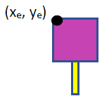
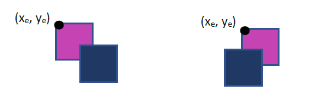
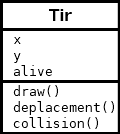
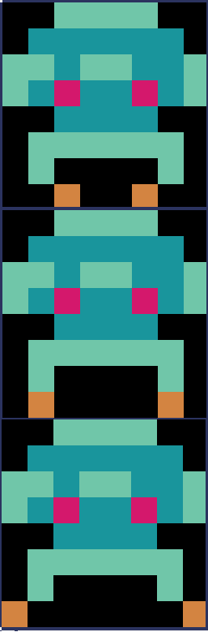
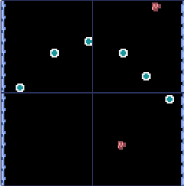

\huge \textbf{Projet}\normalsize  

\ 

\Large \textbf{Découverte de la bibliothèque Pyxel}\normalsize  

# DÉPLACER UN CARRÉ AVEC LES TOUCHES DE DIRECTIONS
Ouvrir le fichier `NSI_Tale_Pyxel_tutoriel1.py`.  

\  

Voici quelques explications à propos de ce fichier :  

\  

Après avoir importé le module `Pyxel` dans votre script Python, on crée une classe `Jeu`, pour regrouper l’ensemble des attributs et méthodes nécessaires. Utiliser une classe a l’avantage de remplacer des variables globales par des attributs.  

Cette classe doit contenir les méthodes `draw()` et `update()`. La méthode `draw()` crée et positionne les objets, alors que la méthode `update()` met à jour les variables. A l’intérieur du constructeur de la classe, on spécifie d’abord la taille de la fenêtre avec la fonction `init()` :  

```Python
# taille de la fenetre 128x128 pixels
# ne pas modifier
pyxel.init(128, 128, title="Nuit du c0de")
```

On lance l’application `Pyxel` avec la fonction `run` qui crée deux processus basés sur les méthodes `draw()` et `update()` :  

```Python
pyxel.run(self.update, self.draw)
```

Cette instruction doit être la dernière du constructeur. La création d’une instance de la classe permet de lancer le jeu. Pour déplacer un objet, on vérifie modifie ses coordonnées dans la méthode `update()`. Ici on les modifie à l’aide du clavier, en vérifiant si une touche est pressée (dans cet exemple, la touche droite et le touche gauche) :  

```Python
if pyxel.btn(pyxel.KEY_RIGHT) and self.vaisseau_x<120:
    self.vaisseau_x += 1
if pyxel.btn(pyxel.KEY_LEFT) and self.vaisseau_x>0:
    self.vaisseau_x += -1
```

Il ne reste plus qu’à afficher le carré avec ses nouvelles coordonnées grâce à cette instruction dans la méthode `draw()` :  

```Python
 # vaisseau (carre 8x8)
pyxel.rect(self.vaisseau_x, self.vaisseau_y, 8, 8, 1)
```

### A vous de jouer
Modifier le script pour le déplacer selon l’axe des y.  

### A vous de jouer
Les attributs `mouse_x` et `mouse_y` du module `pyxel` permettent de connaitre la position actuelle de la souris. **Modifier** le script pour contrôler le carré avec la souris.  

# AJOUTER DES TIRS
Ouvrir le fichier `NSI_Tale_Pyxel_tutoriel2.py`.  

Voici quelques explications à propos de ce fichier :  

Un tir est caractérisé par ses coordonnées. Créer un tir signifie ajouter un couple de coordonnées dans la liste des tirs.  

```Python
if pyxel.btnr(pyxel.KEY_SPACE):
    self.tirs_liste.append([self.vaisseau_x+4, self.vaisseau_y-4])
```

Les coordonnées du tir sont déterminées à partir de celles du vaisseau, sachant que ces coordonnées correspondent au coin en haut à gauche.  

 \   

On déplace ensuite d’un pixel le tir jusqu’à ce qu’il sorte de l’écran. Il suffit alors de le retirer de la liste des tirs pour le supprimer.  

```Python
for tir in  self.tirs_liste:
    tir[1] -= 1
    if  tir[1]<-8:
        self.tirs_liste.remove(tir)
```

# AJOUTER DES ENNEMIS
Ouvrir le fichier `NSI_Tale_Pyxel_tutoriel3.py`.  

\  

Voici quelques explications à propos de ce fichier :  

\  

Les images sont affichées à l’écran à raison de 30 images par secondes. L’attribut `frame_count` du module `pyxel` comptabilise le nombre d’images affichées depuis le début du jeu. Ainsi, pour créer un ennemi toute les secondes, on vérifie que le nombres d’images est un multiple de 30. La création des ennemis repose sur le même principe que celui des tirs, mais on utilise la fonction `randint()` du module `random` pour les créer de façon aléatoire selon l’axe des x.  

```Python
# un ennemi par seconde
if (pyxel.frame_count % 30 == 0):
    self.ennemis_liste.append([random.randint(0, 120), 0])
```

# AJOUTER LES COLLISIONS
Ouvrir le fichier `NSI_Tale_Pyxel_tutoriel4.py`.  

\  

Voici quelques explications à propos de ce fichier :  

\  

Pour le cas de la collision d’un tir avec un ennemi, la détection est simple : la coordonnée en y doit être inférieure à `ye – 8`, et la coordonnée en x doit être comprise entre `xe` et `xe + 8`.  

 \   

Pour détecter une collision entre un ennemi et un vaisseau, il faut considérer deux cas de figure (en ne considérant pour l’instant que l’axe des x) :  

 \   

A partir de ces figures, on en déduit deux conditions : il faut le bord gauche du vaisseau soit inférieur à `xe + 8`, et le bord droit supérieur à `xe`.  

On applique le même raisonnement sur l’axe des y.  

Grâce aux collisions il est possible de mettre une condition d’échec avec un écran de fin de jeu. La méthode `text()` permet d’afficher un texte aux coordonnées spécifiées (on peut également préciser le nombre de vie pendant la partie).  

```Python
# si le vaisseau possede des vies le jeu continue
if self.vaisseau.vies > 0:
    ...
# sinon: GAME OVER
else:
    pyxel.text(50,64, 'GAME OVER', 7)
```

# AJOUTER LES EXPLOSIONS LORS DES COLLISIONS
Ouvrir le fichier `NSI_Tale_Pyxel_tutoriel5.py`.  

\  

Voici quelques explications à propos de ce fichier :  

\  

Pour les explosions, on procède comme pour les tirs.  

Cependant, en plus des coordonnées, on ajoute un troisième paramètre. C’est ce paramètre qui permettra de créer des cercles dont le rayon et la couleur évolue.  


# AJOUTER DES IMAGES
Ouvrir le fichier `NSI_Tale_Pyxel_tutoriel6.py`.  

\  

Voici quelques explications à propos de ce fichier :  

\  

**Une tuile** (**tile** en anglais) est un élément graphique d'un jeu vidéo, constitué de petites images (en général) carrées disposées sur une grille.  

Une tuile peut représenter un sprite ou un élément de décor, avec lequel on peut interagir ou non. L'ensemble complet des tuiles disponibles pour une utilisation dans une zone de jeu est appelé un jeu de tuiles (ou tileset en anglais).  

L’éditeur Pyxel peut créer des images et des sons utilisables dans des applications Pyxel. (voir la documentation Pyxel)  

Lors de l'initialisation du jeu, il est nécessaire de charger en mémoire le fichier ressource (ici, il s'appelle `images.pyxres`).  

```Python
# chargement des images
pyxel.load("images.pyxres")
```

On peut ensuite placer l’image à l’écran, à la place du carré initial :  

```Python
# vaisseau (carre 8x8)
pyxel.blt(self.x, self.y, 0, 0, 0, 8, 8)
```

Si les dimensions de l’image sont indiquées comme négatives, la copie de l’image sera inversée horizontalement et/ou verticalement.  

Il est également possible de spécifier une couleur transparente, qui ne sera donc pas dessinée à l’écran. On a choisi ici la couleur noire (code : `0`), initialisé dans la constante `TRANSPARENT_COLOR`.


# UTILISER LA POO
Ouvrir le fichier `NSI_Tale_Pyxel_tutoriel7.py`.  

\  

Voici quelques explications à propos de ce fichier :  

\  

Il est également possible de créer des instances de classes pour décrire les différents éléments du jeu. En soi, le fonctionnement est identique ; par contre, cela permet de regrouper dans un même objet les caractéristiques et les comportements de l’objet.  

Par exemple, un objet `Tir` va regrouper ses coordonnées, ainsi que la manière de le dessiner, de la déplacer et la gestion des collisions avec les ennemis.  

 \   

On peut remarquer qu’un troisième attribut a été rajouté : il s’agit de l’attribut `alive`, initialisé à `True`, qui permet de déterminer si l’objet doit continuer à être affiché ou s’il doit être supprimé.  

```Python
def deplacement(self):
    self.y -= 1
    if  self.y < -8:
        self.alive = False
```

Les objets qui ne sont plus « vivants » sont alors supprimés des listes à dessiner.  

```Python
for tir in  self.tirs_liste:
    tir.deplacement()
    if  not tir.alive :
        self.tirs_liste.remove(tir)
```

# ANIMER LES SPRITES
Ouvrir le fichier `NSI_Tale_Pyxel_tutoriel8.py`.  

\  

Voici quelques explications à propos de ce fichier :  

\  

Pour animer les sprites, on va utiliser plusieurs images du pavé pour un seul sprite.  

 \   

L’enchainement des images donne l’impression de mouvement. Dans le script `NSI_Tale_Pyxel_tutoriel8.py`, on utilise l’attribut `pyxel.frame_count` pour modifier l’image toutes les 1/10ème de seconde. On utilise la variable `coef` pour choisir l’image.  

```Python
#Change l'aspect tous les 1/10 de secondes
#coef peut valoir 0,1 ou 2
coef = pyxel.frame_count //3% 3
pyxel.blt(self.x, self.y, 0, 0, 8 + 8*coef, 8, 8)
```

# AJOUTER DU SON
Ouvrir le fichier `NSI_Tale_Pyxel_tutoriel9.py`.  

\  

Voici quelques explications à propos de ce fichier :  

\  

Il est possible de rajouter des sons et des musiques au jeu. Ces derniers peuvent être créés à partir de l’éditeur de ressources.  

On peut charger les fichiers ressources grâce à la méthode `load()`. Le fichier peut être chargé en entier, ou partiellement. Dans ce cas on spécifie quelles parties chargées.  

La méthode `playm()` permet de lancer une musique en continu.  

```Python
# chargement des images et des sons
pyxel.load("images.pyxres", True, True, False, False)
pyxel.load("sons.pyxres", False, False, True, True)

#Lancement de la musique
pyxel.playm(0, loop=True)
```

On peut également émettre des bruitages (ici, le son numéro 1) :  

```Python
 #lancement d'un bruitage
pyxel.play(0, 1)
```

# AJOUTER ET FAIRE DÉFILER UN DÉCOR
Ouvrir le fichier `NSI_Tale_Pyxel_tutoriel10.py`.  

\  

Voici quelques explications à propos de ce fichier :  

\  

**Une tilemap** (littéralement une **"carte de tuile"**) est une grille utilisée pour créer la disposition/le fond graphique d'un jeu. L'écran est ainsi représenté par une grille composée de nombreuses cases, sur lesquelles sont appliquées une image par case. Il est alors possible de créer un fond au jeu, composé des éléments du jeu de tuiles.  

On peut également superposer les décor afin de créer une impression de profondeur. En début de la méthode `draw()`, on chargera d’abord le fond, puis le décor de premier plan.  

Ce décor peut être statique, mais il est également possible de réaliser un défilement. Ce défilement peut être automatique (par exemple à raison de 1 px/s) ou lié aux déplacements du personnage.  

```Python
pyxel.camera()

pyxel.bltm(0, 0, 0, 192, (self.scroll_y // 4) % 128, 128, 128)
pyxel.bltm(0, 0, 0, 0, self.scroll_y,  128, 128, TRANSPARENT_COLOR)
```

# INTERAGIR AVEC LE DÉCOR
Ouvrir le fichier `NSI_Tale_Pyxel_tutoriel11.py`.  

\  

Voici quelques explications à propos de ce fichier :  

\  

A l’intérieur du jeu de tuiles, chaque tuile est repérée par des coordonnées.  

 \   

Ici, la fusée se trouve aux coordonnées (0, 0) et le monstre à (0, 1).  

La carte peut être considérée comme une grille où chaque case contient une tuile (elle-même identifiée par ses coordonnées dans le jeu de tuile). Ainsi chaque case de la carte mesure 8 pixels par 8.  

Il est donc possible de détecter des collisions entre le vaisseau et un astéroïde du décor. Dans un premier temps on convertit les coordonnées à l’écran avec les coordonnées de la carte, en prenant en comptant un éventuel défilement.  

```Python
#conversion entre les coordonnées du à l'écran
# et les coordonnées de la carte
x1 = self.x // 8
y1 = (self.y + scroll) // 8
```

Il faut ensuite prendre en compte que le vaisseau peut être à cheval sur plusieurs tuiles.  

```Python
# Le vaisseau peut potentiellement être à cheval sur 4 tuiles
x2 = (self.x + 8 - 1) // 8
y2 = (self.y + scroll + 8 - 1) // 8
```

On peut ensuite détecter sur quelle tuile on se trouve grâce à la méthode `pget()` de l’objet `tilemap`. La constante `TUILE_ASTEROID` est initialisée aux coordonnées de la tuile recherchée, à savoir `(2, 1)`.  

```Python
#on parcours 1 à 4 tuiles
for yi in range(y1, y2 + 1):
    for xi in range(x1, x2 + 1):
        tuile = pyxel.tilemap(0).pget(xi, yi)

        if tuile == TUILE_ASTEROID:
            self.vies -= 1
            #on efface la tuile pour ne pas qu'elle soit prise en compte deux fois
            pyxel.tilemap(0).pset(xi, yi, TUILE_ESPACE)
```

Une fois détectée, on modifie la tuile pour ne pas qu’elle soit prise en compte plusieurs fois grâce à la méthode `pset()` de l’objet `tilemap`. A noter que cette modification n’est pas définitive et n’intervient que pour la carte chargée en mémoire.  

### A vous de jouer
Créer la fonction `detect_bonus()` qui détecte le passage du vaisseau sur les bonus de gain de vie présents dans le décor.  

# PLACER DES ENNEMIS DANS LE DÉCOR
Ouvrir le fichier `NSI_Tale_Pyxel_tutoriel12.py`.  

\  

Voici quelques explications à propos de ce fichier :  

\  

Au lieu que les ennemis apparaissent de manière aléatoire, on peut vouloir qu’ils apparaissent à des endroits précis du décor.  

Pour cela, il faut dédier une tuile à ce placement, puis on place des copies de cette tuile aux endroits de la carte où l’on souhaite voir surgir les ennemis.  

 \   

A l’initialisation du jeu, il est nécessaire de rendre ces tuiles transparentes afin qu’elles ne soient pas affichées, par contre elles pourront toujours être identifiées par la méthode `pget()` de l’objet `tilemap`.  

```Python
# chargement des images
pyxel.load("images.pyxres")
pyxel.image(0).rect(16, 16, 8, 8, TRANSPARENT_COLOR)
```

Lors du défilement, on parcourt la carte (tout du moins la partie nouvellement affichée) et on crée un ennemi aux coordonnées de chaque tuile que l’on trouve.  

```Python
tuile = pyxel.tilemap(0).pget(x, y)
if tuile == TUILE_MONSTRE:
    pyxel.tilemap(0).pset(x, y, TUILE_ESPACE)
    self.ennemis_liste.append([x*8,y*8-y1])
```

\   

\underline{{\textit{\textbf{Sources}}}}  

- Peio47 (2022, 16 novembre). \textit{Créer une application Pyxel}. La Nuit du C0de. [https://nuitducode.github.io/DOCUMENTATION/PYTHON/Tutoriel%20d%C3%A9taill%C3%A9%20-%20Terminale/Cr%C3%A9er%20une%20application%20Pyxel/](https://nuitducode.github.io/DOCUMENTATION/PYTHON/Tutoriel%20d%C3%A9taill%C3%A9%20-%20Terminale/Cr%C3%A9er%20une%20application%20Pyxel/)